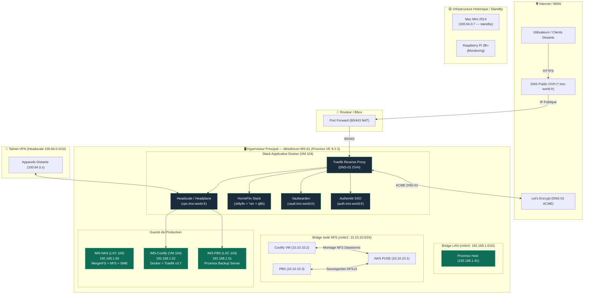

## Principes

L'infrastructure IMS-WORLD repose sur trois principes non négociables :

<CardGroup cols={3}>
  <Card title="100% local" icon="house">
    Aucune dépendance à un cloud tiers pour les services critiques. Auto-hébergement complet.
  </Card>
  <Card title="0€ récurrent" icon="euro-sign">
    Uniquement du matériel possédé et des logiciels open-source. Pas d'abonnement SaaS.
  </Card>
  <Card title="Lean" icon="feather">
    Complexité activement challengée. Pas de sur-ingénierie — chaque brique ajoutée doit se justifier.
  </Card>
</CardGroup>

## Schéma d'Architecture Globale

## État actuel de l'infrastructure

<Info>
**Cutover complet réalisé le 02/08/2026.** Le Minisforum MS-01 (Proxmox) est le point d'entrée de production réel d'IMS-WORLD. Le Mac Mini historique est en standby (période de validation), avant décommissionnement définitif.
</Info>

### Matériel

| Nœud | Rôle | Statut |
|---|---|---|
| [**Labrax**](/infrastructure/labrax) | Rack serveur physique 3D, switch NETGEAR GS308EV4, alim PicoPSU | 🟢 Production |
| **Minisforum MS-01** | Hyperviseur Proxmox VE — hôte principal | 🟢 Production |
| **Mac Mini 2014** | Ancien hôte de production | 🟡 Standby (validation) |
| **Raspberry Pi 3B+** | Monitoring | 🟢 Actif |

### Guests Proxmox (MS-01)

| Guest | VMID | Rôle | Réseau |
|---|---|---|---|
| **IMS-NAS** | LXC 100 | Stockage (NFS + SMB) | `vmbr0` + `vmbr1` |
| **IMS-PBS** | LXC 103 | Sauvegardes (Proxmox Backup Server) | `vmbr0` + `vmbr1` + Tailscale |
| **IMS-Coolify** | VM 104 | Orchestration Docker — héberge tous les services applicatifs | `vmbr0` + `vmbr1` + Tailscale |

<Card title="Détail de chaque nœud" icon="server" href="/infrastructure/proxmox-host">
  Voir la section Infrastructure pour les spécifications complètes.
</Card>

### Services applicatifs en production

| Service | Domaine | Rôle |
|---|---|---|
| [Authentik](/services/authentik) | `auth.ims-world.fr` | SSO / OIDC |
| [Vaultwarden](/services/vaultwarden) | `vault.ims-world.fr` | Gestionnaire de mots de passe |
| [HomeFlix](/services/homeflix) | `homeflix.ims-world.fr` + 5 sous-domaines | Stack médias (Jellyfin, *arr, qBittorrent) |
| [Headscale + Headplane](/services/headscale-headplane) | `vpn.ims-world.fr` | Control plane Tailscale self-hosted |

### Services en cours de migration

| Service | Statut |
|---|---|
| [Cap](/services/cap) | Dump de données récupéré, restore en attente |
| Stirling PDF | Non commencé |
| Beszel, Zipline, Forgejo, Photoprism, Immich, Ntfy, Home Assistant, Patrimo, Sentryx | Encore sur Mac Mini — migration à froid post-validation |

## Réseau en un coup d'œil

<Card title="Architecture réseau complète" icon="network-wired" href="/reseau/architecture-reseau">
  Bridges Proxmox (`vmbr0`/`vmbr1`), Tailscale/Headscale, DNS, port-forward — tout le détail réseau.
</Card>

## Navigation rapide

<CardGroup cols={2}>
  <Card title="Je dépanne un problème" icon="wrench" href="/procedures/depannage-courant">
    Tous les pièges récurrents déjà rencontrés et leur solution.
  </Card>
  <Card title="Plan de Reprise (PRA)" icon="shield-alert" href="/procedures/plan-reprise-activite-pra">
    Procédure de reconstruction complète en cas de crash du serveur MS-01.
  </Card>
  <Card title="Matrice de Sécurité" icon="shield-halved" href="/reseau/matrice-securite-exposition">
    Cartographie complète des accès, de l'exposition publique et du filtrage Tailnet.
  </Card>
  <Card title="Je migre un nouveau service" icon="arrow-right-arrow-left" href="/procedures/migration-service">
    Le protocole standard affiné sur 4 migrations réelles.
  </Card>
  <Card title="J'ajoute un disque au NAS" icon="hard-drive" href="/procedures/ajout-nouveau-disque">
    Extension MergerFS ou bascule storage-hot.
  </Card>
  <Card title="Historique du projet" icon="clock-rotate-left" href="/CHANGELOG">
    Chronologie complète, décisions et déviations par rapport au plan initial.
  </Card>
</CardGroup>
