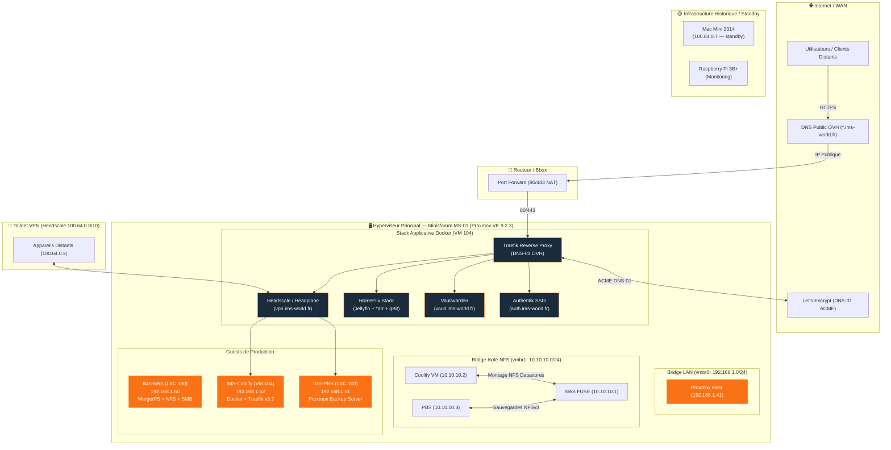

<CardGroup cols={4}>
  <Card title="1 Hôte Proxmox" icon="server" href="/infrastructure/proxmox-host">
    Minisforum MS-01 (14 vCPU / 32 Go RAM)
  </Card>
  <Card title="2 LXC & 1 VM" icon="box" href="/infrastructure/vm-coolify">
    IMS-NAS (100), IMS-PBS (103), VM Coolify (104)
  </Card>
  <Card title="100% Chiffré" icon="shield-check" href="/reseau/matrice-securite-exposition">
    ACME DNS-01 & Headscale Tailnet
  </Card>
  <Card title="0€ SaaS / Mois" icon="euro-sign" href="/history/chronologie">
    100% Self-Hosted & matériel possédé
  </Card>
</CardGroup>

## Principes Directeurs

L'infrastructure IMS-WORLD repose sur trois principes non négociables :

<CardGroup cols={3}>
  <Card title="100% Local" icon="house">
    Aucune dépendance à un cloud tiers pour les services critiques. Auto-hébergement complet sur le cluster physique.
  </Card>
  <Card title="0€ Récurrent" icon="euro-sign">
    Uniquement du matériel possédé et des logiciels open-source. Aucun abonnement SaaS.
  </Card>
  <Card title="Lean & Efficient" icon="feather">
    Complexité activement challengée. Pas de sur-ingénierie — chaque brique ajoutée doit se justifier.
  </Card>
</CardGroup>

## ⚡ Accès Rapides — Cockpit Homelab

<Tabs>
  <Tab title="🛠️ Administration & Ops">
    <CardGroup cols={3}>
      <Card title="Proxmox VE GUI" icon="server" href="https://192.168.1.41:8006">
        Hyperviseur PVE MS-01 (`192.168.1.41:8006`)
      </Card>
      <Card title="Coolify Admin" icon="rocket" href="https://coolify.ims-world.fr">
        Orchestration Docker (`coolify.ims-world.fr`)
      </Card>
      <Card title="Headplane Admin" icon="network-wired" href="https://vpn.ims-world.fr/admin">
        Tailnet VPN GUI (`vpn.ims-world.fr/admin`)
      </Card>
    </CardGroup>
  </Tab>
  <Tab title="🌐 Services Web Applicatifs">
    <CardGroup cols={3}>
      <Card title="Authentik SSO" icon="key" href="https://auth.ims-world.fr">
        Provider OIDC & SSO (`auth.ims-world.fr`)
      </Card>
      <Card title="Vaultwarden" icon="shield-halved" href="https://vault.ims-world.fr">
        Coffre Mots de Passe (`vault.ims-world.fr`)
      </Card>
      <Card title="HomeFlix Streaming" icon="clapperboard" href="https://homeflix.ims-world.fr">
        Jellyfin Streaming (`homeflix.ims-world.fr`)
      </Card>
    </CardGroup>
  </Tab>
</Tabs>

## 🗄️ Rack Physique & Châssis Labrax

<CardGroup cols={2}>
  <Card title="Rack Serveur Physique Labrax" icon="cubes" href="/infrastructure/labrax">
    Châssis 3D-printé MakerWorld (Core IMS-01), ventilateur supérieur Noctua Industrial PPC, switch NETGEAR GS308EV4, 4 caddies Dell PowerEdge 3.5" et alimentation PicoPSU 160W.
  </Card>
  <Card title="Sonde de Monitoring & Écran 2U" icon="display" href="/infrastructure/rpi-monitor">
    Raspberry Pi 3B+ sur module 2U dédié, pilotant l'écran de statut LCD/OLED frontal et assurant le monitoring hors-bande du cluster.
  </Card>
</CardGroup>

## Schéma d'Architecture Globale

## État Actuel des Composants

<Tabs>
  <Tab title="🟢 Services en Production">
    | Service | Domaine | Description | Page associée |
    |---|---|---|---|
    | **Authentik** | `auth.ims-world.fr` | Provider d'identité centralisé (SSO / OIDC + 2FA) | [Authentik](/services/authentik) |
    | **Vaultwarden** | `vault.ims-world.fr` | Coffre-fort de mots de passe compatible Bitwarden | [Vaultwarden](/services/vaultwarden) |
    | **HomeFlix** | `homeflix.ims-world.fr` | Stack médias complète (Jellyfin, *arr, qBittorrent, Gluetun) | [HomeFlix](/services/homeflix) |
    | **Headscale + Headplane** | `vpn.ims-world.fr` | Control plane VPN Tailscale self-hosted | [Headscale](/services/headscale-headplane) |
  </Tab>
  <Tab title="🖥️ Infrastructure Physique & Hyperviseur">
    | Composant | Rôle | Statut | Page associée |
    |---|---|---|---|
    | **Labrax** | Rack serveur physique 3D, switch NETGEAR, alim PicoPSU | 🟢 Production | [Rack Labrax](/infrastructure/labrax) |
    | **Minisforum MS-01** | Hyperviseur Proxmox VE 9.2.3 —  hôte principal | 🟢 Production | [Proxmox Host](/infrastructure/proxmox-host) |
    | **Mac Mini 2014** | Hôte de secours | 🟡 Standby | [Mac Mini](/infrastructure/mac-mini) |
    | **Raspberry Pi 3B+** | Sonde de monitoring & écran 2U | 🟢 Production | [RPi Monitor](/infrastructure/rpi-monitor) |
    | **IMS-NAS (LXC 100)** | Stockage NFS + SMB (MergerFS) | 🟢 Production | [IMS-NAS](/infrastructure/ims-nas) |
    | **IMS-PBS (LXC 103)** | Sauvegardes Proxmox Backup Server | 🟢 Production | [IMS-PBS](/infrastructure/ims-pbs) |
    | **IMS-Coolify (VM 104)** | Orchestration Docker (Traefik v3.7) | 🟢 Production | [VM Coolify](/infrastructure/vm-coolify) |
  </Tab>
</Tabs>

## Guides Opérationnels & Procédures

<CardGroup cols={2}>
  <Card title="Je dépanne un problème" icon="wrench" href="/procedures/depannage-courant">
    Tous les pièges récurrents déjà rencontrés et leur solution.
  </Card>
  <Card title="Plan de Reprise (PRA / DRP)" icon="shield-alert" href="/procedures/plan-reprise-activite-pra">
    Procédure d'urgence et reconstruction intégrale en cas de sinistre.
  </Card>
  <Card title="Matrice de Sécurité" icon="shield-halved" href="/reseau/matrice-securite-exposition">
    Cartographie complète des accès, de l'exposition publique et du filtrage Tailnet.
  </Card>
  <Card title="Je déploie un nouveau service" icon="arrow-right-arrow-left" href="/procedures/deploiement-service">
    Le protocole standard affiné sur 4 migrations réelles.
  </Card>
  <Card title="J'ajoute un disque au NAS" icon="hard-drive" href="/procedures/ajout-nouveau-disque">
    Extension MergerFS ou bascule storage-hot.
  </Card>
  <Card title="Historique du projet" icon="clock-rotate-left" href="/history/chronologie">
    Chronologie complète, décisions et déviations par rapport au plan initial.
  </Card>
</CardGroup>
