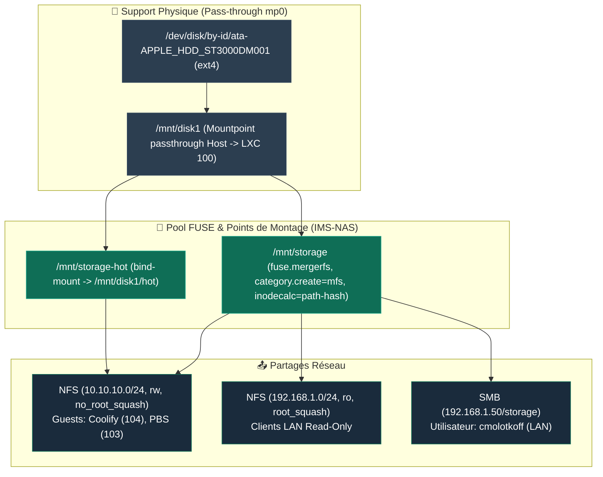

import { ips, hardware } from "/snippets/variables.mdx";

<Badge color="green">🟢 Production Active (LXC 100)</Badge>

<Note>
📦 **Type d'Instance** : **Conteneur LXC 100** (Debian 12 Privilégié) — Partage le noyau Linux directement avec l'hôte Proxmox VE.
</Note>

## Rôle

Centralise le stockage de l'infrastructure : documents, photos, backups, et médias. Sert en NFS aux guests internes (réseau isolé) et en SMB au LAN.

<Warning>
**Capacité & Évolution** : Mono-disque actuellement (HDD Seagate 3To). L'infrastructure est conçue pour accueillir de **nouveaux disques de stockage supplémentaires** (slots caddies Dell 3.5" disponibles dans le rack [Labrax](/infrastructure/labrax), raccordés à la carte SATA 6 ports {hardware.sataCard}).
</Warning>

## Fiche technique

<Info>
**Architecture "Fait Maison"** : Ce NAS n'est pas un boîtier commercial (Synology/QNAP), mais une solution sur-mesure combinant un conteneur LXC Debian 12 et MergerFS. Les disques physiques sont logés dans le **4-Pack Hard Drive Tray Caddy 3,5" pour DELL** du rack [Labrax](/infrastructure/labrax) et raccordés au MS-01 via la carte {hardware.sataCard}.
</Info>

| Propriété | Valeur |
|---|---|
| **VMID** | 100 |
| **Type** | LXC Debian 12, **privilégié** (requis pour NFS + passthrough disque) |
| **CPU / RAM** | 2 cores / 1024 MB |
| **Réseau** | `vmbr0` ({ips.nasLan}/24, LAN) + `vmbr1` (10.10.10.1/24, isolé, sans gateway) |
| **Carte SATA** | {hardware.sataCard} |
| **Emplacement disques** | 4-Pack Hard Drive Tray Caddy 3.5" pour DELL (baie évolutive multi-disques) |
| **Accès distant** | Aucun — LAN uniquement à ce jour |
| **Statut** | <Badge color="green">🟢 Production Active</Badge> |

<Note>
`vmbr1` est un bridge isolé sans port physique ni gateway, dédié au trafic NFS interne entre guests (NAS ↔ PBS ↔ VM Coolify). Le LAN (`vmbr0`) sert le SMB et l'accès humain.
</Note>

## Disques physiques & Évolutivité

| Propriété | Valeur |
|---|---|
| **Disque Actuel** | Seagate/Apple HDD ST3000DM001 (Z1F3N0NZ) |
| **Capacité Actuelle** | 3 To, 7200rpm (ext4) |
| **Santé au déploiement** | SMART PASSED, 0 secteur réalloué, **14h d'usure totale** (quasi neuf) |
| **Évolution Prévue** | Integration de **nouveaux disques** (SSD chaud / HDD additionnels dans le pool MergerFS) |

<Warning>
Le disque Seagate ST3000DM001 est statistiquement plus sujet aux pannes selon les études de référence (Backblaze). L'intégration de nouveaux disques supplémentaires dans le pool permettra de mettre en place de la redondance.
</Warning>

## Stockage — architecture MergerFS



```
/mnt/disk1        ext4, passthrough mp0 — membre actuel du pool
/mnt/storage      fuse.mergerfs (pool modulable, category.create=mfs)
                  ├── documents/
                  ├── photos-archives/
                  ├── backups/
                  └── homeflix/
/mnt/storage-hot  bind mount → /mnt/disk1/hot (destiné à basculer sur SSD dédié)
                  ├── immich-data/
                  └── forgejo-data/
```

### Logique de Découpage : Stockage Capacitif vs Données Chaudes

| Montage NFS (VM Coolify) | Point de Montage NAS (LXC 100) | Usage & Types de Données | Objectif & Comportement Matériel |
|---|---|---|---|
| **`/mnt/nas-storage`** | `/mnt/storage` | **Stockage Capacitif / Froid** : Médias HomeFlix (films, séries), archives photo, documents personnels et sauvegardes PBS (`/mnt/storage/backups`). | Optimisé pour le **stockage de masse** et la lecture séquentielle sur HDD. |
| **`/mnt/nas-hot`** | `/mnt/storage-hot` | **Données Chaudes / I/O Intensif** : Bases de données applicatives, métadonnées Immich (`immich-data`), dépôts Git Forgejo (`forgejo-data`), Authentik. | Optimisé pour la **latence et les IOPS**. Actuellement sur `/mnt/disk1/hot`, prêt à être basculé vers un SSD dédié. |

<Info>
**Avantage Majeur d'Architecture** : En isolant le réseau NFS dès le départ (`/mnt/nas-hot` vs `/mnt/nas-storage`), le futur basculement du dossier physique `/mnt/storage-hot` vers un SSD haute performance s'effectuera sur le NAS **sans aucune reconfiguration ni modification des volumes Docker** dans la VM Coolify.
</Info>

<Tip>
`inodecalc=path-hash` a été ajouté aux options MergerFS pour stabiliser les exports NFS long terme (retour d'expérience communautaire). `noforget` testé puis retiré (cause de fuite mémoire connue).
</Tip>

## NFS

```
/mnt/storage      10.10.10.0/24(rw,no_root_squash)   # guests internes
/mnt/storage      192.168.1.0/24(ro,root_squash)      # LAN, lecture seule
/mnt/storage-hot  10.10.10.0/24(rw,no_root_squash)    # guests internes uniquement
```

## SMB

| Propriété | Valeur |
|---|---|
| **Partage** | `smb://{ips.nasLan}/storage` |
| **Utilisateur** | `cmolotkoff` |

<Note>
L'accès SMB est configuré sur l'utilisateur `cmolotkoff` pour la gestion simplifiée des droits du partage. À adapter avec un compte restreint si le stockage doit être ouvert à d'autres utilisateurs du LAN.
</Note>

## Monitoring

<Warning>
**`smartd` et `hd-idle` ne peuvent PAS tourner dans ce LXC** — le passthrough mountpoint ne donne pas accès au device bloc brut nécessaire à ces outils. Les deux tournent sur le **host**. Voir [Dépannage courant](/procedures/depannage-courant) pour le détail de cette découverte.
</Warning>

## Documents associés

<CardGroup cols={2}>
  <Card title="Dépannage IMS-NAS" icon="wrench" href="/procedures/depannage-courant">
    Tous les problèmes réseau/FUSE/monitoring rencontrés sur ce nœud.
  </Card>
  <Card title="Ajout d'un disque" icon="hard-drive" href="/procedures/ajout-nouveau-disque">
    Procédure pour l'intégration de nouveaux disques dans MergerFS.
  </Card>
</CardGroup>
