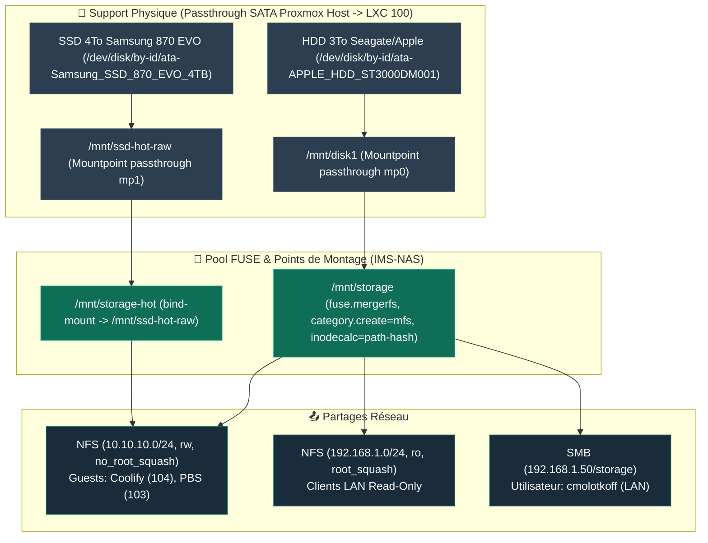

import { ips, hardware } from "/snippets/variables.mdx";

<Badge color="green">🟢 Production Active (LXC 100)</Badge>

<Note>
📦 **Type d'Instance** : **Conteneur LXC 100** (Debian 12 Privilégié) — Partage le noyau Linux directement avec l'hôte Proxmox VE.
</Note>

## Rôle

Centralise le stockage de l'infrastructure : documents, photos, backups, et médias. Sert en NFS aux guests internes (réseau isolé) et en SMB au LAN.

<Info>
**Capacité & Évolution** : Architecture multi-disques hybride composée d'un **HDD capacitif 3To** (Pool `/mnt/storage`) et d'un **SSD 4To dédié** (Tier `/mnt/storage-hot`). L'infrastructure reste évolutive pour accueillir de futurs disques durs HDD supplémentaires dans les slots caddies Dell 3.5" du rack [Labrax](/infrastructure/labrax).
</Info>

## Fiche technique

<Info>
**Architecture "Fait Maison"** : Ce NAS n'est pas un boîtier commercial (Synology/QNAP), mais une solution sur-mesure combinant un conteneur LXC Debian 12 et MergerFS. Les disques physiques sont logés dans le **4-Pack Hard Drive Tray Caddy 3,5" pour DELL** du rack [Labrax](/infrastructure/labrax) et raccordés au MS-01 via la carte {hardware.sataCard}.
</Info>

| Propriété | Valeur |
|---|---|
| **VMID** | 100 |
| **Type** | LXC Debian 12, **privilégié** (requis pour NFS + passthrough disque) |
| **CPU / RAM** | 2 cores / 1024 MB |
| **Réseau** | `vmbr0` ({ips.nasLan}/24, LAN) + `vmbr1` (10.10.10.1/24, isolé, sans gateway) |
| **Carte SATA** | {hardware.sataCard} |
| **Emplacement disques** | 4-Pack Hard Drive Tray Caddy 3.5" pour DELL (baie évolutive multi-disques) |
| **Accès distant** | Aucun — LAN uniquement à ce jour |
| **Statut** | <Badge color="green">🟢 Production Active</Badge> |

<Note>
`vmbr1` est un bridge isolé sans port physique ni gateway, dédié au trafic NFS interne entre guests (NAS ↔ PBS ↔ VM Coolify). Le LAN (`vmbr0`) sert le SMB et l'accès humain.
</Note>

## Disques physiques & Évolutivité

| Disque | Référence Matérielle | Capacité / Type | Affectation NAS | Passthrough Proxmox |
|---|---|---|---|---|
| **Disque 1 (Capacitif)** | Seagate/Apple ST3000DM001 (`Z1F3N0NZ`) | 3 To HDD 7200rpm (ext4) | Pool `/mnt/storage` (Documents, HomeFlix, Backups, PhotoPrism) | `mp0` → `/mnt/disk1` |
| **Disque 2 (Hot/Performant)** | Samsung SSD 870 EVO (`S758NX0W713130Z`) | 4 To SSD SATA (ext4) | Tier `/mnt/storage-hot` (Immich, Forgejo) | `mp1` → `/mnt/ssd-hot-raw` |

<Warning>
Le disque Seagate ST3000DM001 est statistiquement plus sujet aux pannes selon les études de référence (Backblaze). L'intégration ultérieure de nouveaux HDD supplémentaires dans le pool permettra de mettre en place de la redondance.
</Warning>

## Stockage — architecture MergerFS



```
/mnt/disk1        ext4, passthrough mp0 — membre actuel du pool
/mnt/storage      fuse.mergerfs (pool modulable, category.create=mfs, inodecalc=path-hash)
                  ├── documents/
                  ├── backups/
                  ├── homeflix/
                  └── photoprism-data/
/mnt/storage-hot  bind mount → /mnt/ssd-hot-raw (SSD SATA 4To dédié, passthrough mp1 — 🟢 Production Active)
                  ├── immich-data/
                  └── forgejo-data/
```

<Warning>
**Piège du calcul d'inodes MergerFS (`inodecalc=path-hash`)** : MergerFS génère des inodes virtuels basés sur le hash du chemin. Deux fichiers hardlinkés sur `/mnt/disk1` afficheront des inodes virtuels différents via `/mnt/storage` ou via les montages NFS clients. Tout diagnostic d'inode ou de hardlink DOIT s'effectuer en SSH direct sur le LXC NAS 100 sur le chemin physique `/mnt/disk1/...`. Voir l'[ADR-007](/history/adr/adr-007-calcul-inodes-mergerfs-path-hash).
</Warning>

### Logique de Découpage : Stockage Capacitif vs Données Chaudes

| Montage NFS (VM Coolify) | Point de Montage NAS (LXC 100) | Usage & Types de Données | Objectif & Comportement Matériel |
|---|---|---|---|
| **`/mnt/nas-storage`** | `/mnt/storage` | **Stockage Capacitif / Froid** : Médias HomeFlix (films, séries), archives photo, documents personnels et sauvegardes PBS (`/mnt/storage/backups`). | Optimisé pour le **stockage de masse** et la lecture séquentielle sur HDD. |
| **`/mnt/nas-hot`** | `/mnt/storage-hot` | **Données Chaudes / I/O Intensif** : Assets Immich (`immich-data`), dépôts Git Forgejo (`forgejo-data`). *(Remarque : Les bases de données Postgres/MariaDB résident directement sur le SSD NVMe local de la VM Coolify)*. | Optimisé pour la **latence et les IOPS**. Basculé avec succès le 18/08/2026 vers le **SSD SATA 4To dédié** (`/mnt/ssd-hot-raw`). |

<Info>
**Succès d'Architecture** : En isolant le réseau NFS dès le départ (`/mnt/nas-hot` vs `/mnt/nas-storage`), la bascule physique de `/mnt/storage-hot` vers le SSD 4To dédié s'est effectuée sur le LXC NAS **sans aucune reconfiguration ni modification des volumes Docker** dans la VM Coolify.
</Info>

<Tip>
`inodecalc=path-hash` a été ajouté aux options MergerFS pour stabiliser les exports NFS long terme (retour d'expérience communautaire). `noforget` testé puis retiré (cause de fuite mémoire connue).
</Tip>

## NFS

```
/mnt/storage      10.10.10.0/24(rw,no_root_squash)   # guests internes
/mnt/storage      192.168.1.0/24(ro,root_squash)      # LAN, lecture seule
/mnt/storage-hot  10.10.10.0/24(rw,no_root_squash)    # guests internes uniquement
```

## SMB

| Propriété | Valeur |
|---|---|
| **Partage** | `smb://`{ips.nasLan}`/storage` |
| **Utilisateur** | `cmolotkoff` |

<Note>
L'accès SMB est configuré sur l'utilisateur `cmolotkoff` pour la gestion simplifiée des droits du partage. À adapter avec un compte restreint si le stockage doit être ouvert à d'autres utilisateurs du LAN.
</Note>

## Monitoring

<Warning>
**`smartd` et `hd-idle` ne peuvent PAS tourner dans ce LXC** — le passthrough mountpoint ne donne pas accès au device bloc brut nécessaire à ces outils. Les deux tournent sur le **host**. Voir [Dépannage courant](/procedures/depannage-courant) pour le détail de cette découverte.
</Warning>

## Sauvegardes & Stratégie d'Exclusion Proxmox (vzdump)

<Warning>
**Exclusion de Sauvegarde Quotidienne Automatique** : Le conteneur LXC 100 est **volontairement exclu des sauvegardes automatiques quotidiennes**. Chaque arrêt de la LXC 100 réinitialise l'instance FUSE MergerFS et invalide définitivement les descripteurs de fichiers NFS (`Stale filehandle`) côté VM Coolify. Voir le [Post-Mortem du 19/08/2026](/history/incidents/2026-08-19-stale-nfs-filehandle-jellyfin-mergerfs).
</Warning>

### 1. Incompatibilité avec le Mode Snapshot
Le `--mode snapshot` de `vzdump` ne peut pas être utilisé sur la LXC 100 : le gel (*freeze*) du système de fichiers s'exécute sur l'ensemble du *mount namespace* du conteneur et bloque indéfiniment à cause de la présence du point de montage FUSE MergerFS (`mp0`), même lorsque `backup=0` est configuré.

### 2. Directive `backup=0` Obligatoire
Les deux points de montage doivent impérativement conserver la directive `backup=0` sur l'hôte MS-01 pour éviter d'embarquer les téraoctets de données dans le stockage système `local-lvm` lors des sauvegardes manuelles :
```bash
# Vérification / Correction sur le host MS-01
sudo pct set 100 -mp0 /mnt/disk1,mp=/mnt/disk1,backup=0
sudo pct set 100 -mp1 /dev/disk/by-id/ata-Samsung_SSD_870_EVO_4TB_S758NX0W713130Z,mp=/mnt/ssd-hot-raw,backup=0
```

### 3. Procédure Post-Redémarrage ou Sauvegarde du NAS (LXC 100)
En dehors d'un redémarrage complet de l'hôte MS-01 (où l'ordre de boot PVE gère la séquence), tout redémarrage isolé ou sauvegarde manuelle de la LXC 100 exige l'enchaînement suivant :
1. **Sauvegarde Manuelle Préalable** : `vzdump 100 --mode stop --compress zstd --storage local`.
2. **Exécution des modifications / Redémarrage LXC 100**.
3. **Reboot Obligatoire de Proxmox Backup Server (LXC 103)** :
   ```bash
   # Redémarrage obligatoire pour réinitialiser le datastore NFS PBS
   pct reboot 103
   ```
4. **Redémarrage Recommandé de la VM IMS-Coolify (VM 104)** :
   - *Idéalement* : Redémarrer proprement la VM Coolify (`qm reboot 104` ou `sudo reboot` dans la VM).
   - *A minima* : Redémarrer les conteneurs clients du NAS (`docker restart jellyfin sonarr radarr prowlarr photoprism`).

## Documents associés

<CardGroup cols={2}>
  <Card title="Dépannage IMS-NAS" icon="wrench" href="/procedures/depannage-courant">
    Tous les problèmes réseau/FUSE/monitoring rencontrés sur ce nœud.
  </Card>
  <Card title="Ajout d'un disque" icon="hard-drive" href="/procedures/ajout-nouveau-disque">
    Procédure pour l'intégration de nouveaux disques dans MergerFS.
  </Card>
</CardGroup>
