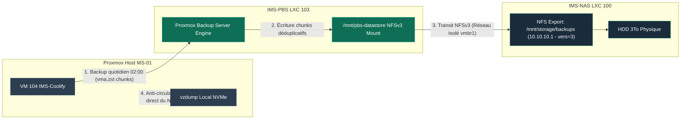

import { ips } from "/snippets/variables.mdx";

<Badge color="green">🟢 Production Active (LXC 103)</Badge>

<Note>
📦 **Type d'Instance** : **Conteneur LXC 103** (Debian 12 Privilégié) — Partage le noyau Linux directement avec l'hôte Proxmox VE.
</Note>

## Rôle

Datastore de sauvegarde déduplicée pour les VM/LXC applicatifs (VM Coolify en premier lieu). Stocke les backups sur le HDD du NAS via NFS.

<Warning>
**Ne sauvegarde PAS la donnée brute du NAS.** Principe anti-circularité : le NAS et PBS eux-mêmes sont sauvegardés séparément (`vzdump` vers le NVMe local du host), jamais dans le datastore qu'ils hébergent/gèrent. Voir la [Politique de Sauvegarde & Tâches Planifiées](/infrastructure/politique-sauvegardes).
</Warning>

## Fiche technique

| Propriété | Valeur |
|---|---|
| **VMID** | 103 |
| **Type** | LXC Debian 12, **privilégié** (requis pour montage NFS direct) |
| **CPU / RAM** | 2 cores / 1024 MB |
| **Réseau** | `vmbr0` ({ips.pbsLan}/24) + `vmbr1` (10.10.10.3/24) + client Tailscale dédié |
| **Accès Tailscale** | `{ips.pbs}`, hostname `ims-pve-103-pbs` |
| **Statut** | <Badge color="green">🟢 Production Active</Badge> |

<Note>
**Contrainte Technique LXC** : Le conteneur LXC 103 est configuré en mode **privilégié** avec la feature `mount=nfs`. Ce mode est techniquement obligatoire pour autoriser le montage direct du stockage réseau NFS sans restriction par les user namespaces du noyau Linux.
</Note>

## Accès distant — client Tailscale dédié

Contrairement au NAS (aucun accès distant), PBS a son propre client Tailscale plutôt qu'un subnet router généraliste — accès chirurgical, pas d'exposition du LAN entier.

<Steps>
  <Step title="Device TUN requis dans la config LXC">
    ```ini
    lxc.cgroup2.devices.allow: c 10:200 rwm
    lxc.mount.entry: /dev/net/tun dev/net/tun none bind,create=file
    ```
    <Warning>À ne pas oublier en cas de recréation du CT — sans ces lignes, Tailscale ne démarre pas.</Warning>
  </Step>
  <Step title="Installation & Enregistrement">
    ```bash
    curl -fsSL https://tailscale.com/install.sh | sh
    tailscale up --login-server=https://vpn.ims-world.fr --hostname=ims-pbs --accept-routes
    ```
  </Step>
</Steps>

## Datastore



| Propriété | Valeur |
|---|---|
| **Nom** | `pve-backups` |
| **Backing path** | `/mnt/pbs-datastore` |
| **Source NFS** | `10.10.10.1:/mnt/storage/backups` (HDD du NAS) |

<Note>
Le datastore est nommé **`pve-backups`**. Il sert d'espace de stockage déduplicatif pour les sauvegardes automatisées des machines virtuelles du cluster Proxmox.
</Note>

## Jobs configurés

| Job | Schedule | Détail |
|---|---|---|
| Garbage Collection | `sat 03:00` | Libère les chunks non référencés |
| Prune | quotidien | Rétention 7 daily / 4 weekly / 3 monthly |
| Verify | `sun 04:00` | Détecte la corruption silencieuse |
| **Backup VM Coolify** | `02:00` quotidien | Configuré côté Proxmox host (Datacenter → Backup) |

<Check>
Sauvegarde de la VM Coolify (104) opérationnelle et validée en production (snapshots quotidiens récurrents à 02:00).
</Check>

<Warning>
**Montage NFS forcé en `vers=3`** (pas la valeur par défaut v4.2) — un bug d'interaction NFSv4.2/MergerFS causait un `Stale file handle` systématique en toute fin de backup (échec du commit du manifest, après un transfert 100% réussi). Voir [Dépannage courant](/procedures/depannage-courant#stale-file-handle-en-fin-de-backup-nfsv4-2-mergerfs) pour le détail complet du diagnostic.
```ini
# fstab du CT PBS
10.10.10.1:/mnt/storage/backups  /mnt/pbs-datastore  nfs  defaults,nofail,_netdev,vers=3  0 0
```
</Warning>

## Résumé du Diagnostic NFS

Pour assurer la stabilité du montage du datastore sur le conteneur LXC 103 :

1. **LXC privilégié** : passage du conteneur en privilège root pour autoriser les syscalls de montage NFS.
2. **Feature `mount=nfs`** : activation explicite dans la configuration du LXC.
3. **Version NFS** : réglage en **`vers=3`** pour contourner les blocages `Stale file handle` avec MergerFS.

<Card title="Procédure de Dépannage" icon="magnifying-glass" href="/procedures/depannage-courant">
  Consulter toutes les commandes et retours d'expérience sur la gestion NFS/FUSE.
</Card>
