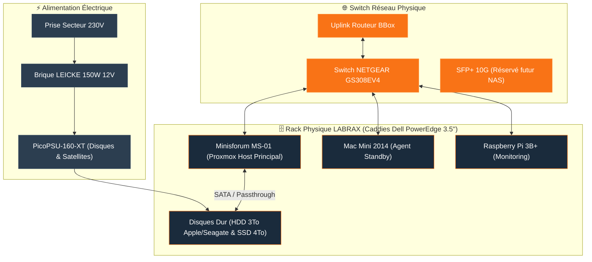

<Info>
**LABRAX** (Révision Core IMS-01) est le rack serveur physique 3D-printé qui héberge l'ensemble du matériel informatique IMS-WORLD. Cette page sert d'**index physique** : elle documente l'emplacement des machines, leur refroidissement, l'alimentation électrique et le câblage réel.
</Info>

## Vues 3D & Conception du Rack Labrax

<Tabs>
  <Tab title="🖼️ Face Principale & Écran Status">
    
  </Tab>
  <Tab title="🔌 Vue Arrière & Câblage">
    
  </Tab>
</Tabs>

## Fiche Technique & Matériaux du Chassis

| Élément | Spécification & Détails |
|---|---|
| **Structure du rack** | Modèle 3D-printé MakerWorld (Châssis gris renforcé avec poignées supérieures) |
| **Panneau Latéral** | Acrylique teinté noir profond (encastré dans les fentes intérieures du plastique) |
| **Refroidissement Supérieur** | Ventilateur Noctua Industrial PPC Noir (extraction d'air chaud par le haut) |
| **Plaque de Marque Frontale** | Panneau "INTERNATIONAL MOLOTKOFF SERVICES IMS" + [Screen module for 10-inch rack - Raspberry Pi 2U (MakerWorld)](https://makerworld.com/fr/models/2233953-screen-module-for-10-inch-rack-raspberry-pi-2u#profileId-2521672) |
| **Switch & Patch Panel** | Switch NETGEAR GS308EV4 encastré + Patch Panel RJ45 12 ports |
| **Emplacements Stockage** | 4 Caddies 3.5" Dell PowerEdge (Gen 11-14G: `058CWC` / `0KG1CH`) |
| **Distribution Électrique** | PicoPSU-160-XT (Entrée 12V DC) + Brique externe LEICKE 150W 12V |

## Schéma d'Architecture & Câblage Physique

## Topologie Réseau Physique

| Port / Connectique | Équipement connecté | Spécification câble / Vitesse |
|---|---|---|
| **Switch principal** | Switch **NETGEAR GS308EV4** | 8 ports Gigabit RJ45 |
| **Port Uplink (Port 1)** | BBox (Routeur WAN) | RJ45 Cat 6 |
| **Port Hôte Principal (Port 2)** | Minisforum MS-01 | RJ45 Cat 6 (2.5G) |
| **Port Standby (Port 3)** | Mac Mini 2014 | RJ45 Cat 6 (1G) |
| **Port Monitoring (Port 4)** | Raspberry Pi 3B+ | RJ45 Cat 6 (100M) |
| **Port Extension (SFP+)** | Port SFP+ 10G | Réservé pour évolution NAS 10G |

## Nœuds Hébergés dans le Rack

| Nœud | Rôle | Statut Physique | Page associée |
|---|---|---|---|
| **Minisforum MS-01** | Hyperviseur Proxmox VE principal | 🟢 Actif (Prod) | [Host Proxmox](/infrastructure/proxmox-host) |
| **Mac Mini 2014** | Ancien hôte de production | 🟡 Standby | [Architecture réseau](/reseau/architecture-reseau) |
| **Raspberry Pi 3B+** | Monitoring indépendant | 🟢 Actif | [Vue d'ensemble](/index) |
| **IMS-NAS (LXC 100)** | Stockage logique (MergerFS) | 🟢 Actif (sur MS-01) | [IMS-NAS](/infrastructure/ims-nas) |
| **Disques Physiques** | HDD 3To + SSD 4To (Phase 4) | 🟢 Actif | [Ajout d'un disque](/procedures/ajout-nouveau-disque) |

<Tip>
Toute modification matérielle du câblage ou de la distribution électrique doit être mise à jour sur cette page pour conserver l'exactitude de l'inventaire physique.
</Tip>
