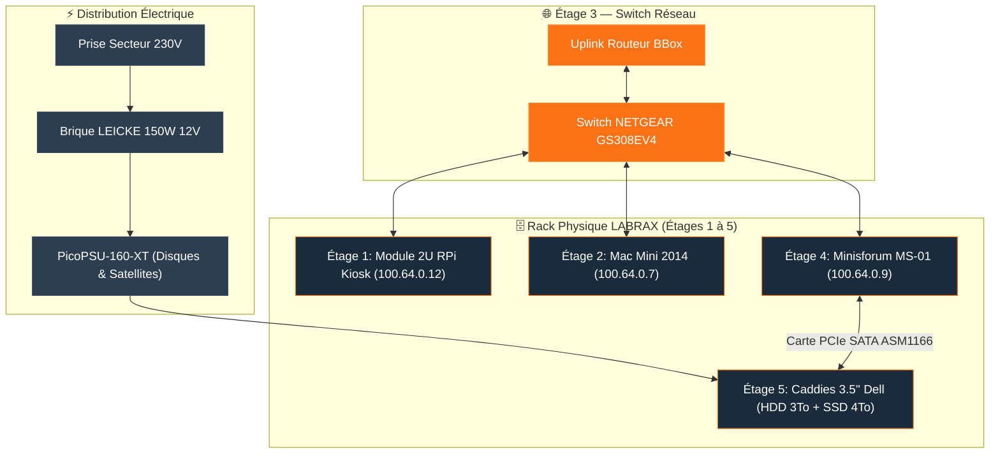

<Info>
**LABRAX** (Révision Core IMS-01) est le rack serveur physique 3D-printé qui héberge l'ensemble du matériel informatique IMS-WORLD. Cette page documente la vue générale du châssis, puis le détail **étage par étage**, la distribution électrique et le câblage physique.
</Info>

## 📐 Vue Globale & Conception du Châssis 3D

<Tabs>
  <Tab title="🖼️ Face Principale 3D">
    
  </Tab>
  <Tab title="🔌 Vue Arrière & Alimentation">
    
  </Tab>
</Tabs>

### Spécifications du Châssis 3D & Alimentation
| Élément | Spécification & Détails |
|---|---|
| **Structure** | Châssis 3D-printé MakerWorld (gris renforcé avec poignées supérieures) |
| **Panneaux Latéraux** | Acrylique teinté noir profond (encastré dans les fentes intérieures du plastique) |
| **Refroidissement Supérieur** | Ventilateur Noctua NF-A12x25 G2 PWM chromax.black (extraction d'air chaud par le haut) |
| **Distribution Électrique** | PicoPSU-160-XT (Entrée 12V DC) + Brique externe LEICKE 150W 12V |

---

## 🗄️ Détail par Étage & Module du Rack

<Tabs>
  <Tab title="📺 Étage 1 — Module Écran 2U & RPi">
    <Card title="Documentation Complète Kiosk" icon="display" href="/infrastructure/rpi-monitor">
      Voir la fiche dédiée pour le script de rotation Chromium headless, le contrôle par bouton poussoir GPIO et le paramétrage.
    </Card>

    <Tabs>
      <Tab title="🖼️ Face Principale (Façade 2U & Vitre)">
        
      </Tab>
      <Tab title="📐 Vue Isométrique 3D & Intérieur Tray">
        
      </Tab>
    </Tabs>

    ### Caractéristiques du Module 2U
    | Composant | Détails |
    |---|---|
    | **Format 3D** | [Screen module for 10-inch rack - Raspberry Pi 2U (MakerWorld)](https://makerworld.com/fr/models/2233953-screen-module-for-10-inch-rack-raspberry-pi-2u#profileId-2521672) |
    | **Écran Principal** | Wisecoco 7.84 pouces LCD (`1280x400`) |
    | **Écran Secondaire** | Module OLED 0.91 pouces (`128x32`, blanc/bleu) |
    | **Bouton GPIO** | Appui court = Change source / Appui long 3s = Éteint l'écran |
  </Tab>

  <Tab title="🍎 Étage 2 — Slot Mac Mini">
    <Card title="Fiche Hôte Mac Mini Standby" icon="desktop" href="/infrastructure/mac-mini">
      Accès SSH d'urgence sur le port 4242 et Endlessh tarpit sur le port 22.
    </Card>

    ### Spécifications Physique du Slot
    | Élément | Détails |
    |---|---|
    | **Hôte** | Mac Mini 2014 (Intel Dual-Core, SSD 500 Go) |
    | **Statut Physique** | 🟡 Standby chaud sous tension (Secours immédiat) |
    | **Connectivité** | Port Switch #3 (RJ45 Cat6 1G) + IP Tailnet `100.64.0.7` |
    | **Rôle** | Ancien serveur de prod, conservé pour reprise d'urgence post-cutover |
  </Tab>

  <Tab title="🔌 Étage 3 — Switch NETGEAR & Patch Panel">
    ### Interconnexion Réseau & Câblage
    | Connectique | Équipement raccordé | Spécification |
    |---|---|---|
    | **Switch** | Switch NETGEAR GS308EV4 encastré | 8 ports Gigabit RJ45 gérés |
    | **Patch Panel** | Patch Panel RJ45 12 ports encastré | Cat 6 blindé |
    | **Port 1 (Uplink)** | Routeur Bbox WAN (IP Publique) | RJ45 Cat 6 |
    | **Port 2 (Compute)** | Minisforum MS-01 (Proxmox Host) | RJ45 Cat 6 (2.5G) |
    | **Port 3 (Standby)** | Mac Mini 2014 | RJ45 Cat 6 (1G) |
    | **Port 4 (Kiosk)** | Raspberry Pi 3B+ (Module 2U) | RJ45 Cat 6 (100M) |
  </Tab>

  <Tab title="💻 Étage 4 — Slot Minisforum MS-01">
    <Card title="Fiche Hyperviseur MS-01" icon="server" href="/infrastructure/proxmox-host">
      Proxmox VE 9.2.3, 12 Cores / 16 Threads, 32 Go RAM DDR5, 1 To NVMe & iGPU Iris Xe passthrough.
    </Card>

    ### Caractéristiques du Slot Compute
    | Élément | Spécifications |
    |---|---|
    | **Hôte** | Minisforum MS-01 |
    | **Carte d'extension** | Carte SATA PCIe Tbest ASM1166 (6 ports, PCIe SATA 3.0 Gen3) |
    | **Statut Physique** | 🟢 Nœud Compute Principal (Proxmox VE 9.2.3) |
    | **Réseau** | Port Switch #2 (2.5G) + IP Tailnet `100.64.0.9` |
  </Tab>

  <Tab title="🗄️ Étage 5 — Caddies Stockage 3.5'' Dell">
    <Card title="Fiche Conteneur IMS-NAS" icon="box" href="/infrastructure/ims-nas">
      Stockage logique MergerFS, partages NFS/SMB et passthrough mp0.
    </Card>

    ### Spécifications du Rack HDD
    | Élément | Spécifications |
    |---|---|
    | **Châssis Caddies** | 4-Pack Hard Drive Tray Caddy 3.5" pour DELL (avec 1 adaptateur 2.5" pour SSD) |
    | **Disque Actuel** | Seagate/Apple HDD 3To 7200rpm (ST3000DM001) |
    | **Raccordement** | Câblage direct vers la carte SATA PCIe Tbest ASM1166 du MS-01 |
    | **Évolution (Phase 4)** | Emplacement prêt pour intégration du SSD 4To |
  </Tab>
</Tabs>

---

## Schéma d'Architecture & Câblage Électrique / Réseau

