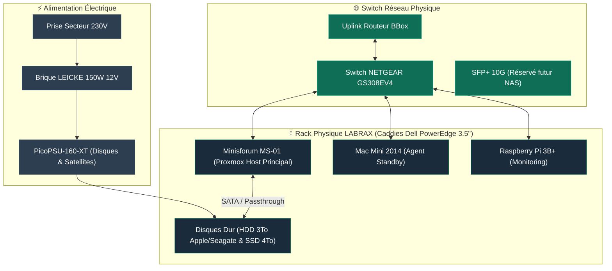

## Rôle et Vue d'ensemble

<Info>
**LABRAX** est le rack serveur physique (modèle 3D-printé MakerWorld) qui héberge l'ensemble des équipements et nœuds informatiques IMS-WORLD. Cette page sert d'**index physique** : elle documente l'emplacement, l'alimentation électrique et le câblage réel des machines.
</Info>

## Schéma d'Architecture & Câblage Physique

## Fiche technique & Alimentation

| Élément | Spécification |
|---|---|
| **Structure du rack** | Modèle 3D-printé MakerWorld |
| **Caddies disques** | Dell PowerEdge Gen 11-14G (058CWC / 0KG1CH) |
| **Alimentation disques** | PicoPSU-160-XT + Brique LEICKE 150W 12V |
| **Hot-swap** | Esthétique / mécanique uniquement (pas de backplane active) |

## Topologie réseau physique

| Élément / Port | Équipement connecté | Type de câble / Vitesse |
|---|---|---|
| **Switch principal** | Switch **NETGEAR GS308EV4** | Ethernet Gigabit RJ45 |
| **Port Uplink** | BBox (Routeur WAN) | RJ45 Cat 6 |
| **Port Hôte Principal** | Minisforum MS-01 | RJ45 Cat 6 (2.5G) |
| **Port Standby** | Mac Mini 2014 | RJ45 Cat 6 (1G) |
| **Port Monitoring** | Raspberry Pi 3B+ | RJ45 Cat 6 (100M) |
| **Port Réservé** | Port SFP+ 10G | Réservé pour évolution NAS 10G |

## Nœuds hébergés dans le rack

| Nœud | Rôle | Statut Physique | Page associée |
|---|---|---|---|
| **Minisforum MS-01** | Hyperviseur Proxmox VE principal | 🟢 Actif (Prod) | [Host Proxmox](/infrastructure/proxmox-host) |
| **Mac Mini 2014** | Ancien hôte de production | 🟡 Standby | [Architecture réseau](/reseau/architecture-reseau) |
| **Raspberry Pi 3B+** | Monitoring indépendant | 🟢 Actif | [README](/README#matériel) |
| **IMS-NAS (LXC 100)** | Stockage logique (MergerFS) | 🟢 Actif (sur MS-01) | [IMS-NAS](/infrastructure/ims-nas) |
| **Disques Physiques** | HDD 3To + SSD 4To (Phase 4) | 🟢 Actif | [Ajout d'un disque](/procedures/ajout-nouveau-disque) |

<Tip>
Toute modification matérielle du câblage ou de la distribution électrique doit être mise à jour sur cette page pour conserver l'exactitude de l'inventaire physique.
</Tip>
