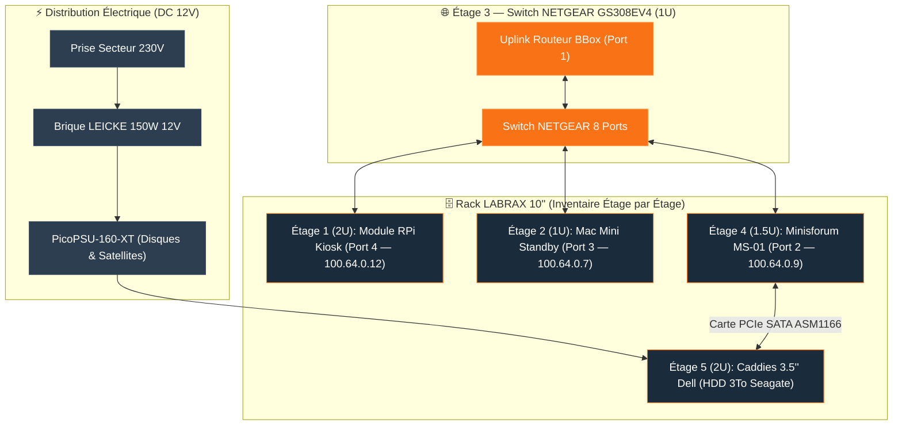

<Info>
**LABRAX** (Révision Core IMS-01) est le rack serveur physique 10 pouces 3D-printé qui héberge l'ensemble du matériel informatique IMS-WORLD. Cette page documente la vue générale du châssis, l'inventaire physique **étage par étage**, la distribution électrique et le câblage.
</Info>

## 📐 Vue Globale & Conception du Châssis 3D

<Tabs>
  <Tab title="🖼️ Face Principale 3D">
    
  </Tab>
  <Tab title="🔌 Vue Arrière & Alimentation">
    
  </Tab>
</Tabs>

### Spécifications Matérielles du Châssis & Alimentation
| Élément | Spécification & Détails |
|---|---|
| **Modèle Original 3D** | Projet [Lab Rax — A 3D Printable Modular 10" Rack System (The DIY Life)](https://the-diy-life.com/introducing-lab-rax-a-3d-printable-modular-10-rack-system/) |
| **Structure** | Châssis modulable 10" 3D-printé (PETG/PLA+ gris renforcé avec poignées supérieures) |
| **Panneaux Latéraux** | Acrylique teinté noir profond (encastré dans les fentes intérieures du plastique) |
| **Refroidissement Supérieur** | Ventilateur Noctua NF-A12x25 G2 PWM chromax.black (extraction d'air chaud par le haut) |
| **Distribution Électrique** | PicoPSU-160-XT (Entrée 12V DC) + Brique externe LEICKE 150W 12V |

---

## 🗄️ Inventaire Physique Étage par Étage (du Haut vers le Bas)

| Étage / Slot | Hauteur (U) | Équipement Physique Encastré | Connectivité & Ports | Fiche Détaillée (Vérité Terrain) |
|---|---|---|---|---|
| **Étage 1** | **2U** | Module 2U avec écran Wisecoco 7.84" LCD, OLED 0.91", bouton GPIO & RPi 3B+ | Port Switch #4 (100M) • IP `100.64.0.12` | 📺 [Raspberry Pi Kiosk](/infrastructure/rpi-monitor) |
| **Étage 2** | **1U** | Mac Mini 2014 (Slot Standby chaud) | Port Switch #3 (1G) • IP `100.64.0.7` | 🍎 [Mac Mini 2014](/infrastructure/mac-mini) |
| **Étage 3** | **1U** | Switch NETGEAR GS308EV4 (8p Gérés) + Patch Panel RJ45 12p | Ports 1 à 4 câblés • Uplink Bbox | 🔌 *(Voir câblage ci-dessous)* |
| **Étage 4** | **1.5U** | Minisforum MS-01 (Carte SATA PCIe Tbest ASM1166 6 ports) | Port Switch #2 (2.5G) • IP `100.64.0.9` | 💻 [Host Proxmox (MS-01)](/infrastructure/proxmox-host) |
| **Étage 5** | **2U** | 4-Pack Hard Drive Tray Caddy 3.5" Dell (HDD Seagate 3To) | Nappe SATA via carte PCIe MS-01 | 🗄️ [IMS-NAS (LXC 100)](/infrastructure/ims-nas) |

---

## 🔌 Interconnexion Réseau & Câblage du Switch (Étage 3)

| Port Switch NETGEAR | Équipement Raccordé | Vitesse & Câblage |
|---|---|---|
| **Port 1 (Uplink WAN)** | Routeur Bbox | RJ45 Cat 6 |
| **Port 2 (Compute)** | Minisforum MS-01 (Hyperviseur PVE) | RJ45 Cat 6 (2.5G) |
| **Port 3 (Standby)** | Mac Mini 2014 | RJ45 Cat 6 (1G) |
| **Port 4 (Kiosk)** | Raspberry Pi 3B+ (Module 2U Écran) | RJ45 Cat 6 (100M) |
| **Port SFP+** | Port SFP+ 10G | Réservé pour évolution réseau 10G |

---

## Schéma d'Architecture & Câblage Électrique / Réseau

