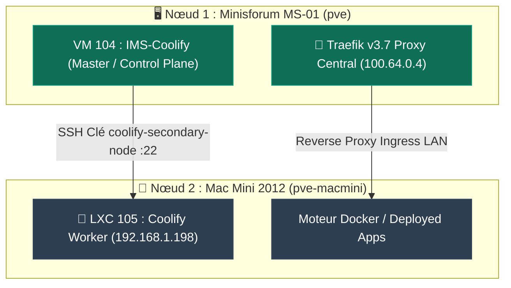

import { ips, domains } from "/snippets/variables.mdx";

<Badge color="green">🟢 Production Active (Nœud Worker Coolify v4.3.14)</Badge>

---

## Fiche Technique & Métadonnées

| Propriété | Valeur |
|---|---|
| **Hostname / Conteneur** | `pve-macmini-worker_LXC-105` (ID `105`) |
| **Hôte d'Hébergement** | Proxmox VE Nœud 2 (`pve-macmini.ims-world.fr`) |
| **OS / Distribution** | Debian 13 (Trixie) LXC Unprivileged |
| **Adresse IP LAN** | `192.168.1.198` |
| **Accès VPN / Tailnet** | Non (Réseau LAN `192.168.1.0/24` uniquement pour le moment) |
| **Accès SSH Master** | Clé publique `coolify-secondary-node` (Port 22, User `root`) |
| **Version Coolify** | `v4.3.14` |
| **Rôle dans l'Architecture** | **Nœud Worker Distant** (Moteur d'exécution Docker autonome) |
| **Statut** | <Badge color="green">🟢 Opérationnel & Enrôlé</Badge> |

---

## Architecture Multi-Nœuds Coolify

Le homelab s'appuie sur une **topologie distribuée Control Plane / Worker** :



### 1. Ingress & Routage Réseau
- Tout le trafic HTTP/HTTPS entrant (WAN et VPN Tailnet) continue d'arriver exclusivement sur le **Traefik principal de la VM 104** (`100.64.0.4`).
- Traefik réachemine ensuite les requêtes vers les conteneurs applicatifs exécutés sur le Worker LXC 105 via le réseau LAN local `192.168.1.198`.

### 2. Authentification & Enrôlement SSH
- **Clé SSH Dédiée** : Le Master VM 104 s'authentifie sur le LXC 105 via la clé publique `coolify-secondary-node`.
- **Fichier de Configuration (`/etc/ssh/sshd_config.d/01-coolify.conf`)** :
  ```text
  PermitRootLogin prohibit-password
  PubkeyAuthentication yes
  ```
- Clé inscrite dans `/root/.ssh/authorized_keys` avec les permissions strictes `600`.

---

## 🧹 Optimisation & Nettoyage de la RAM du Worker

Le conteneur LXC 105 étant un simple **nœud d'exécution distant**, l'interface d'administration autonome instanciée par le script `install.sh` a été arrêtée et supprimée pour libérer la mémoire RAM DDR3 du Mac Mini :

```bash
# Arrêt et suppression des services d'IHM autonome inutiles sur le Worker
docker stop coolify coolify-db coolify-realtime
docker rm coolify coolify-db coolify-realtime
```

<Info>
**Conteneurs Conservés sur le Worker** :
Seul le moteur Docker Engine et le conteneur local `coolify-proxy` (Traefik d'exécution) restent actifs sur `192.168.1.198` pour assurer le relais local des applications déployées.
</Info>
