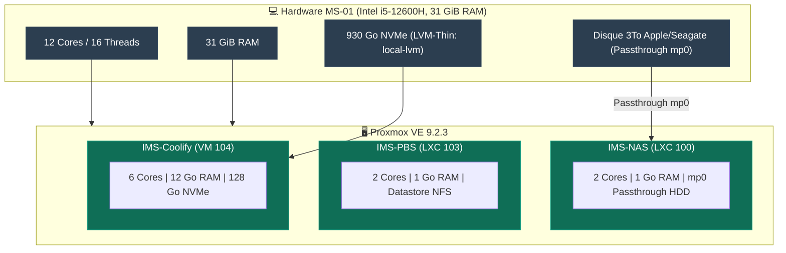
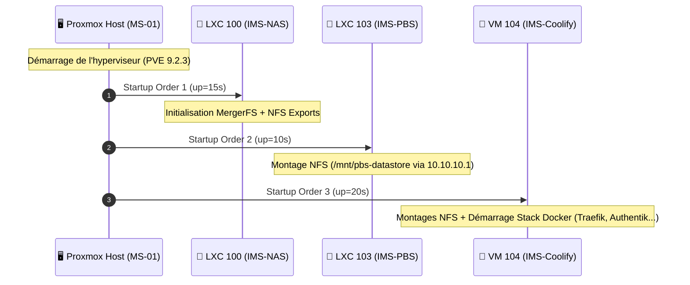

import { ips, hardware } from "/snippets/variables.mdx";

<Badge color="green">🟢 Production Active (Hyperviseur Principal)</Badge>

## Fiche matériel

| Propriété | Valeur |
|---|---|
| **Modèle** | Minisforum MS-01 |
| **CPU** | {hardware.ms01Cpu} (iGPU Iris Xe intégrée) |
| **RAM** | {hardware.ms01Ram} |
| **Stockage NVMe** | {hardware.ms01Storage} (LVM-Thin `local-lvm`) |
| **OS** | Proxmox VE 9.2.3 |
| **Accès Admin GUI** | `https://{ips.pveLan}:8006` |
| **Comptes** | `cmolotkoff@pam` (nominatif), `root@pam` en break-glass local |

## Topologie Matérielle & Allocation



<Warning>
Le firewall Proxmox 3 niveaux (node → datacenter → VM) n'est **pas encore configuré**. À faire avant toute exposition publique supplémentaire. Ordre impératif : règles niveau nœud d'abord, vérifier l'accès GUI+SSH immédiatement après activation, garder la console web ouverte pendant l'opération.
</Warning>

## Repos APT

Le format `deb822` (`.sources`) est utilisé sur PVE9, pas l'ancien `pve-enterprise.list` :

```bash
# /etc/apt/sources.list.d/pve-enterprise.sources → Enabled: false
# /etc/apt/sources.list.d/proxmox.sources → pve-no-subscription, Enabled: true
```

## Guests hébergés

| VMID | Nom | Type | Statut | Rôle |
|---|---|---|---|---|
| **100** | ims-nas | LXC privilégié | <Badge color="green">🟢 Actif</Badge> | Stockage NFS/SMB |
| **103** | ims-pbs | LXC privilégié | <Badge color="green">🟢 Actif</Badge> | Sauvegardes |
| **104** | ims-coolify | VM | <Badge color="green">🟢 Actif</Badge> | Orchestration Docker |
| **101** | vm-test | VM | <Badge color="gray">⚪ Non utilisé</Badge> | Test, non utilisé en prod |
| **102** | ims-windows | VM | <Badge color="gray">⚪ Inactif</Badge> | Environnement Windows |
| **9000** | ubuntu-2404-template | Template | <Badge color="blue">🔵 Template</Badge> | Base pour clonage de VM Ubuntu |

## Autostart et ordre de boot



<Check>
Validé par un reboot complet réel du host — les trois guests de production redémarrent automatiquement dans le bon ordre.
</Check>

```bash
# NAS en premier (les autres en dépendent via NFS)
pct set 100 -onboot 1 -startup order=1,up=15

# PBS ensuite
pct set 103 -onboot 1 -startup order=2,up=10

# Coolify en dernier
qm set 104 --onboot 1 --startup order=3,up=20
```

## Monitoring bas niveau & Mise en veille HDD (hd-idle)

<Warning>
**Tout outil nécessitant un accès device bloc direct (ioctl ATA/SCSI) doit tourner sur le host, jamais dans un LXC avec passthrough mountpoint.** Le passthrough (`mp0`) donne accès au filesystem monté, pas au device brut. Concerne `smartd` et `hd-idle` — voir [Dépannage courant](/procedures/depannage-courant) pour le détail complet de cette découverte.
</Warning>

### Configuration hd-idle (Timeout 30 minutes)

Le daemon **`hd-idle`** s'exécute directement sur l'hyperviseur MS-01 afin de placer le disque dur Seagate 3To du NAS en veille mécanique (spin-down) après **30 minutes d'inactivité** I/O.

- Fichier de configuration sur le host : `/etc/default/hd-idle`
- Option activée : `HD_IDLE_OPTS="-i 1800 -a /dev/disk/by-id/ata-APPLE_HDD_ST3000DM001_Z1F3N0NZ"`

```bash
# Vérifier l'état d'exécution des services hd-idle et smartd sur le host
systemctl status hd-idle smartd --no-pager

# Contrôler l'état de veille en temps réel (doit afficher "drive state is: standby" après 30min d'inactivité)
hdparm -C /dev/disk/by-id/ata-APPLE_HDD_ST3000DM001_Z1F3N0NZ

# Vérifier le bilan de santé SMART
smartctl -H /dev/disk/by-id/ata-APPLE_HDD_ST3000DM001_Z1F3N0NZ
```

## GPU (iGPU Iris Xe) — Passthrough VM Coolify

L'iGPU Intel Iris Xe du processeur i5-12600H est attribuée en passthrough PCIe (`hostpci0`) à la VM IMS-Coolify (VM 104). Voir l'[ADR-008 — Passthrough GPU (iGPU Iris Xe)](/history/adr/adr-008-passthrough-gpu-igpu-iris-xe) pour le détail complet de la mise en place (IOMMU, VFIO, chipset q35, drivers).

### Statut de Validation des Services Applicatifs
- **[HomeFlix / Jellyfin](/services/homeflix#accélération-matérielle-gpu-intel-quicksync-qsv--validé)** : <Badge color="green">🟢 Validé en Production (29.7x)</Badge> — QuickSync QSV opérationnel (`hevc_qsv` / `h264_qsv`), transcodage à 29.7x le temps réel.
- **[PhotoPrism](/services/photoprism#accélération-gpu-ffmpeg--statut-transcodage-igpu-iris-xe)** : <Badge color="orange">⚠️ Transcodage Vidéo Partiel</Badge> — Variable `PHOTOPRISM_INIT: 'intel tensorflow'` requise pour installer les paquets VA-API/QSV (évite la retombée sur `libx264` CPU).
- **[Immich](/services/immich#décision-darchitecture--accélération-gpu--openvino-ia--smart-search)** : <Badge color="gray">⚙️ Écarté (Maintien CPU)</Badge> — Support OpenVINO écarté pour éviter la complexité de stack, l'indexation initiale du stock photo (61 880 assets) étant déjà achevée.
