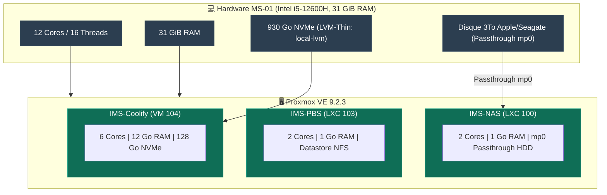
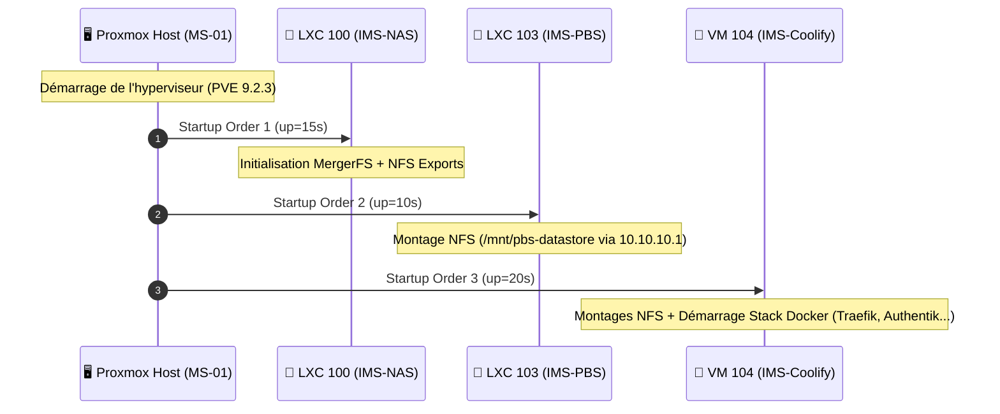

import { ips, hardware } from "/snippets/variables.mdx";

<Badge color="green">🟢 Production Active (Hyperviseur Principal)</Badge>

## Fiche matériel

| Propriété | Valeur |
|---|---|
| **Modèle** | Minisforum MS-01 |
| **CPU** | {hardware.ms01Cpu} (iGPU Iris Xe intégrée) |
| **RAM** | {hardware.ms01Ram} |
| **Stockage NVMe** | {hardware.ms01Storage} (LVM-Thin `local-lvm`) |
| **OS** | Proxmox VE 9.2.3 |
| **Accès Admin GUI** | `https://{ips.pveLan}:8006` |
| **Comptes** | `cmolotkoff@pam` (nominatif), `root@pam` en break-glass local |

## Topologie Matérielle & Allocation

<Frame caption="Architecture matérielle et répartition des ressources du Minisforum MS-01">

</Frame>

<Warning>
Le firewall Proxmox 3 niveaux (node → datacenter → VM) n'est **pas encore configuré**. À faire avant toute exposition publique supplémentaire. Ordre impératif : règles niveau nœud d'abord, vérifier l'accès GUI+SSH immédiatement après activation, garder la console web ouverte pendant l'opération.
</Warning>

## Repos APT

Le format `deb822` (`.sources`) est utilisé sur PVE9, pas l'ancien `pve-enterprise.list` :

```bash
# /etc/apt/sources.list.d/pve-enterprise.sources → Enabled: false
# /etc/apt/sources.list.d/proxmox.sources → pve-no-subscription, Enabled: true
```

## Guests hébergés

| VMID | Nom | Type | Statut | Rôle |
|---|---|---|---|---|
| **100** | ims-nas | LXC privilégié | <Badge color="green">🟢 Actif</Badge> | Stockage NFS/SMB |
| **103** | ims-pbs | LXC privilégié | <Badge color="green">🟢 Actif</Badge> | Sauvegardes |
| **104** | ims-coolify | VM | <Badge color="green">🟢 Actif</Badge> | Orchestration Docker |
| **101** | vm-test | VM | <Badge color="gray">⚪ Non utilisé</Badge> | Test, non utilisé en prod |
| **102** | ims-windows | VM | <Badge color="gray">⚪ Inactif</Badge> | Environnement Windows |
| **9000** | ubuntu-2404-template | Template | <Badge color="blue">🔵 Template</Badge> | Base pour clonage de VM Ubuntu |

## Autostart et ordre de boot

<Frame caption="Séquence d'initialisation automatique au démarrage de l'hyperviseur">

</Frame>

<Check>
Validé par un reboot complet réel du host — les trois guests de production redémarrent automatiquement dans le bon ordre.
</Check>

```bash
# NAS en premier (les autres en dépendent via NFS)
pct set 100 -onboot 1 -startup order=1,up=15

# PBS ensuite
pct set 103 -onboot 1 -startup order=2,up=10

# Coolify en dernier
qm set 104 --onboot 1 --startup order=3,up=20
```

## Monitoring bas niveau — contrainte importante

<Warning>
**Tout outil nécessitant un accès device bloc direct (ioctl ATA/SCSI) doit tourner sur le host, jamais dans un LXC avec passthrough mountpoint.** Le passthrough (`mp0`) donne accès au filesystem monté, pas au device brut. Concerne `smartd` et `hd-idle` — voir [Dépannage courant](/procedures/depannage-courant) pour le détail complet de cette découverte.
</Warning>

```bash
# smartd et hd-idle tournent tous les deux sur le HOST, ciblant le disque NAS
systemctl status smartd hd-idle --no-pager
smartctl -H /dev/disk/by-id/ata-APPLE_HDD_ST3000DM001_Z1F3N0NZ
hdparm -C /dev/disk/by-id/ata-APPLE_HDD_ST3000DM001_Z1F3N0NZ   # doit passer "standby" après 30min d'inactivité
```

## GPU (iGPU Iris Xe) — Passthrough VM Coolify

L'iGPU Intel Iris Xe du processeur i5-12600H est attribuée en passthrough PCIe (`hostpci0`) à la VM IMS-Coolify (VM 104) pour assurer le transcodage matériel QuickSync (H.264/HEVC/AV1) du serveur média [HomeFlix](/services/homeflix) (Jellyfin).
