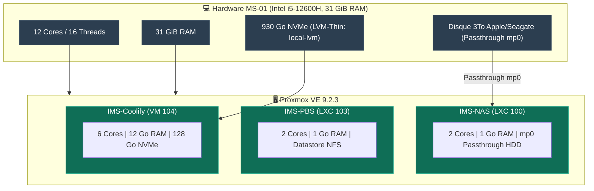
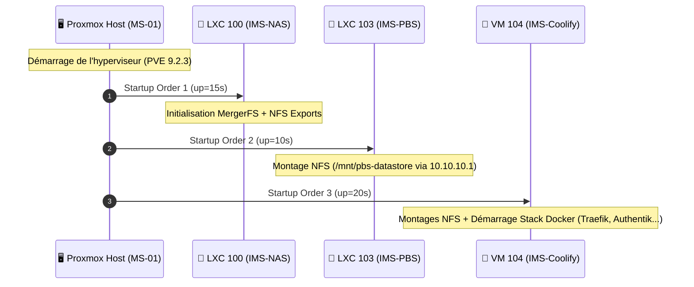

## Fiche matériel

| Propriété | Valeur |
|---|---|
| **Modèle** | Minisforum MS-01 |
| **CPU** | Intel i5-12600H (iGPU Iris Xe intégrée, non exploitée actuellement) |
| **RAM** | 31 Gi disponibles |
| **Stockage NVMe** | ~930 Go, LVM-Thin (`local-lvm`, ~793 Go utilisables) |
| **OS** | Proxmox VE 9.2.3 |
| **Accès admin** | `cmolotkoff@pam` (compte nominatif), `root@pam` en break-glass local uniquement |

## Topologie Matérielle & Allocation



<Warning>
Le firewall Proxmox 3 niveaux (node → datacenter → VM) n'est **pas encore configuré**. À faire avant toute exposition publique supplémentaire. Ordre impératif : règles niveau nœud d'abord, vérifier l'accès GUI+SSH immédiatement après activation, garder la console web ouverte pendant l'opération.
</Warning>

## Repos APT

Le format `deb822` (`.sources`) est utilisé sur PVE9, pas l'ancien `pve-enterprise.list` :

```bash
# /etc/apt/sources.list.d/pve-enterprise.sources → Enabled: false
# /etc/apt/sources.list.d/proxmox.sources → pve-no-subscription, Enabled: true
```

## Guests hébergés

| VMID | Nom | Type | Rôle |
|---|---|---|---|
| 100 | ims-nas | LXC privilégié | Stockage NFS/SMB |
| 103 | ims-pbs | LXC privilégié | Sauvegardes |
| 104 | ims-coolify | VM | Orchestration Docker |
| 101 | vm-test | VM | Test, non utilisé en prod |
| 102 | ims-windows | VM | Environnement Windows |
| 9000 | ubuntu-2404-template | Template | Base pour clonage de VM Ubuntu |

## Autostart et ordre de boot



<Check>
Validé par un reboot complet réel du host — les trois guests de production redémarrent automatiquement dans le bon ordre.
</Check>

```bash
# NAS en premier (les autres en dépendent via NFS)
pct set 100 -onboot 1 -startup order=1,up=15

# PBS ensuite
pct set 103 -onboot 1 -startup order=2,up=10

# Coolify en dernier
qm set 104 --onboot 1 --startup order=3,up=20
```

## Monitoring bas niveau — contrainte importante

<Warning>
**Tout outil nécessitant un accès device bloc direct (ioctl ATA/SCSI) doit tourner sur le host, jamais dans un LXC avec passthrough mountpoint.** Le passthrough (`mp0`) donne accès au filesystem monté, pas au device brut. Concerne `smartd` et `hd-idle` — voir [Dépannage courant](/procedures/depannage-courant) pour le détail complet de cette découverte.
</Warning>

```bash
# smartd et hd-idle tournent tous les deux sur le HOST, ciblant le disque NAS
systemctl status smartd hd-idle --no-pager
smartctl -H /dev/disk/by-id/ata-APPLE_HDD_ST3000DM001_Z1F3N0NZ
hdparm -C /dev/disk/by-id/ata-APPLE_HDD_ST3000DM001_Z1F3N0NZ   # doit passer "standby" après 30min d'inactivité
```

## GPU (iGPU Iris Xe) — non exploité

Passthrough prévu pour le transcodage matériel Jellyfin (HomeFlix), volontairement différé. Nécessite :
1. Activation IOMMU (BIOS + kernel cmdline `intel_iommu=on`) — **reboot host requis**
2. Ajout `hostpci0` dans la config de la VM cible
3. Installation des drivers i965/intel media dans le guest

<Card title="Suivi de cette tâche" icon="microchip" href="/services/homeflix#gpu-passthrough">
  Voir HomeFlix pour le contexte d'usage.
</Card>
