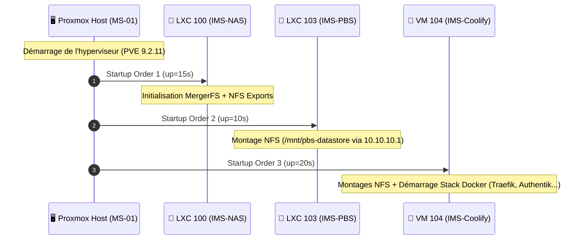

import { ips, hardware } from "/snippets/variables.mdx";

<Badge color="green">🟢 Production Active (Hyperviseur Principal)</Badge>

## Fiche matériel

| Propriété | Valeur |
| --- | --- |
| **Modèle** | Minisforum MS-01 |
| **CPU** | {hardware.ms01Cpu} (iGPU Iris Xe intégrée) |
| **RAM** | {hardware.ms01Ram} |
| **Stockage NVMe** | {hardware.ms01Storage} (LVM-Thin `local-lvm`) |
| **Disques SATA** | HDD 3To Apple/Seagate (Passthrough `mp0`) \+ SSD 4To (Passthrough `mp1` — `storage-hot`) |
| **OS** | **Proxmox VE 9.2.11** (Aligné avec Mac Mini) |
| **Cluster Proxmox** | Leader Nœud 1 du cluster **`ims-cluster`** (2/2 votes, Quorate: Yes) |
| **Accès Admin GUI** | `https://`{ips.pveLan}`:8006` |
| **Comptes** | `cmolotkoff@pam` (nominatif), `root@pam` en break-glass local |

## Topologie Matérielle & Allocation

```mermaid
graph TD
    subgraph HW ["💻 Hardware MS-01 (Intel i5-12600H, 31 GiB RAM)"]
        CPU["12 Cores / 16 Threads"]
        RAM["31 GiB RAM"]
        NVME["930 Go NVMe (LVM-Thin: local-lvm)"]
        HDD["HDD 3To SATA Apple/Seagate (Passthrough mp0)"]
        SSD["SSD 4To SATA (Passthrough mp1 — storage-hot)"]
    end

    subgraph PVE ["🖥️ Proxmox VE 9.2.11 (pve — Nœud 1 Cluster ims-cluster)"]
        subgraph LXC100 ["IMS-NAS (LXC 100)"]
            NAS_RES["2 Cores | 1 Go RAM | mp0 HDD + mp1 SSD 4To"]
        end
        subgraph LXC103 ["IMS-PBS (LXC 103)"]
            PBS_RES["2 Cores | 1 Go RAM | Datastore NFS"]
        end
        subgraph VM104 ["IMS-Coolify (VM 104)"]
            COOL_RES["6 Cores | 18 Go RAM | 128 Go NVMe"]
        end
    end

    CPU --> PVE
    RAM --> PVE
    NVME --> VM104
    HDD -->|Passthrough mp0 (SATA)| LXC100
    SSD -->|Passthrough mp1 (SATA)| LXC100

    classDef hw fill:#2c3e50,stroke:#34495e,color:#fff;
    classDef vm fill:#0F6E56,stroke:#16A085,color:#fff;
    class CPU,RAM,NVME,HDD,SSD hw;
    class LXC100,LXC103,VM104 vm;
```

<Warning>
  Le firewall Proxmox 3 niveaux (node → datacenter → VM) n'est **pas encore configuré**. À faire avant toute exposition publique supplémentaire. Ordre impératif : règles niveau nœud d'abord, vérifier l'accès GUI\+SSH immédiatement après activation, garder la console web ouverte pendant l'opération.
</Warning>

## Repos APT

Le format `deb822` (`.sources`) est utilisé sur PVE9, pas l'ancien `pve-enterprise.list` :

```bash
# /etc/apt/sources.list.d/pve-enterprise.sources → Enabled: false
# /etc/apt/sources.list.d/proxmox.sources → pve-no-subscription, Enabled: true
```

## Guests hébergés

| VMID | Nom | Type | Statut | Rôle |
| --- | --- | --- | --- | --- |
| **100** | ims-nas | LXC privilégié | <Badge color="green">🟢 Actif</Badge> | Stockage NFS/SMB |
| **103** | ims-pbs | LXC privilégié | <Badge color="green">🟢 Actif</Badge> | Sauvegardes |
| **104** | ims-coolify | VM | <Badge color="green">🟢 Actif</Badge> | Orchestration Docker |
| **101** | vm-test | VM | <Badge>⚪ Non utilisé</Badge> | Test, non utilisé en prod |
| **102** | ims-windows | VM | <Badge>⚪ Inactif</Badge> | Environnement Windows |
| **8000** | ubuntu-2404-template | Template | <Badge color="blue">🔵 Template</Badge> | Base pour clonage de VM Ubuntu avec Tailscale automatique |

## Template de VM Ubuntu 24.04 (VMID 8000) & automatisation Tailscale

Le template **`ubuntu-2404-template`** (VMID `8000`) sert de base standardisée pour déployer rapidement de nouvelles machines virtuelles Linux sur le cluster Proxmox VE. Il intègre une image officielle Ubuntu Cloud Image, les pilotes VirtIO, l'agent QEMU et l'enrôlement automatique sur le réseau VPN privé Headscale.

### Caractéristiques du template

- **Image source** : Ubuntu 24.04 LTS (*Noble Numbat*) Cloud Image (`noble-server-cloudimg-amd64.img`).
- **Stockage disque** : Disque SCSI VirtIO sur `local-lvm` avec option `discard=on` (trim SSD).
- **Interface réseau** : Pont virtuel `vmbr0` en mode VirtIO avec bail DHCP.
- **Observabilité hyperviseur** : Agent QEMU Guest (`qemu-guest-agent`) préconfiguré pour remonter les adresses IP et l'état de santé dans Proxmox VE.
- **Accès système initial** : Utilisateur d'administration `cmolotkoff` avec injection de clé SSH publique et privilèges `sudo` sans mot de passe.

### Mécanisme d'automatisation Tailscale (Cloud-Init vendor-data)

L'enrôlement réseau de chaque VM clonée s'effectue automatiquement dès son tout premier démarrage grâce au mécanisme **Cloud-Init vendor-data**.

<Important>
  **Utilisez toujours `vendor-data` et jamais `user-data` pour les personnalisations Proxmox.**  
  Proxmox VE utilise nativement `user-data` pour configurer le nom d'hôte, l'utilisateur et les clés SSH. Si vous écrasez `user-data`, vous cassez l'injection native des identifiants et des accès Proxmox. Le fichier `vendor-data` s'exécute en complément sans interférer avec la configuration de base.
</Important>

Le snippet `/var/lib/vz/snippets/vendor-data.yaml` contient les instructions d'amorçage :

```yaml
#cloud-config
package_update: true
package_upgrade: true

packages:
  - curl
  - qemu-guest-agent

runcmd:
  - systemctl enable --now qemu-guest-agent
  - curl -fsSL https://tailscale.com/install.sh | sh
  - |
    tailscale up \
      --authkey="HEADSCALE_PREAUTH_KEY" \
      --login-server="https://vpn.ims-world.fr" \
      --accept-dns=false \
      --hostname="$(hostname)"
```

Au boot :
1. Cloud-Init démarre et met à jour les dépôts de paquets.
2. Il active le démon `qemu-guest-agent`.
3. Il télécharge et installe le client officiel Tailscale.
4. Il connecte automatiquement la machine au serveur Headscale (`https://vpn.ims-world.fr`) avec la Pre-Auth Key d'infrastructure et le nom de la machine.
5. La nouvelle VM apparaît immédiatement connectée sur Headscale avec son IP `100.64.0.x`.

### Procédure de clonage rapide

Depuis le shell root de Proxmox VE (ou via SSH sur le MS-01) :

```bash
# 1. Cloner le template 8000 vers un nouvel identifiant VMID
qm clone 8000 <NOUVEAU_VMID> --name "<nom-de-la-vm>" --full --storage local-lvm

# 2. Associer le snippet Cloud-Init vendor-data
qm set <NOUVEAU_VMID> --cicustom "vendor=local:snippets/vendor-data.yaml"

# 3. Ajuster les ressources matérielles (CPU, RAM)
qm set <NOUVEAU_VMID> --memory 2048 --cores 2

# 4. Démarrer la nouvelle machine virtuelle
qm start <NOUVEAU_VMID>
```

Patientez environ 60 secondes. La machine sera joignable directement par SSH sur son adresse Tailscale :

```bash
ssh cmolotkoff@<nom-de-la-vm>.ims-world.fr
```

## Autostart et ordre de boot


```mermaid
sequenceDiagram
    autonumber
    participant Host as 🖥️ Proxmox Host (MS-01)
    participant NAS as 📁 LXC 100 (IMS-NAS)
    participant PBS as 💾 LXC 103 (IMS-PBS)
    participant Coolify as 🚀 VM 104 (IMS-Coolify)

    Note over Host: Démarrage de l'hyperviseur (PVE 9.2.11)
    Host->>NAS: Startup Order 1 (up=15s)
    Note over NAS: Initialisation MergerFS + NFS Exports
    Host->>PBS: Startup Order 2 (up=10s)
    Note over PBS: Montage NFS (/mnt/pbs-datastore via 10.10.10.1)
    Host->>Coolify: Startup Order 3 (up=20s)
    Note over Coolify: Montages NFS + Démarrage Stack Docker (Traefik, Authentik...)
```

<Check>
  Validé par un reboot complet réel du host — les trois guests de production redémarrent automatiquement dans le bon ordre.
</Check>

```bash
# NAS en premier (les autres en dépendent via NFS)
pct set 100 -onboot 1 -startup order=1,up=15

# PBS ensuite
pct set 103 -onboot 1 -startup order=2,up=10

# Coolify en dernier
qm set 104 --onboot 1 --startup order=3,up=20
```

## Monitoring bas niveau & Mise en veille HDD (hd-idle)

<Warning>
  **Tout outil nécessitant un accès device bloc direct (ioctl ATA/SCSI) doit tourner sur le host, jamais dans un LXC avec passthrough mountpoint.** Le passthrough (`mp0`) donne accès au filesystem monté, pas au device brut. Concerne `smartd` et `hd-idle` — voir [Dépannage courant](/procedures/depannage-courant) pour le détail complet de cette découverte.
</Warning>

### Configuration hd-idle (Timeout 30 minutes)

Le daemon **`hd-idle`** s'exécute directement sur l'hyperviseur MS-01 afin de placer le disque dur Seagate 3To du NAS en veille mécanique (spin-down) après **30 minutes d'inactivité** I/O.

- Fichier de configuration sur le host : `/etc/default/hd-idle`
- Option activée : `HD_IDLE_OPTS="-i 1800 -a /dev/disk/by-id/ata-APPLE_HDD_ST3000DM001_Z1F3N0NZ"`

```bash
# Vérifier l'état d'exécution des services hd-idle et smartd sur le host
systemctl status hd-idle smartd --no-pager

# Contrôler l'état de veille en temps réel (doit afficher "drive state is: standby" après 30min d'inactivité)
hdparm -C /dev/disk/by-id/ata-APPLE_HDD_ST3000DM001_Z1F3N0NZ

# Vérifier le bilan de santé SMART
smartctl -H /dev/disk/by-id/ata-APPLE_HDD_ST3000DM001_Z1F3N0NZ
```

## GPU (iGPU Iris Xe) — Passthrough VM Coolify

L'iGPU Intel Iris Xe du processeur i5-12600H est attribuée en passthrough PCIe (`hostpci0`) à la VM IMS-Coolify (VM 104). Voir l'[ADR-008 — Passthrough GPU (iGPU Iris Xe)](/history/adr/adr-008-passthrough-gpu-igpu-iris-xe) pour le détail complet de la mise en place (IOMMU, VFIO, chipset q35, drivers).

### Statut de Validation des Services Applicatifs

- [**HomeFlix / Jellyfin**](/services/homeflix#accélération-matérielle-gpu-intel-quicksync-qsv--validé) : <Badge color="green">🟢 Validé en Production (29.7x)</Badge> — QuickSync QSV opérationnel (`hevc_qsv` / `h264_qsv`), transcodage à 29.7x le temps réel.
- [**PhotoPrism**](/services/photoprism#accélération-gpu-ffmpeg--statut-transcodage-igpu-iris-xe) : <Badge color="orange">⚠️ Transcodage Vidéo Partiel</Badge> — Variable `PHOTOPRISM_INIT: 'intel tensorflow'` requise pour installer les paquets VA-API/QSV (évite la retombée sur `libx264` CPU).
- [**Immich**](/services/immich#décision-darchitecture--accélération-gpu--openvino-ia--smart-search) : <Badge>⚙️ Écarté (Maintien CPU)</Badge> — Support OpenVINO écarté pour éviter la complexité de stack, l'indexation initiale du stock photo (61 880 assets) étant déjà achevée.

---

## 🛡️ Sécurité & Protection Host Bare-Metal (Fail2ban & Ntfy)

Le service **Fail2ban** (`fail2ban.service`) est déployé et harmonisé sur l'hôte physique MS-01, le Mac Mini (`pve-macmini`) et la VM Coolify (`ims-coolify`). Il intercepte les tentatives d'intrusion SSH et bloque les IPs malveillantes via `iptables` / `nftables`.

<Info>
  **Architecture Harmonisée (3 Hôtes)** : Fail2ban s'exécute sur 3 instances indépendantes (MS-01, Mac Mini, VM Coolify). Chaque hôte utilise `/etc/fail2ban/jail.local` avec escalade de ban progressive (`1h` à `1 semaine`), prison `recidive` (3 bans en 24h ➔ 1 semaine) et alertes instantanées transmises au topic Ntfy **`ims-alerts`** avec un jeton d'accès scopé.
</Info>

### Commandes CLI Usuelles d'Administration

```bash
# Vérifier le statut du service Fail2ban et les prisons actives (sshd + recidive)
sudo systemctl status fail2ban
sudo fail2ban-client status

# Inspecter les adresses IP actuellement bannies sur la prison SSH ou récidive
sudo fail2ban-client status sshd
sudo fail2ban-client status recidive

# Débannir manuellement une adresse IP (ex: auto-ban accidentel)
sudo fail2ban-client set sshd unbanip <ADRESSE_IP>
sudo fail2ban-client set recidive unbanip <ADRESSE_IP>
```
