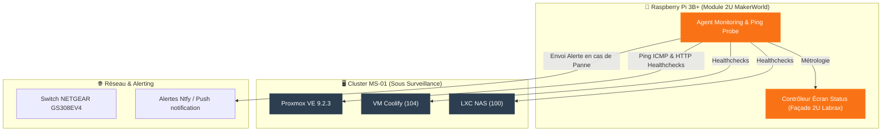

<Note>
🍓 **Type d'Instance** : **Sonde Physique Indépendante** (Raspberry Pi 3B+ ARMv8) — Système de monitoring externe fonctionnant hors de l'hyperviseur Proxmox.
</Note>

## Rôle & Emplacement

<Info>
Le **Raspberry Pi 3B+** est une sonde de surveillance autonome intégrée au rack [Labrax](/infrastructure/labrax). Son rôle est d'assurer un **monitoring matériel hors-bande** et de piloter le module d'écran de statut LCD encastré en façade du rack.
</Info>

## Conception 3D du Module d'Écran

<Card title="Module 3D MakerWorld — Raspberry Pi 2U" icon="cube" href="https://makerworld.com/fr/models/2233953-screen-module-for-10-inch-rack-raspberry-pi-2u#profileId-2521672">
  Module d'intégration 2U personnalisé pour rack 10 pouces (**Screen module for 10-inch rack - Raspberry Pi 2U**). Héberge l’écran LCD de contrôle et le Raspberry Pi 3B+ directement dans la structure du rack [Labrax](/infrastructure/labrax).
</Card>

## Fiche Technique

| Propriété | Valeur |
|---|---|
| **Matériel** | Raspberry Pi 3B+ (Broadcom BCM2837B0 quad-core 1.4GHz) |
| **Module 3D** | [Screen module for 10-inch rack 2U (MakerWorld #2233953)](https://makerworld.com/fr/models/2233953-screen-module-for-10-inch-rack-raspberry-pi-2u#profileId-2521672) |
| **Format Rack** | 2U (Rack 10 pouces) |
| **Mémoire RAM** | 1 Go LPDDR2 |
| **OS** | Raspberry Pi OS Lite (64-bit) |
| **Réseau LAN** | Ethernet RJ45 `192.168.1.x` (100Mbps) |
| **Affichage** | Écran LCD de statut frontal encastré |
| **Alimentation** | Micro-USB via le bus 5V interne / PicoPSU |
| **Statut** | 🟢 Production (Actif) |

## Fonctionnalités & Avantages Hors-Bande

<CardGroup cols={2}>
  <Card title="Monitoring Hors-Bande" icon="heart-pulse">
    Fonctionne de façon 100% indépendante du serveur principal MS-01. Continue de surveiller le réseau et d'alerter même si Proxmox ou le NAS est éteint/en reboot.
  </Card>
  <Card title="Pilote d'Écran Frontal 2U" icon="display">
    Pilote l'affichage physique du logo **IMS** et les télémétries de température / charge intégrées au module 2U du rack [Labrax](/infrastructure/labrax).
  </Card>
</CardGroup>

## Schéma d'Indépendance du Monitoring

## Intégration dans le Rack Labrax

<Tip>
Le module d'écran 2U est directement vissé sur les rails du rack [Labrax](/infrastructure/labrax), sous le ventilateur Noctua Industrial PPC, et affiche l'état d'activité du cluster en temps réel.
</Tip>
