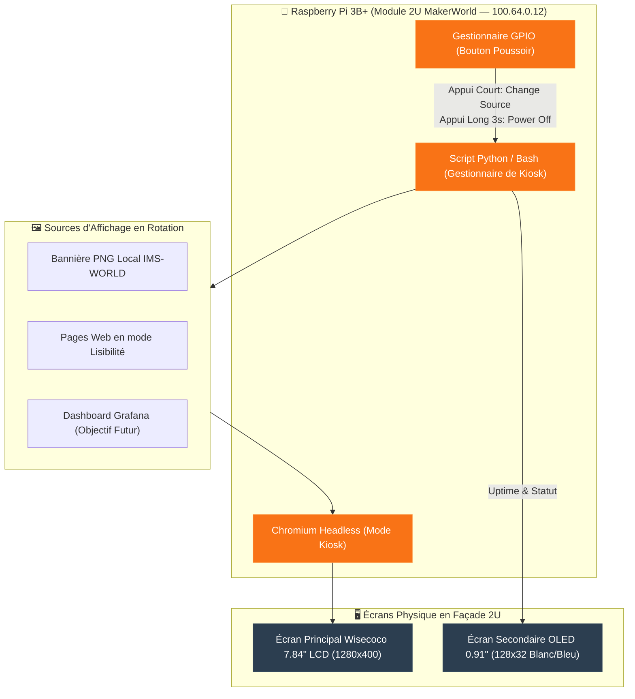

<Note>
🍓 **Type d'Instance** : **Afficheur Kiosk Physique** (Raspberry Pi 3B+ ARMv8 — IP Tailscale `100.64.0.12`) — Module d'affichage passif 2U intégré au rack [Labrax](/infrastructure/labrax).
</Note>

## Rôle & Fonctionnement Réel

<Info>
Le **Raspberry Pi 3B+** est une unité d'affichage physique dédiée. Contrairement à une sonde de monitoring actif (pas de healthchecks ICMP/HTTP ni d'alertes Ntfy configurés actuellement), son rôle est de piloter l'affichage visuel en façade du rack [Labrax](/infrastructure/labrax) via un **navigateur web headless en mode kiosk**.
</Info>

### Contrôle Physique par Bouton Poussoir
Un bouton poussoir raccordé aux GPIOs du Raspberry Pi permet d'interagir directement sans clavier :
- 🔘 **Appui court** : Basculer vers la source d'affichage suivante (rotation).
- ⏹️ **Appui long (3 secondes)** : Éteindre l'écran principal.

---

## Conception 3D & Matériel du Module 2U

<Card title="Module 3D MakerWorld — Raspberry Pi 2U" icon="cube" href="https://makerworld.com/fr/models/2233953-screen-module-for-10-inch-rack-raspberry-pi-2u#profileId-2521672">
  Module d'intégration 2U personnalisé pour rack 10 pouces (**Screen module for 10-inch rack - Raspberry Pi 2U**). Héberge les 2 écrans, le bouton poussoir de contrôle, 2 ports RJ45 Keystones et le Raspberry Pi 3B+.
</Card>

<Tabs>
  <Tab title="🖼️ Face Principale (Façade 2U & Vitre)">
    
  </Tab>
  <Tab title="📐 Vue Isométrique 3D & Intérieur Tray">
    
  </Tab>
</Tabs>

## Fiche Technique des Écrans

| Composant / Écran | Spécifications | Usage Actuel & Prévu |
|---|---|---|
| **Écran Principal** | **Wisecoco 7.84 pouces LCD** (Résolution `1280x400`) | Rotation entre bannière PNG IMS et sites web en mode lisibilité. *(Prévu : Dashboard Grafana)* |
| **Écran Secondaire** | **Module OLED 0.91 pouces** (`128x32`, affichage blanc/bleu) | Affichage direct des métriques de statut et uptime. |
| **Carte Mère** | Raspberry Pi 3B+ (Broadcom BCM2837B0 quad-core 1.4GHz, 1 Go RAM) | Exécute le script de rotation et le navigateur Chromium headless. |
| **Bouton de Contrôle** | Bouton poussoir GPIO avec LED | Appui court = Change source / Appui long 3s = Éteint l'écran. |
| **Réseau & Tailnet** | Ethernet RJ45 + Client Tailscale (`100.64.0.12`) | Hostname Tailnet: `ims-rpi-monitor` |
| **Statut** | 🟢 Production (Affichage Kiosk) | |

---

## Schéma d'Architecture d'Affichage Kiosk

