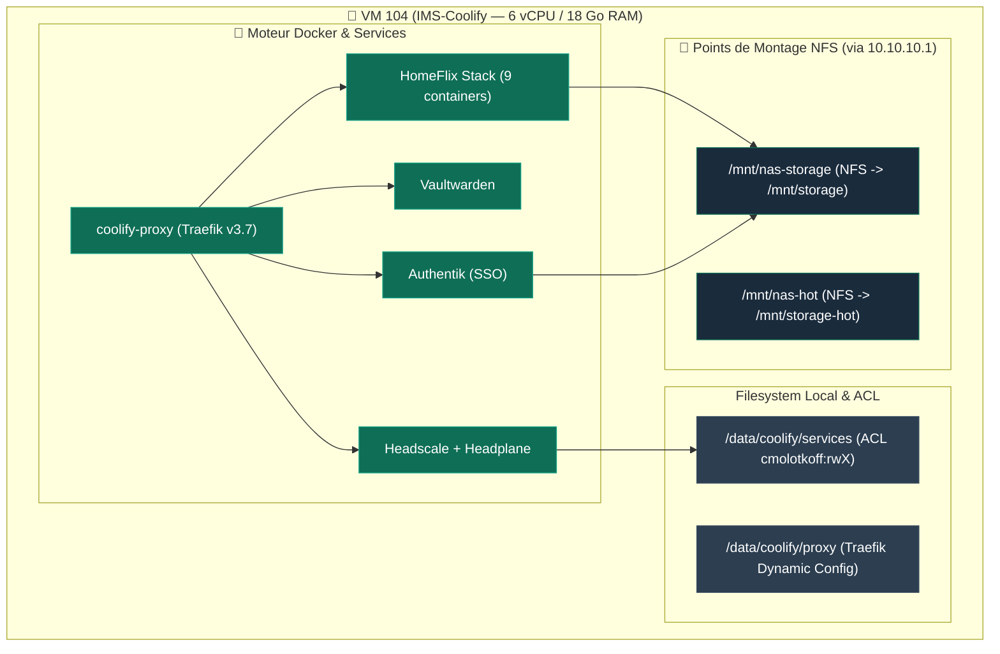

<Badge color="green">🟢 Production Active (VM 104)</Badge>

<Note>
🖥️ **Type d'Instance** : **Machine Virtuelle QEMU/KVM 104** (Ubuntu 24.04 LTS) — Isolation complète du noyau avec hyperviseur dédié et kernel propre.
</Note>

## Rôle

Héberge Coolify et l'ensemble de la stack applicative (Authentik, Vaultwarden, HomeFlix, Headscale, etc). C'est le point d'entrée de production principal de l'infrastructure.

## Fiche technique

| Propriété | Valeur |
|---|---|
| **VMID** | 104 |
| **OS** | Ubuntu 24.04 LTS (clonée depuis template `9000`) |
| **CPU / RAM** | 6 cores (mode CPU `host` — `x86-64-v2`) / 18 Go RAM |
| **Disque** | 128 Go NVMe |
| **Réseau** | `vmbr0` (192.168.1.52/24) + `vmbr1` (10.10.10.2/24) + client Tailscale dédié |
| **Version Coolify** | `v4.3.9` |
| **Statut** | <Badge color="green">🟢 Production Active</Badge> |

## Coolify & Architecture Docker



| Propriété | Valeur |
|---|---|
| **Version** | 4.1.2 |
| **URL** | `https://coolify.ims-world.fr` |
| **Accès legacy Mac Mini** | `http://coolify-old.ims-world.fr:8000` (temporaire, période de validation) |

## Cartographie des services Coolify (UUIDs & Chemins)

| Service | UUID Coolify | Chemin d'accès sur la VM | Statut |
|---|---|---|---|
| **Authentik** | `k5mxvc2r6c4zlb6j3d443h7b` | `/data/coolify/services/k5mxvc2r6c4zlb6j3d443h7b/` | <Badge color="green">🟢 Production</Badge> |
| **Vaultwarden** | `i5ae953riutbot9afjcboptb` | `/data/coolify/services/i5ae953riutbot9afjcboptb/` | <Badge color="green">🟢 Production</Badge> |
| **HomeFlix** (Jellyfin/Sonarr/Radarr/Prowlarr/qBit/Gluetun) | `w39uebmcnse7yctsft8hzed8` | `/data/coolify/services/w39uebmcnse7yctsft8hzed8/` | <Badge color="green">🟢 Production</Badge> |
| **Headscale + Headplane** | `i136ix2bmrrbeovnyrh1o72w` | `/data/coolify/services/i136ix2bmrrbeovnyrh1o72w/` | <Badge color="green">🟢 Production</Badge> |
| **Monitoring LGTM** (Grafana/Loki/Prometheus) | `rrw19kmye6gng961igtzqpgw` | `/data/coolify/services/rrw19kmye6gng961igtzqpgw/` | <Badge color="green">🟢 Production</Badge> |
| **Ntfy** (Push Notifications) | `j5akn2e9pr6g7c2pjvdj78w0` | `/data/coolify/services/j5akn2e9pr6g7c2pjvdj78w0/` | <Badge color="green">🟢 Production</Badge> |
| **Dozzle** (Logs Docker Live) | `ejdn7jiuwiyixrmp8nffjkcj` | `/data/coolify/services/ejdn7jiuwiyixrmp8nffjkcj/` | <Badge color="green">🟢 Production</Badge> |
| **Immich** (Médiathèque Photo/Vidéo IA) | `p3ujda5c7sc8nf4j9zzd8lck` | `/data/coolify/services/p3ujda5c7sc8nf4j9zzd8lck/` | <Badge color="green">🟢 Production</Badge> |
| **Uptime Kuma** (Monitoring Actif & Status) | `il53bmpdybmss5q14sfy0umm` | `/data/coolify/services/il53bmpdybmss5q14sfy0umm/` | <Badge color="green">🟢 Production</Badge> |
| **IT-Tools** (Boîte à outils développeur) | `yefujwl3pxvum45edpsbsru7` | `/data/coolify/services/yefujwl3pxvum45edpsbsru7/` | <Badge color="green">🟢 Production</Badge> |
| **Stirling PDF** (Traitement & OCR PDF) | `p6lm9p4zf1caqruekeuocnje` | `/data/coolify/services/p6lm9p4zf1caqruekeuocnje/` | <Badge color="green">🟢 Production</Badge> |
| **Zipline** (Partage Fichiers & ShareX) | `kbcknnnkswmcnlgmupxoyheh` | `/data/coolify/services/kbcknnnkswmcnlgmupxoyheh/` | <Badge color="green">🟢 Production</Badge> |
| **Forgejo** (Forge Git & Miroir GitHub) | `culcigf0vwg0fbdvegbkzoan` | `/data/coolify/services/culcigf0vwg0fbdvegbkzoan/` | <Badge color="green">🟢 Production</Badge> |
| **Patrimo** (App Node.js — Git Build) | *Application Git* | `/var/lib/docker/volumes/...` (Volume nommé) | <Badge color="green">🟢 Production</Badge> |
| **PhotoPrism** (Studio Photo RAW & Archivage) | `yfotvbtkqj8cqw5alox6gfpr` | `/data/coolify/services/yfotvbtkqj8cqw5alox6gfpr/` | <Badge color="green">🟢 Production</Badge> |

---

## 🛡️ Stratégie & Politique de Sauvegarde (PBS)

<Info>
**Principe d'Architecture** : **Coolify ne gère aucune sauvegarde nativement** (aucun job de backup applicatif automatisé n'est configuré dans l'UI Coolify). La sécurité et l'historisation des données reposent intégralement sur **Proxmox Backup Server (PBS)**, qui effectue un snapshot dédupliqué quotidien à chaud de la **VM 104 (IMS-Coolify)** complète au niveau hyperviseur.

Ce snapshot englobe à la fois le système d'exploitation Ubuntu, l'arborescence `/data/coolify/` (configurations & bind-mounts localisés) et l'intégralité des **volumes Docker nommés** (`/var/lib/docker/volumes/` comme les bases Postgres et MariaDB). Voir la [Politique de Sauvegarde & Tâches Planifiées](/infrastructure/politique-sauvegardes).
</Info>

---

## Stockage NFS

```bash
10.10.10.1:/mnt/storage      /mnt/nas-storage  nfs  defaults,nofail,_netdev  0 0
10.10.10.1:/mnt/storage-hot  /mnt/nas-hot      nfs  defaults,nofail,_netdev  0 0
```

<Check>
Contrairement à PBS (LXC unprivileged), le montage NFS sur une VM fonctionne sans restriction — accès kernel complet, aucun des blocages user-namespace rencontrés ailleurs.
</Check>

## Accès filesystem Coolify — ACL

Pour éviter `sudo` à chaque commande sur `/data/coolify/services/` et `/data/coolify/proxy/` :

```bash
sudo setfacl -R -m u:cmolotkoff:rwX /data/coolify/services
sudo setfacl -R -d -m u:cmolotkoff:rwX /data/coolify/services
sudo setfacl -m u:cmolotkoff:--x /data/coolify        # traversée du parent uniquement
sudo setfacl -R -m u:cmolotkoff:rwX /data/coolify/proxy
sudo setfacl -R -d -m u:cmolotkoff:rwX /data/coolify/proxy
```

<Tip>
`chown` évité volontairement — casserait potentiellement des vérifications de permissions internes à Coolify (user `9999`).
</Tip>

## Docker sans sudo

```bash
sudo usermod -aG docker cmolotkoff
# reconnexion nécessaire, ou `newgrp docker`
```

<Warning>
Être dans le groupe `docker` équivaut en pratique à un accès root sur la machine. Acceptable ici (seul admin), à garder en tête si un autre utilisateur devait accéder à cette VM.
</Warning>

<Info>
**Maintenance Noyau Ubuntu & GPU Passthrough** : Pour éviter que les mises à jour automatiques du noyau (`unattended-upgrades`) ne suppriment le pilote DRM `i915` (`/dev/dri`), le métapaquet **`linux-modules-extra-generic`** doit rester installé. Nettoyage préventif des noyaux orphelins via `sudo apt autoremove --purge`. Voir le [Post-Mortem du 19/08/2026](/history/incidents/2026-08-19-perte-gpu-passthrough-dev-dri).
</Info>

---

## 🔒 Réglages Réseau & Sécurité Système (Préservation IP Source)

<Check>
**Les 2 Piliers Réseau vpn-only (CIS Benchmark & Tailscale SNAT Bypass)** :
Pour préserver l'adresse IP source réelle des clients (`100.64.0.x`) jusqu me conteneur Traefik sans masquage en `10.0.1.1`, la VM Coolify exige deux configurations système impératives :
</Check>

```json
// 1. /etc/docker/daemon.json (CIS Docker Benchmark Section 2.12)
{
  "log-driver": "json-file",
  "log-opts": { "max-size": "10m", "max-file": "3" },
  "default-address-pools": [{"base":"10.0.0.0/8","size":24}],
  "userland-proxy": false
}
```

```bash
# 2. Configuration du démon Tailscale (Désactivation du SNAT automatique ts-postrouting)
sudo tailscale set --snat-subnet-routes=false
```

---

## ⚠️ Règle d'Or : Routage Dynamic File Provider (`vpn-only.yaml`) vs UI Coolify

<Warning>
**Gestion des Domaines d'Administration Privés** :

- **Services Publics / OIDC** : Renseigner le sous-domaine dans le champ *Domains* de l'UI Coolify.
- **Services Privés `vpn-only`** (Coolify, Headplane, qBittorrent, Sonarr, Radarr, Prowlarr, Grafana) : **Laisser le champ Domains VIDE dans l'UI Coolify** et déclarer le routeur et le service dans `/data/coolify/proxy/dynamic/vpn-only.yaml`.
</Warning>

---

## 🔧 Procédure Post-Mise à Jour Coolify (Perte IHM)

<Warning>
**Gotcha connu après mise à jour** : Lors des montées en version de Coolify (ex: v4.3.2 → v4.3.6), le proxy d'administration interne `coolify-proxy` peut perdre la liaison avec l'application web, rendant `coolify.ims-world.fr` inaccessible (erreur 502 / 504 / Connection refused).

**Procédure de déblocage (SSH VM Coolify 104)** :
```bash
# Redémarrer le conteneur du proxy d'administration Coolify
docker restart coolify-proxy
```
L'interface web redevient immédiatement disponible après cette commande.
</Warning>

