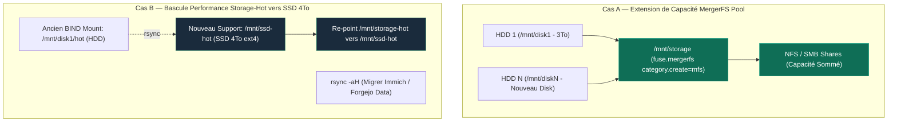

## Schéma des Deux Stratégies d'Extension Stockage



<Info>
Cette procédure couvre deux cas de figure distincts, à ne pas confondre.
</Info>

## Cas A — Extension du pool MergerFS (capacité)

Ajoute le nouveau disque comme membre supplémentaire du pool `/mnt/storage`, augmentant la capacité totale disponible pour `documents/`, `photos-archives/`, `backups/`, `homeflix/`.

<Steps>
  <Step title="Passthrough du disque vers le LXC NAS">
    Ajouter un `mpX` dans la config du CT 100, pointant vers le nouveau device.
  </Step>
  <Step title="Formatage et montage">
    ```bash
    mkfs.ext4 /dev/sdX
    mkdir /mnt/diskN
    mount /dev/sdX /mnt/diskN
    ```
  </Step>
  <Step title="Ajout au pool MergerFS">
    Éditer `/etc/fstab` pour inclure le nouveau membre dans la ligne de montage MergerFS existante, avec les mêmes options (`category.create=mfs`, `inodecalc=path-hash`).
  </Step>
  <Step title="Validation">
    ```bash
    df -h /mnt/storage   # capacité totale doit refléter la somme des membres
    ```
  </Step>
</Steps>

<Warning>
Category policy `mfs` (most free space) répartit les nouvelles écritures vers le disque le moins rempli — ne redistribue PAS automatiquement les fichiers existants entre les membres.
</Warning>

## Cas B — Bascule storage-hot vers SSD (performance)

Objectif visé pour le SSD 4To : migrer `storage-hot/` (Immich, Forgejo) d'un simple bind-mount sur le HDD vers un vrai SSD dédié, pour la latence.

<Steps>
  <Step title="Formatage du SSD">
    ```bash
    mkfs.ext4 /dev/sdY
    mkdir /mnt/ssd-hot
    mount /dev/sdY /mnt/ssd-hot
    ```
  </Step>
  <Step title="Copie des données existantes">
    ```bash
    rsync -aH --info=progress2 /mnt/disk1/hot/ /mnt/ssd-hot/
    ```
    <Warning>Vérifier hardlinks/cohérence comme pour toute migration de données volumineuse — voir [Déploiement d'un service](/procedures/deploiement-service).</Warning>
  </Step>
  <Step title="Bascule du point de montage">
    Remplacer le bind-mount `/mnt/storage-hot` pour pointer vers `/mnt/ssd-hot` au lieu de `/mnt/disk1/hot`.
  </Step>
  <Step title="Validation puis nettoyage">
    Confirmer le bon fonctionnement des services concernés avant de supprimer l'ancienne copie sur le HDD.
  </Step>
</Steps>

## Rollback

<Info>
Les deux cas sont réversibles tant que l'ancienne copie/membre n'a pas été supprimé : il suffit de revenir au montage précédent dans `/etc/fstab` et de redémarrer les services concernés.
</Info>

## Statut actuel

<Warning>
SSD 4To — Phase 4 du plan, **non commencée**. Cette page sera mise à jour avec le déroulé réel une fois l'intégration effectuée.
</Warning>
