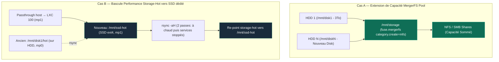

<Info>
Cette procédure couvre deux cas de figure distincts, à ne pas confondre.
</Info>

## Schéma des Deux Stratégies d'Extension Stockage



---

## Cas A — Extension du pool MergerFS (capacité)

Ajoute le nouveau disque comme membre supplémentaire du pool `/mnt/storage`, augmentant la capacité totale disponible pour `documents/`, `photoprism-data/`, `backups/`, `homeflix/`.

<Steps>
  <Step title="Passthrough du disque vers le LXC NAS">
    Sur le **host Proxmox** :
    ```bash
    pct set 100 --mp1 /dev/disk/by-id/<id-stable-du-disque>,mp=/mnt/diskN
    ```
  </Step>
  <Step title="Formatage et montage — depuis l'intérieur du LXC">
    ```bash
    pct enter 100
    mkfs.ext4 /dev/sdX
    mkdir /mnt/diskN
    mount /dev/sdX /mnt/diskN
    ```
  </Step>
  <Step title="Ajout au pool MergerFS">
    Éditer `/etc/fstab` (dans le LXC) pour inclure le nouveau membre dans la ligne de montage MergerFS existante, avec les mêmes options (`category.create=mfs`, `inodecalc=path-hash`).
  </Step>
  <Step title="Validation">
    ```bash
    df -h /mnt/storage   # capacité totale doit refléter la somme des membres
    ```
  </Step>
</Steps>

<Warning>
Category policy `mfs` (most free space) répartit les nouvelles écritures vers le disque le moins rempli — ne redistribue PAS automatiquement les fichiers existants entre les membres.
</Warning>

---

## Cas B — Bascule storage-hot vers SSD dédié (performance)

Objectif : migrer `storage-hot/` (Immich, Forgejo) d'un simple bind-mount sur le HDD vers un vrai SSD dédié, pour la latence.

<Warning>
⚠️ **Règle d'Architecture LXC NAS** : Le passthrough vers le LXC NAS est une étape à part entière. `storage-hot` est géré à l'intérieur du conteneur 100, pas directement par le host. Toutes les commandes `mkfs`/`mount`/`rsync` de ce Cas B s'exécutent **depuis l'intérieur du LXC** (`pct enter 100`), jamais depuis le host.
</Warning>

<Steps>
  <Step title="Identification du disque — depuis le host">
    ```bash
    lsblk
    ls -la /dev/disk/by-id/ | grep -v part
    ```
    Note l'identifiant stable `/dev/disk/by-id/...` — jamais `/dev/sdX` seul, qui peut changer d'un boot à l'autre.
  </Step>
  <Step title="Passthrough du disque vers le LXC NAS — depuis le host">
    ```bash
    pct set 100 --mp1 /dev/disk/by-id/<id-stable>,mp=/mnt/ssd-hot-raw
    ```
    *(Nom de mountpoint distinct de `mp0`, déjà utilisé par le HDD principal).*
  </Step>
  <Step title="Formatage et montage — depuis l'intérieur du LXC">
    ```bash
    pct enter 100
    mkfs.ext4 /dev/sdY
    ```
    Le point de montage est déjà géré automatiquement par le passthrough Proxmox (`mp=/mnt/ssd-hot-raw` défini à l'étape précédente) — pas de `mkdir`/`mount` manuel supplémentaire nécessaire ici.
  </Step>
  <Step title="Première synchro — à chaud, services toujours actifs">
    Toujours depuis l'intérieur du LXC :
    ```bash
    rsync -aH --info=progress2 /mnt/disk1/hot/ /mnt/ssd-hot-raw/
    ```
    <Warning>Vérifier hardlinks/cohérence comme pour toute migration de données volumineuse — voir [Déploiement d'un service](/procedures/deploiement-service).</Warning>
  </Step>
  <Step title="Arrêt bref des services concernés — depuis Coolify">
    Sur la VM Coolify, stoppe temporairement Immich et Forgejo (les deux seuls consommateurs actuels de `storage-hot`) pour geler les écritures :
    ```bash
    docker stop immich_server-<uuid> forgejo-<uuid> postgres-<uuid-forgejo>
    ```
  </Step>
  <Step title="Synchro finale — delta uniquement, rapide">
    Toujours depuis l'intérieur du LXC :
    ```bash
    rsync -aH --info=progress2 /mnt/disk1/hot/ /mnt/ssd-hot-raw/
    ```
    Cette seconde passe ne recopie que les fichiers modifiés depuis la première synchro — rapide, services arrêtés garantit zéro désync.
  </Step>
  <Step title="Bascule du point de montage storage-hot">
    Dans le LXC, édite `/etc/fstab` ou la config du bind-mount existant : remplace la source `/mnt/disk1/hot` par `/mnt/ssd-hot-raw` pour le mountpoint `storage-hot` exposé en NFS.
  </Step>
  <Step title="Redémarre les services">
    ```bash
    docker start immich_server-<uuid> forgejo-<uuid> postgres-<uuid-forgejo>
    ```
  </Step>
  <Step title="Validation puis nettoyage">
    Confirme le bon fonctionnement d'Immich et Forgejo (accès aux photos/repos, pas d'erreur) avant de supprimer l'ancienne copie sur le HDD (`/mnt/disk1/hot`).
  </Step>
</Steps>

<Info>
Aucune reconfiguration Docker/Coolify nécessaire côté VM — le montage NFS (`/mnt/nas-hot`) et le chemin exposé restent identiques, seule la source physique change côté LXC NAS. C'était l'objectif de la séparation des montages dès le départ.
</Info>

---

## Rollback

<Info>
Les deux cas sont réversibles tant que l'ancienne copie ou l'ancien membre n'a pas été supprimé : il suffit de revenir au montage précédent dans `/etc/fstab` (dans le LXC NAS) et de redémarrer les services concernés.
</Info>
