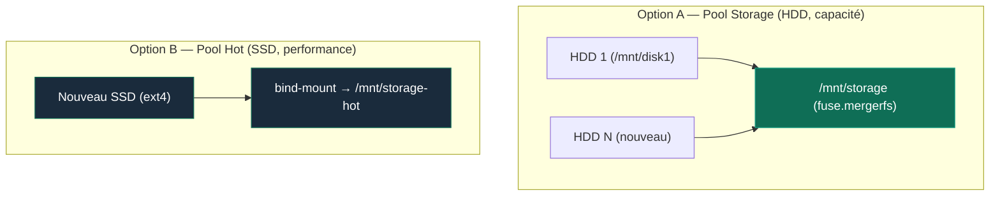

<Warning>
**Contrôleur ASM1166 (MS-01) — hotplug non fiable.** Toujours éteindre le host avant de connecter ou déconnecter un disque SATA sur ce contrôleur. Ne jamais tenter de hot-swap : au mieux le disque n'est pas détecté (reboot nécessaire de toute façon), au pire le lien du contrôleur plante et peut affecter les autres disques qui y sont câblés.
</Warning>

<Info>
Cette procédure couvre deux cas de figure distincts, à ne pas confondre.
</Info>

## Schéma des Deux Stratégies d'Extension Stockage



---

## Identification du disque — commun aux deux options

Depuis le **host Proxmox** (`pve`, 192.168.1.41) :

```bash
lsblk
ls -la /dev/disk/by-id/ | grep -v part
```

Note l'identifiant stable `ata-<modèle>_<numéro-série>` — jamais `/dev/sdX` seul, qui peut changer d'un boot à l'autre.

<Warning>
Si le disque provient d'un boîtier USB, le WWN relevé côté USB peut être générique/invalide (ex: `wwn-0x5000000000000001`) — le pont USB-SATA ne relaie pas toujours correctement le vrai WWN. Une fois branché en SATA natif, se fier au nouvel identifiant `ata-<modèle>_<série>`, pas à l'ancien WWN.
</Warning>

---

## Option A — Extension du pool Storage (capacité, HDD)

<Warning>
⚠️ **Option A : PROCÉDURE THÉORIQUE — EN ATTENTE DE TEST SUR LE TERRAIN**

L'extension multi-membres MergerFS n'a pas encore été pratiquée sur cette infrastructure (le pool `/mnt/storage` ne compte actuellement qu'un seul membre HDD).
</Warning>

Ajoute le disque comme membre supplémentaire du pool `/mnt/storage`, augmentant la capacité totale pour `documents/`, `photoprism-data/`, `backups/`, `homeflix/`.

<Steps>
  <Step title="Wipe et formatage — depuis le host">
    ```bash
    sudo wipefs -a /dev/disk/by-id/<id-stable>
    sudo mkfs.ext4 /dev/disk/by-id/<id-stable>
    ```
    <Info>
    Le formatage se fait ici sur le host, **avant** le passthrough — le mode `mp=` de `pct set` monte immédiatement le disque et échoue s'il n'a pas encore de filesystem valide.
    </Info>
  </Step>
  <Step title="Passthrough vers le LXC NAS — depuis le host">
    ```bash
    pct set 100 --mp1 /dev/disk/by-id/<id-stable>,mp=/mnt/diskN
    ```
  </Step>
  <Step title="Ajout au pool MergerFS — depuis l'intérieur du LXC">
    ```bash
    pct enter 100
    df -h /mnt/diskN   # confirme le montage
    ```
    Éditer `/etc/fstab` (dans le LXC) pour inclure le nouveau membre dans la ligne de montage MergerFS existante, avec les mêmes options (`category.create=mfs`, `inodecalc=path-hash`).
    ```bash
    sudo systemctl daemon-reload
    sudo mount -a
    ```
  </Step>
  <Step title="Validation">
    ```bash
    df -h /mnt/storage   # capacité totale doit refléter la somme des membres
    ```
  </Step>
</Steps>

<Warning>
Category policy `mfs` (most free space) répartit les nouvelles écritures vers le disque le moins rempli — ne redistribue PAS automatiquement les fichiers existants entre les membres.
</Warning>

---

## Option B — Ajout/remplacement dans le pool Hot (performance, SSD)

<Check>
🟢 **Option B : VALIDÉE EN PRODUCTION (18/08/2026)**

La bascule du tier `storage-hot` vers le SSD SATA 4To dédié (Samsung 870 EVO) a été exécutée et validée avec succès selon ce pas-à-pas.
</Check>

Le pool hot (`storage-hot`, consommé par Immich et Forgejo) est actuellement un disque unique en bind-mount — pas un pool MergerFS multi-membres. Cette section couvre l'ajout d'un nouveau SSD, que ce soit un premier déploiement ou le remplacement du disque en place.

<Steps>
  <Step title="Wipe et formatage — depuis le host">
    ```bash
    sudo wipefs -a /dev/disk/by-id/<id-stable>
    sudo mkfs.ext4 /dev/disk/by-id/<id-stable>
    ```
  </Step>
  <Step title="Passthrough vers le LXC NAS — depuis le host">
    ```bash
    pct set 100 --mp1 /dev/disk/by-id/<id-stable>,mp=/mnt/ssd-hot-raw
    ```
  </Step>
  <Step title="Vérification du montage — depuis l'intérieur du LXC">
    ```bash
    pct enter 100
    df -h /mnt/ssd-hot-raw
    ```
  </Step>
  <Step title="Si remplacement d'un disque hot déjà en service — synchro à chaud">
    ```bash
    rsync -aH --info=progress2 /mnt/storage-hot/ /mnt/ssd-hot-raw/
    ```
    Lancer dans un `tmux`/`screen` si le volume est important.
  </Step>
  <Step title="Arrêt bref des services concernés — depuis Coolify">
    Stoppe temporairement Immich et Forgejo (+ Postgres associé) via l'IHM Coolify pour geler les écritures.
  </Step>
  <Step title="Synchro finale (si remplacement) — delta uniquement">
    ```bash
    rsync -aH --info=progress2 /mnt/storage-hot/ /mnt/ssd-hot-raw/
    ```
  </Step>
  <Step title="Désexport NFS avant bascule">
    ```bash
    exportfs -v | grep storage-hot   # relever le réseau exact exporté
    sudo exportfs -u <reseau>:/mnt/storage-hot
    ```
    <Warning>
    Sans cette étape, `umount` échoue avec `target is busy` — le service NFS garde des handles ouverts sur le point de montage même sans écriture active.
    </Warning>
  </Step>
  <Step title="Bascule du bind-mount">
    ```bash
    sudo umount /mnt/storage-hot   # uniquement si un ancien disque était monté
    sudo mount --bind /mnt/ssd-hot-raw /mnt/storage-hot
    df -h /mnt/storage-hot   # confirme la nouvelle source
    ```
  </Step>
  <Step title="Ré-export NFS">
    ```bash
    sudo exportfs -r   # relit /etc/exports, préserve fsid et options d'origine
    exportfs -v | grep storage-hot
    ```
  </Step>
  <Step title="Mise à jour fstab + systemd">
    Éditer `/etc/fstab` (dans le LXC) : source de `storage-hot` → `/mnt/ssd-hot-raw`.
    ```bash
    sudo systemctl daemon-reload
    systemctl status mnt-storage\x2dhot.mount   # confirme What= à jour
    ```
    <Warning>
    Sans `daemon-reload`, systemd garde en cache l'ancienne génération de fstab — un reboot reviendrait silencieusement à l'ancienne source malgré le fichier corrigé.
    </Warning>
  </Step>
  <Step title="Remount côté client NFS (VM Coolify)">
    ```bash
    ssh cmolotkoff@192.168.1.52
    sudo umount -f /mnt/nas-hot   # ou -l si -f échoue (stale handle attendu)
    sudo mount /mnt/nas-hot
    ls /mnt/nas-hot
    ```
  </Step>
  <Step title="Redémarrage et validation">
    Redémarre Immich et Forgejo via Coolify. Vérifie l'accès aux photos/repos et l'absence d'erreur dans les logs.
  </Step>
  <Step title="Nettoyage (si remplacement)">
    Une fois validé, supprimer l'ancien contenu sur l'ancien support — jamais avant confirmation fstab/systemd à jour, sinon un reboot intermédiaire pointerait vers un chemin vide.
  </Step>
</Steps>

---

## Rollback

<Info>
Les deux options sont réversibles tant que l'ancien support n'a pas été supprimé : revenir au montage précédent dans `/etc/fstab` (LXC NAS), lancer `systemctl daemon-reload`, puis redémarrer les services concernés.
</Info>
