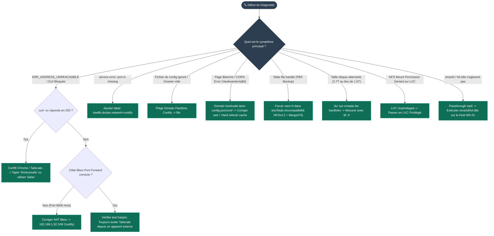

import { ips, domains } from "/snippets/variables.mdx";

## Arbre de Décision de Dépannage Rapide

<Frame caption="Arbre de décision interactif pour diagnostiquer les pannes fréquentes du homelab">

</Frame>

<Info>
Cette page recense chaque problème réellement rencontré pendant le projet, avec sa cause exacte et sa solution — pas de théorie, uniquement du vécu.
</Info>

## ⚡ Commandes CLI de Diagnostic Rapide

<CodeGroup>
```bash Proxmox PVE CLI
# Lister les conteneurs LXC et VM
pct list
qm list

# Entrer dans un conteneur LXC (ex: NAS LXC 100)
pct enter 100

# Vérifier l'état de la VM Coolify (104)
qm status 104

# Inspecter le journal système Proxmox en direct
journalctl -fu pveproxy
```

```bash Docker & Coolify CLI
# Lister l'état des conteneurs applicatifs
docker ps --format "table {{.Names}}\t{{.Status}}\t{{.Ports}}"

# Inspecter les logs d'un service spécifique (ex: Authentik / HomeFlix)
cd /data/coolify/services/<uuid>/
docker compose logs -f --tail=100

# Tester la résolution des montages FUSE/NFS dans un conteneur
docker exec -it <container_id> df -h
```

```bash Network & Tailscale CLI
# Statut des nœuds du Tailnet
tailscale status

# Tester la connectivité vers la VM Coolify (100.64.0.4)
tailscale ping 100.64.0.4

# Tester le filtrage middleware vpn-only (doit retourner 403 Forbidden depuis le WAN)
curl -Iv https://qbit.ims-world.fr
```
</CodeGroup>

## Réseau et connectivité

### <Badge color="amber">Réseau</Badge> `ERR_ADDRESS_UNREACHABLE` dans Chrome, mais le service répond

<Warning>
Rencontré sur la console Proxmox (8006) et la GUI VM Coolify (8000). `curl` fonctionne parfaitement, seul Chrome bloque. Cause exacte non élucidée (probablement un conflit avec une route Tailscale active).
</Warning>

**Solutions** : taper `thisisunsafe` sur la page d'erreur, ou utiliser un autre navigateur (Safari a fonctionné à chaque fois). Toujours valider avec `curl -sv <url>` avant de conclure à un vrai problème serveur.

### <Badge color="amber">Réseau</Badge> Tester un service Tailscale depuis la machine qui l'héberge

<Warning>
Un `curl` lancé depuis la VM elle-même vers son propre nom Tailscale (hairpin self-connection) peut donner des résultats trompeurs (503, timeouts) qui n'ont rien à voir avec le vrai état du service.
</Warning>

**Règle** : toujours tester la disponibilité d'un service Tailscale depuis un point **externe** (Mac perso, autre appareil du tailnet), jamais depuis la machine hôte.

### <Badge color="amber">Réseau</Badge> Port-forward pointant vers la mauvaise machine

<Warning>
Une règle NAT Bbox ciblant l'IP du host Proxmox au lieu de la VM applicative fait tomber tout le trafic dans le vide (le host n'écoute que sur son port d'admin, 8006). Symptôme : `curl` → `000` (timeout total, pas de code HTTP).
</Warning>

**Vérification systématique** avant de chercher plus loin : confirmer la cible exacte de chaque règle de port-forward.

## Docker / Coolify

### <Badge color="orange">Docker</Badge> `service error: port is missing`

<Warning>
Un container attaché à **plusieurs réseaux Docker** fait échouer Traefik s'il ne sait pas quelle IP utiliser, même avec un port explicitement déclaré dans les labels.
</Warning>

```yaml
labels:
  - traefik.docker.network=coolify   # obligatoire si le container a >1 réseau
```

### <Badge color="orange">Docker</Badge> Dossier fantôme créé avant la copie de fichier

<Warning>
Coolify pré-crée parfois un dossier vide à l'emplacement attendu d'un fichier de config, avant même le premier démarrage. `cp` vers ce dossier copie le fichier DEDANS au lieu de remplacer — erreur silencieuse.

Pire : si un container a déjà démarré avec ce mauvais mapping, un simple `docker restart` ne corrige PAS le montage figé — il faut une vraie recréation du container.
</Warning>

<CodeGroup>
  ```bash Diagnostic Fichier Fantôme
  # Vérification AVANT tout premier démarrage
  file <chemin_fichier_attendu>   # doit dire "ASCII text", pas "directory"

  # Si déjà cassé après un démarrage :
  docker rm -f <container>
  # puis redeploy depuis Coolify
  ```
</CodeGroup>

### <Badge color="orange">Traefik</Badge> Double router Traefik auto-généré par Coolify

<Info>
Coolify peut générer automatiquement un router Traefik en plus des labels manuels définis dans le compose (nommé `https-0-<uuid>-<service>`). Comportement **normal**, confirmé identique entre plusieurs instances — pas une anomalie à corriger systématiquement, mais à garder en tête lors d'un diagnostic de routage.
</Info>

## Validation de données

### <Badge color="blue">Stockage</Badge> `du` sur-compte les hardlinks

<Warning>
`du -sh` additionne la taille de chaque fichier à chaque fois qu'il le rencontre dans son parcours, y compris pour des hardlinks — un dossier avec beaucoup de hardlinks affichera un total très supérieur à l'espace disque réellement utilisé.
</Warning>

**Toujours valider avec `df -h`** (mesure au niveau bloc, source de vérité) après une migration impliquant des hardlinks, jamais `du` seul.

<CodeGroup>
  ```bash Vérification Espace Disque Réel
  du -sh /chemin/          # peut mentir, ex: 2.7T affiché
  df -h /mnt/point-montage # vérité terrain, ex: 1.6T réel
  ```
</CodeGroup>

## Fichiers de configuration à domaine figé

<Warning>
Plusieurs applications stockent leur domaine en dur dans un fichier de config qui **prend le pas** sur les variables d'environnement (Vaultwarden `config.json`, qBittorrent `qBittorrent.conf`). Un changement de variable d'environnement seul ne suffit pas.
</Warning>

```bash
grep -ri "domain\|serverdomains\|hostheader" <fichier_config>
```

## qBittorrent — `HostHeaderValidation`

<Warning>
Rejette les requêtes derrière un reverse proxy si le header `Host` ne correspond pas à un domaine autorisé, **même avec `ServerDomains=*`** (wildcard insuffisant pour une raison non élucidée).
</Warning>

```ini
WebUI\HostHeaderValidation=false
```

## DNS

### <Badge color="purple">DNS</Badge> Résolveur DNS OVH en panne

<Warning>
Le résolveur recommandé par OVH pour le challenge DNS-01 (`213.251.128.1:53`) peut tomber en panne silencieusement — les certificats existants restent valides jusqu'à expiration, masquant le problème pendant des jours.
</Warning>

```bash
dig @213.251.128.1 google.com   # teste le résolveur directement
```

Contournement : basculer sur `8.8.8.8` seul dans la liste des résolveurs DNS-01.

### <Badge color="red">Sécurité</Badge> Endlessh masque le vrai port SSH

<Info>
Si `ssh` reste figé indéfiniment sur le port 22 sans jamais échouer proprement (`Connection established` puis rien), c'est probablement un tarpit anti-bot (Endlessh) — le vrai service SSH tourne sur un autre port.
</Info>

```bash
ssh -v user@host   # si bloqué après "Connection established", suspecter Endlessh
```

## Proxmox Backup Server

### <Badge color="red">PBS</Badge> `Stale file handle` en fin de backup (NFSv4.2 + MergerFS)

<Warning>
Un backup PBS via NFS peut échouer systématiquement à la toute dernière étape (commit du manifest `index.json.blob`), après un transfert complet réussi à 100% :
```
ERROR: backup finish failed: command error: unable to update manifest blob - ... Stale file handle (os error 116)
```
Cause : incompatibilité entre **NFSv4.2** et un backend **MergerFS/FUSE** — le fileid peut être réattribué pendant une opération de rename/write atomique typique de PBS, invalidant le file handle NFS déjà ouvert côté client. Confirmé reproductible sur deux tentatives consécutives, avec `use_ino` déjà actif côté MergerFS (donc pas une simple question d'option manquante).
</Warning>

<Steps>
  <Step title="Diagnostic côté serveur NFS">
    ```bash
    # Côté serveur NFS (le NAS) — chercher l'erreur au moment exact du backup
    dmesg | grep "fileid changed"
    ```
  </Step>

  <Step title="Solution — Forcer NFSv3 dans /etc/fstab">
    Forcer NFSv3 sur le montage du datastore PBS (moins strict sur la gestion des file handles, plus tolérant avec FUSE) :
    ```bash
    # /etc/fstab sur le CT PBS
    10.10.10.1:/mnt/storage/backups  /mnt/pbs-datastore  nfs  defaults,nofail,_netdev,vers=3  0 0
    ```
  </Step>
</Steps>

<Tip>
Si `umount` refuse avec `device is busy`, arrêter temporairement les services PBS avant de remonter :
```bash
systemctl stop proxmox-backup-proxy proxmox-backup
umount /mnt/pbs-datastore && mount -a
systemctl start proxmox-backup proxmox-backup-proxy
```
</Tip>

## LXC Proxmox

### <Badge color="gray">Proxmox</Badge> Unprivileged ne peut pas monter de NFS

<Warning>
Restriction noyau sur les user namespaces, non contournable par la config `features: mount=nfs` seule. `mount(2) Permission denied` local, pas un refus serveur (le message d'erreur peut être trompeur : "access denied by server" alors que c'est un blocage client).
</Warning>

**Solution** : passer le LXC en privilégié si NFS est nécessaire.

### <Badge color="gray">Proxmox</Badge> smartd/hd-idle ne fonctionnent pas via passthrough mountpoint

<Warning>
Un LXC avec passthrough (`mp0`) a accès au filesystem monté, mais **pas au device bloc brut** (`/dev/sda`) nécessaire aux outils SMART/spin-down. Ces outils échouent silencieusement ou affichent un faux "actif" sans fonctionner réellement.
</Warning>

**Solution** : faire tourner `smartd`/`hd-idle` sur le **host**, jamais dans le LXC. Toujours valider par le comportement réel (`hdparm -C`), pas seulement `systemctl status`.
