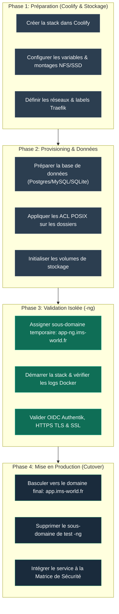

## Philosophie & Standard de Déploiement

<Info>
Ce protocole définit la méthode éprouvée pour déployer et mettre en production une nouvelle application sur l'infrastructure IMS-WORLD sans interruption de service ni faille de sécurité.
</Info>

---

## 🗺️ Workflow des 4 Phases de Déploiement

---

## 📋 Checklist Opérationnelle

### Phase 1 — Choix du Mode de Routage Traefik

- **Option A — Service Public WAN ou avec SSO OIDC Natif (ex: Immich, Vaultwarden, Forgejo)** :
  - [ ] Saisir le FQDN définitif (`https://app.ims-world.fr`) dans le champ **Domains** de l'UI Coolify.
  - [ ] Laisser Coolify générer le routeur Traefik automatique.

- **Option B — Service d'Administration Privé Restreint au Tailnet (`vpn-only`) (ex: qBittorrent, Sonarr, Radarr, Prowlarr, Coolify, Headplane)** :
  - [ ] **Laisser le champ Domains vide dans l'UI Coolify** (pour éviter la concurrence de routeurs).
  - [ ] Supprimer tout label de routage Traefik (`traefik.http.routers...`) du fichier Compose.
  - [ ] Déclarer le router et le service dans `/data/coolify/proxy/dynamic/vpn-only.yaml`.
  - [ ] Suivre la procédure [Sécuriser un Service avec vpn-only](/procedures/securiser-service-vpn-only).

### Phase 2 — Validation et Tests (`-ng`)
- [ ] Utiliser un domaine de qualification temporaire (`nom-ng.ims-world.fr`).
- [ ] Vérifier la génération du certificat Let's Encrypt via le challenge DNS-01.

### Phase 3 — Mise en Production & Audit
- [ ] Valider le FQDN définitif (`nom.ims-world.fr`).
- [ ] Tester le filtrage étanche :
  - **403 Forbidden** depuis le WAN (4G/5G mobile).
  - **200 OK** depuis un appareil authentifié sur le Tailnet (`100.64.0.0/10`).
- [ ] Mettre à jour la [Matrice de Sécurité](/reseau/matrice-securite-exposition) et le [Changelog](/history/chronologie).
