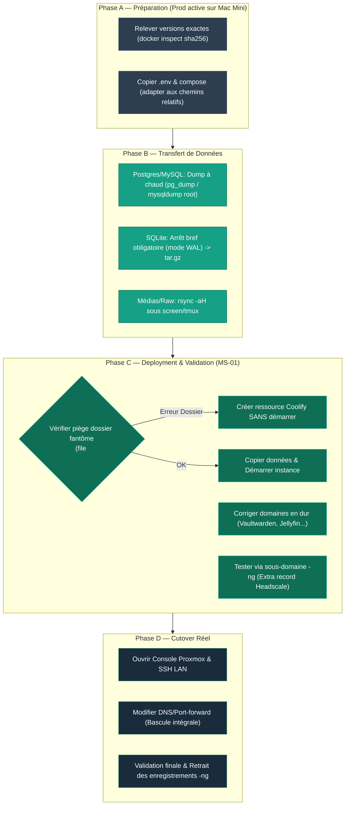

## Principe directeur

## Workflow Global de Migration (Phases A -> B -> C -> D)



<Info>
L'ancien serveur reste actif et sert le vrai trafic jusqu'au tout dernier moment. On teste la nouvelle instance en parallèle, sans jamais couper la prod avant validation complète — sauf exception (voir Headscale ci-dessous).
</Info>

## Phase A — Préparation (zéro downtime)

<Steps>
  <Step title="Localiser le compose et les données réelles">
    ```bash
    find /data/coolify/services -iname "docker-compose.yml" -exec grep -l "<nom_service>" {} \;
    ```
  </Step>
  <Step title="Relever les VRAIES versions d'images">
    <Warning>
    Ne jamais reprendre `latest` tel quel — piège rencontré sur presque chaque service. Toujours relever la version réellement en cours d'exécution :
    ```bash
    docker inspect <container> --format '{{.Config.Image}}'
    # Si le tag ne donne pas de version lisible :
    docker inspect <container> --format '{{.Image}}'   # digest sha256
    ```
    </Warning>
  </Step>
  <Step title="Copier .env et compose, adapter les chemins">
    Chemins relatifs (`./data`) plutôt qu'absolus — Coolify les mappe automatiquement vers `/data/coolify/services/<uuid>/`.
  </Step>
</Steps>

## Phase B — Transfert des données

<Tabs>
  <Tab title="Base SQL (Postgres/MySQL)">
    Dump à chaud possible, pas d'arrêt nécessaire :
    ```bash
    docker exec <db-container> pg_dump -U <user> -d <db> -F c -f /tmp/dump.sql
    # ou pour MySQL, avec le compte ROOT (privilèges PROCESS requis) :
    docker exec <db-container> mysqldump -u root -p'<pass>' <db> > dump.sql
    ```
  </Tab>
  <Tab title="SQLite (mode WAL)">
    <Warning>
    Arrêt bref du service source obligatoire — copier à chaud risque une base incohérente entre le fichier principal et les fichiers `-shm`/`-wal`.
    </Warning>
    ```bash
    docker stop <container>
    sudo tar czf data.tar.gz -C <chemin_data> .
    docker start <container>
    ```
  </Tab>
  <Tab title="Fichiers bruts (MinIO, médias)">
    Simple copie, arrêt recommandé pour cohérence mais pas strictement bloquant.
  </Tab>
</Tabs>

<Tip>
Si les fichiers source appartiennent à `root` et qu'aucun SSH root n'est disponible : `sudo tar` côté source, transfert via `scp` dans le sens qui fonctionne déjà.
</Tip>

## Phase C — Validation

<Steps>
  <Step title="Créer la ressource Coolify SANS démarrer">
    Le premier démarrage créerait des dossiers vides qu'il faudra ensuite écraser proprement.
  </Step>
  <Step title="Vérifier avant de copier — piège du dossier fantôme">
    <Warning>
    Coolify pré-crée parfois un dossier vide à l'emplacement attendu d'un fichier. `cp` vers un dossier existant copie le fichier DEDANS au lieu de remplacer, silencieusement.
    ```bash
    file <chemin_fichier_attendu>   # doit dire "ASCII text", pas "directory"
    ```
    </Warning>
  </Step>
  <Step title="Copier les données, démarrer">
    Puis rechercher les fichiers de config à domaine figé (voir ci-dessous).
  </Step>
  <Step title="Tester via un sous-domaine -ng">
    Extra_record Headscale dédié plutôt que `/etc/hosts` local — accessible depuis tout le tailnet :
    ```yaml
    extra_records:
      - name: "<service>-ng.ims-world.fr"
        value: "<ip-tailscale-nouvelle-instance>"
    ```
    <Warning>
    Exception : un service dont le domaine est une **identité** (pas juste un routage), comme Headscale, ne peut pas être testé de cette façon. Voir [Headscale](/services/headscale-headplane).
    </Warning>
  </Step>
</Steps>

## Piège transversal — fichiers de config à domaine figé

<Warning>
Plusieurs applications stockent leur domaine **en dur** dans un fichier de config qui prend le pas sur les variables d'environnement Coolify (Vaultwarden `config.json`, Jellyfin `network.xml`). Toujours vérifier et corriger après changement de domaine :
```bash
grep -ri "domain\|url" <fichier_config> | grep "ancien-domaine"
```
Un écran bloqué après correction n'est pas forcément une vraie erreur — vérifier le cache navigateur (hard refresh) avant de creuser.
</Warning>

## Phase D — Cutover réel

<Steps>
  <Step title="Filets de sécurité (services réseau-critiques uniquement)">
    Console web Proxmox ouverte + accès SSH LAN direct (pas Tailscale) — indispensable pour Headscale, recommandé pour tout service impactant l'accès distant.
  </Step>
  <Step title="Bascule">
    Domaine réel + extra_record + (si applicable) port-forward.
  </Step>
  <Step title="Validation finale + nettoyage">
    Tester en conditions réelles, puis retirer les références `-ng` restantes.
  </Step>
</Steps>

<Warning>
Le port-forward, s'il est modifié, bascule **tout le trafic public d'un coup** — pas de bascule partielle possible à ce niveau. Voir [Traefik Proxy](/reseau/traefik-proxy).
</Warning>

<Card title="Tous les pièges détaillés" icon="triangle-exclamation" href="/procedures/depannage-courant">
  Liste complète et commandes de diagnostic pour chaque problème déjà rencontré.
</Card>
