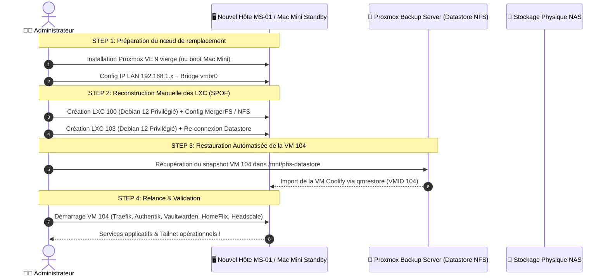

import { ips, domains } from "/snippets/variables.mdx";

<Warning>
⚠️ **PROCÉDURE THÉORIQUE — EN ATTENTE DE TEST & VALIDATION SUR LE TERRAIN**

Ce Plan de Reprise d'Activité (PRA) a été conçu et documenté selon les spécifications d'architecture, mais **n'a pas encore fait l'objet d'une simulation réelle de crash et de restauration de bout en bout**.
</Warning>

<Check>
**Couverture & Stratégie de Sauvegarde (Mise à jour Août 2026)** :
- <Badge color="green">🟢 VM 104 (IMS-Coolify)</Badge> : **Sauvegardée & Restaurable** — Backup quotidien automatisé à 02:00 dans PBS via NFSv3 (`pbs-coolify`).
- <Badge color="green">🟢 LXC 100 (IMS-NAS)</Badge> : **Sauvegardé & Restaurable** — Backup `vzdump` local NVMe quotidien à 05:00 (`--mode stop`).
- <Badge color="green">🟢 LXC 103 (IMS-PBS)</Badge> : **Sauvegardé & Restaurable** — Backup `vzdump` local NVMe quotidien à 03:00 (`--mode snapshot`).

*Voir la [Politique de Sauvegarde & Tâches Planifiées](/infrastructure/politique-sauvegardes) pour le détail de la chronologie et de l'anti-circularité.*
</Check>

## Objectif & Scénarios de Sinistre

Ce plan définit les étapes exactes pour reconstruire l'infrastructure en cas de :
1. **Sinistre Majeur Host (MS-01 HS)** : Panne carte mère, CPU ou NVMe principal de l'hyperviseur Minisforum MS-01.
2. **Crash Stockage NAS (HDD 3To HS)** : Corruption ou défaillance mécanique du disque de stockage principal.
3. **Pertes de Connectivité VPN (Headscale HS)** : Perte du control plane et procédure d'accès d'urgence LAN/console.

---

## 🗺️ Schéma de Restauration PRA (Workflow Réel)



---

## 📋 Procédure de Reconstruction Pas-à-Pas

<Steps>
  <Step title="Phase 1 — Préparation de la machine de remplacement">
    1. **Si remplacement du MS-01** par un nouvel ordinateur/serveur :
       - Installer Proxmox VE 9.x depuis une clé USB de boot ISO.
       - Configurer l'IP hôte (ex: `{ips.pveLan}/24`, gateway `192.168.1.254`).
       - S'assurer que le bridge `vmbr0` est rattaché à la carte réseau physique principale.

    2. **Si bascule temporaire d'urgence sur le Mac Mini 2014 (Standby)** :
       - Démarrer le Mac Mini dans le rack [Labrax](/infrastructure/labrax).
       - Vérifier la connectivité réseau et l'accès SSH sur le port `4242` (`ssh -p 4242 cmolotkoff@{ips.macmini}`).
  </Step>

  <Step title="Phase 2 — Restauration de la VM 104 (IMS-Coolify) depuis PBS">
    La VM Coolify est le seul guest bénéficiant d'un snapshot quotidien automatisé dans PBS.

    <CodeGroup>
      ```bash Restauration Proxmox CLI
      # Se connecter au nouvel hôte Proxmox ({ips.pveLan})
      mkdir -p /mnt/recovery-pbs

      # Monter le stockage du datastore en NFSv3 (vers=3 obligatoire)
      mount -t nfs -o vers=3 {ips.nasLan}:/mnt/storage/backups /mnt/recovery-pbs

      # Restaurer la VM Coolify (104)
      qmrestore /mnt/recovery-pbs/dump/vzdump-qemu-104-*.vma.zst 104 --storage local-lvm
      qm start 104
      ```
    </CodeGroup>

    <Check>
      La VM Coolify redémarre automatiquement avec son IP statique (`{ips.coolifyLan}`). Le reverse proxy Traefik v3.7 reprend le routage du trafic dès son démarrage.
    </Check>
  </Step>

  <Step title="Phase 3 — Restauration des Conteneurs LXC 100 (NAS) & 103 (PBS)">
    <Check>
      Les conteneurs LXC 100 et 103 disposent de sauvegardes `vzdump` quotidiennes stockées sur le NVMe local de l'hôte (`/var/lib/vz/dump/`). Voir la [Politique de Sauvegarde](/infrastructure/politique-sauvegardes).
    </Check>

    ```bash
    # Restaurer le conteneur LXC 103 (PBS) depuis l'archive vzdump
    pctrestore 103 /var/lib/vz/dump/vzdump-lxc-103-*.tar.zst --storage local-lvm

    # Restaurer le conteneur LXC 100 (NAS) depuis l'archive vzdump
    pctrestore 100 /var/lib/vz/dump/vzdump-lxc-100-*.tar.zst --storage local-lvm
    ```

    1. **Reconnexion du passthrough disque NAS (LXC 100)** :
       - Re-créer la ligne passthrough `mp0` du disque physique Seagate 3To dans `/etc/pve/lxc/100.conf`.
       - Démarrer le conteneur et vérifier l'export NFS : `pct start 100`.

    2. **Vérification du Datastore PBS (LXC 103)** :
       - Démarrer le conteneur et lancer un verifier job : `pct start 103`.
       - Installer Proxmox Backup Server (`proxmox-backup-server`).
       - Remonter le partage NFS `/mnt/storage/backups` en `vers=3`. Voir [Fiche IMS-PBS](/infrastructure/ims-pbs).
  </Step>

  <Step title="Phase 4 — Clés critiques à vérifier après restauration">
    | Composant | Fichier sensible à contrôler | Risque si perdu |
    |---|---|---|
    | **Headscale** | `/data/coolify/services/i136ix2bmrrbeovnyrh1o72w/noise_private.key` | Reconnexion manuelle obligatoire de tous les appareils du tailnet |
    | **Authentik** | Variable `SECRET_KEY` dans le compose | Invalidation de toutes les sessions utilisateurs et tokens JWT |
    | **Vaultwarden** | `/data/coolify/services/i5ae953riutbot9afjcboptb/data/rsa_key.pem` | Incapacité à déchiffrer les pièces jointes du coffre |
  </Step>
</Steps>

---

## 🧪 Tests de Simulation PRA (Exercices réguliers)

<Tip>
Il est recommandé d'effectuer un test de restauration à blanc (dry-run) tous les 6 mois en restaurant la VM Coolify dans un VMID de test (ex: VM 101) pour valider l'intégrité des snapshots PBS.
</Tip>

<CodeGroup>
  ```bash Restauration à Blanc (Dry-Run)
  # Test de restauration sur une VMID fictive (101) sans impacter la prod (104)
  qmrestore /mnt/recovery-pbs/dump/vzdump-qemu-104-latest.vma.zst 101 --storage local-lvm
  ```
</CodeGroup>
