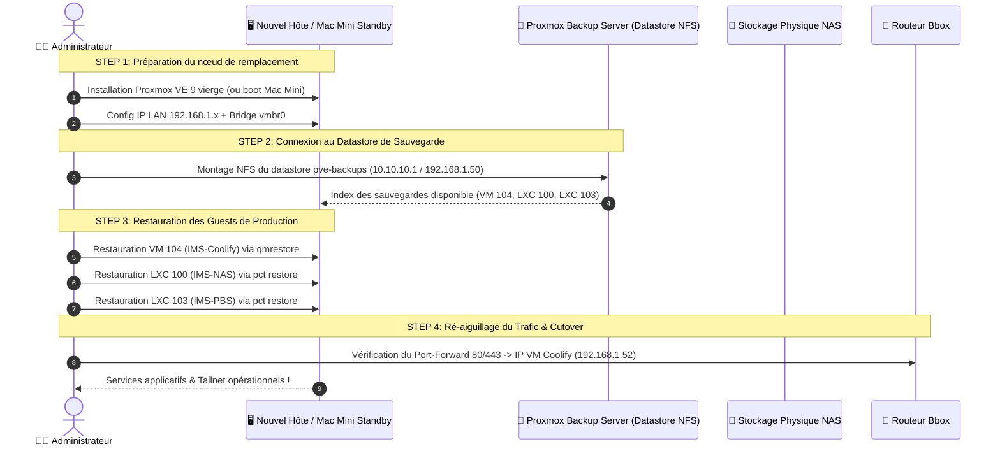

## Objectif & Scénarios de Sinistre

<Warning>
**Document critique d'urgence** — à conserver également sous forme de copie imprimée ou accessible hors-ligne (ex: sur un ordinateur portable ou clé USB de secours).
</Warning>

Ce plan définit les étapes exactes pour reconstruire l'infrastructure en cas de :
1. **Sinistre Majeur Host (MS-01 HS)** : Panne carte mère, CPU ou NVMe principal de l'hyperviseur Minisforum MS-01.
2. **Crash Stockage NAS (HDD 3To HS)** : Corruption ou défaillance mécanique du disque de stockage principal.
3. **Pertes de Connectivité VPN (Headscale HS)** : Perte du control plane et procédure d'accès d'urgence LAN/console.

---

## 🗺️ Schéma de Restauration PRA (Workflow de Secours)



---

## 📋 Procédure de Reconstruction Pas-à-Pas

### Phase 1 — Préparation de la machine de remplacement

1. **Si remplacement du MS-01** par un nouvel ordinateur/serveur :
   - Installer Proxmox VE 9.x depuis une clé USB de boot ISO.
   - Configurer l'IP hôte (ex: `192.168.1.41/24`, gateway `192.168.1.254`).
   - S'assurer que le bridge `vmbr0` est rattaché à la carte réseau physique principale.

2. **Si bascule temporaire d'urgence sur le Mac Mini 2014 (Standby)** :
   - Démarrer le Mac Mini.
   - Vérifier la connectivité réseau et l'accès SSH sur le port `4242` (`ssh -p 4242 cmolotkoff@100.64.0.7`).

---

### Phase 2 — Montage des sauvegardes PBS

Si le conteneur PBS (LXC 103) est indisponible, les fichiers de sauvegarde `.vma.zst` et les chunks déduplicatifs vivent physiquement sur le disque du NAS (`/mnt/storage/backups`).

```bash
# Sur le nouvel hyperviseur Proxmox :
mkdir -p /mnt/recovery-pbs

# Monter le dossier de backup du NAS en NFSv3
mount -t nfs -o vers=3 192.168.1.50:/mnt/storage/backups /mnt/recovery-pbs
```

---

### Phase 3 — Restauration des VMs et LXCs

#### 1. Restauration du NAS (IMS-NAS — LXC 100)
```bash
# Identifier le dernier backup de la VM 100
ls -la /mnt/recovery-pbs/dump/

# Restaurer le LXC NAS
pct restore 100 /mnt/recovery-pbs/dump/vzdump-lxc-100-*.tar.zst --storage local-lvm
pct start 100
```

#### 2. Restauration de la VM Coolify (IMS-Coolify — VM 104)
```bash
# Restaurer la VM applicative Coolify (héberge Traefik, Authentik, Vaultwarden, HomeFlix, Headscale)
qmrestore /mnt/recovery-pbs/dump/vzdump-qemu-104-*.vma.zst 104 --storage local-lvm
qm start 104
```

<Check>
La VM Coolify redémarre automatiquement avec son IP statique (`192.168.1.52`). Le reverse proxy Traefik v3.7 reprend le routage du trafic dès son démarrage.
</Check>

---

### Phase 4 — Clés critiques à vérifier après restauration

| Composant | Fichier sensible à contrôler | Risque si perdu |
|---|---|---|
| **Headscale** | `/data/coolify/services/i136ix2bmrrbeovnyrh1o72w/noise_private.key` | Reconnexion manuelle obligatoire de tous les appareils du tailnet |
| **Authentik** | Variable `SECRET_KEY` dans le compose | Invalidation de toutes les sessions utilisateurs et tokens JWT |
| **Vaultwarden** | `/data/coolify/services/i5ae953riutbot9afjcboptb/data/rsa_key.pem` | Incapacité à déchiffrer les pièces jointes du coffre |
| **Cap** | `DATABASE_ENCRYPTION_KEY` & `NEXTAUTH_SECRET` | Perte du déchiffrement des enregistrements vidéo |

---

## 🧪 Tests de Simulation PRA (Exercices réguliers)

<Tip>
Il est recommandé d'effectuer un test de restauration à blanc (dry-run) tous les 6 mois en restaurant une VM dans un VMID de test (ex: VM 101) pour valider l'intégrité des backups PBS.
</Tip>

```bash
# Test de restauration sur une VMID fictive (101) sans impacter la prod (104)
qmrestore /mnt/recovery-pbs/dump/vzdump-qemu-104-latest.vma.zst 101 --storage local-lvm
```
