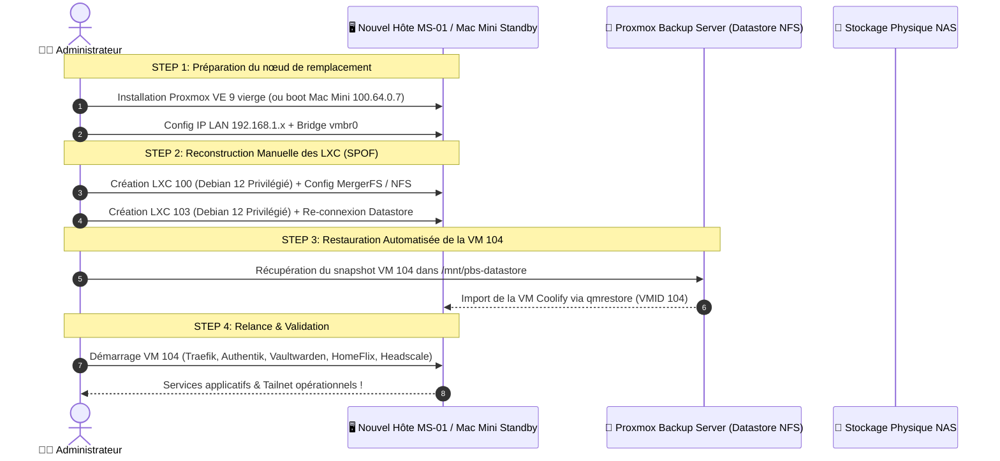

<Warning>
**État Réel de la Couverture Sauvegardes (Audit Aout 2026)** :
- 🟢 **VM 104 (IMS-Coolify)** : **Sauvegardée & Restaurable** — Backup quotidien automatisé à 02:00 dans PBS via NFSv3 (`vers=3`).
- 🔴 **LXC 100 (IMS-NAS)** : **Aucun backup actif** (SPOF) — Reconstruction manuelle obligatoire en cas de sinistre.
- 🔴 **LXC 103 (IMS-PBS)** : **Aucun backup actif** (SPOF) — Reconstruction manuelle obligatoire en cas de sinistre.

*Voir la [Roadmap](/procedures/roadmap) pour le chantier prioritaire "Mise en place de sauvegardes vzdump locales pour les LXC 100 et 103".*
</Warning>

## Objectif & Scénarios de Sinistre

Ce plan définit les étapes exactes pour reconstruire l'infrastructure en cas de :
1. **Sinistre Majeur Host (MS-01 HS)** : Panne carte mère, CPU ou NVMe principal de l'hyperviseur Minisforum MS-01.
2. **Crash Stockage NAS (HDD 3To HS)** : Corruption ou défaillance mécanique du disque de stockage principal.
3. **Pertes de Connectivité VPN (Headscale HS)** : Perte du control plane et procédure d'accès d'urgence LAN/console.

---

## 🗺️ Schéma de Restauration PRA (Workflow Réel)



---

## 📋 Procédure de Reconstruction Pas-à-Pas

### Phase 1 — Préparation de la machine de remplacement

1. **Si remplacement du MS-01** par un nouvel ordinateur/serveur :
   - Installer Proxmox VE 9.x depuis une clé USB de boot ISO.
   - Configurer l'IP hôte (ex: `192.168.1.41/24`, gateway `192.168.1.254`).
   - S'assurer que le bridge `vmbr0` est rattaché à la carte réseau physique principale.

2. **Si bascule temporaire d'urgence sur le Mac Mini 2014 (Standby)** :
   - Démarrer le Mac Mini dans le rack [Labrax](/infrastructure/labrax).
   - Vérifier la connectivité réseau et l'accès SSH sur le port `4242` (`ssh -p 4242 cmolotkoff@100.64.0.7`).

---

### Phase 2 — Restauration de la VM 104 (IMS-Coolify) depuis PBS

La VM Coolify est le seul guest bénéficiant d'un snapshot quotidien automatisé dans PBS.

```bash
# Se connecter au nouvel hôte Proxmox (192.168.1.41)
mkdir -p /mnt/recovery-pbs

# Monter le stockage du datastore en NFSv3 (vers=3 obligatoire)
mount -t nfs -o vers=3 192.168.1.50:/mnt/storage/backups /mnt/recovery-pbs

# Restaurer la VM Coolify (104)
qmrestore /mnt/recovery-pbs/dump/vzdump-qemu-104-*.vma.zst 104 --storage local-lvm
qm start 104
```

<Check>
La VM Coolify redémarre automatiquement avec son IP statique (`192.168.1.52`). Le reverse proxy Traefik v3.7 reprend le routage du trafic dès son démarrage.
</Check>

---

### Phase 3 — Reconstruction Manuelle des Conteneurs LXC (NAS & PBS)

<Warning>
Les conteneurs LXC 100 et LXC 103 n'ayant pas de sauvegarde PBS/vzdump active, leur restauration nécessite une réinstallation à partir des procédures documentées.
</Warning>

1. **LXC 100 (IMS-NAS)** :
   - Créer un LXC Debian 12 Privilégié (2 vCPU / 1024 Mo RAM).
   - Réinstaller `mergerfs`, `nfs-kernel-server` et `samba`.
   - Re-créer le passthrough `mp0` du disque physique Seagate 3To dans `/etc/pve/lxc/100.conf`.
   - Remonter le pool `/mnt/storage` avec l'option `inodecalc=path-hash`. Voir [Fiche IMS-NAS](/infrastructure/ims-nas).

2. **LXC 103 (IMS-PBS)** :
   - Créer un LXC Debian 12 Privilégié (2 vCPU / 1024 Mo RAM) avec la feature `mount=nfs`.
   - Installer Proxmox Backup Server (`proxmox-backup-server`).
   - Remonter le partage NFS `/mnt/storage/backups` en `vers=3`. Voir [Fiche IMS-PBS](/infrastructure/ims-pbs).

---

### Phase 4 — Clés critiques à vérifier après restauration

| Composant | Fichier sensible à contrôler | Risque si perdu |
|---|---|---|
| **Headscale** | `/data/coolify/services/i136ix2bmrrbeovnyrh1o72w/noise_private.key` | Reconnexion manuelle obligatoire de tous les appareils du tailnet |
| **Authentik** | Variable `SECRET_KEY` dans le compose | Invalidation de toutes les sessions utilisateurs et tokens JWT |
| **Vaultwarden** | `/data/coolify/services/i5ae953riutbot9afjcboptb/data/rsa_key.pem` | Incapacité à déchiffrer les pièces jointes du coffre |

---

## 🧪 Tests de Simulation PRA (Exercices réguliers)

<Tip>
Il est recommandé d'effectuer un test de restauration à blanc (dry-run) tous les 6 mois en restaurant la VM Coolify dans un VMID de test (ex: VM 101) pour valider l'intégrité des snapshots PBS.
</Tip>

```bash
# Test de restauration sur une VMID fictive (101) sans impacter la prod (104)
qmrestore /mnt/recovery-pbs/dump/vzdump-qemu-104-latest.vma.zst 101 --storage local-lvm
```
