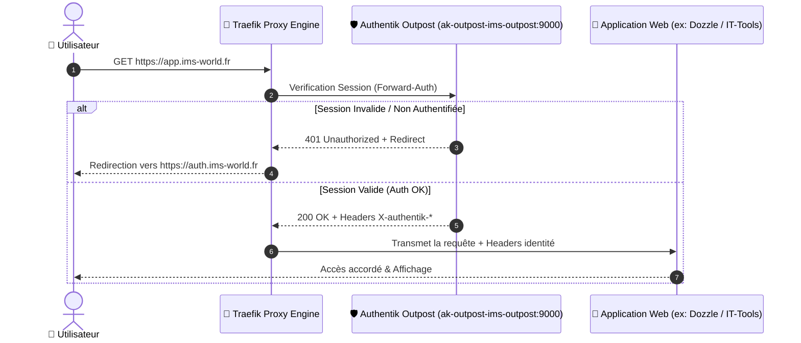

<Badge color="amber">🟡 En attente de validation (Non testé sur un nouveau service)</Badge>

## Objectif

Cette procédure décrit la séquence exacte pour sécuriser n'importe quelle application web hébergée sur le homelab ne disposant pas d'un système d'authentification natif ni de support OIDC / OAuth2 (ex. **Dozzle**, **Uptime Kuma**, **IT-Tools**, **Stirling PDF**).

Elle s'appuie sur le pattern **Forward-Auth Traefik** d'Authentik ([ADR-002](/history/adr/adr-002-pattern-forward-auth-authentik)) pour bloquer tout accès non authentifié au niveau du reverse proxy.

---

## Vue d'Ensemble du Flux



---

## Procédure Pas-à-Pas (4 Étapes)

<Steps>
  <Step title="Créer le Proxy Provider & l'Application dans Authentik Admin">
    1. Se connecter à la console **Authentik Admin** (`https://auth.ims-world.fr`).
    2. Aller dans **Applications → Providers → Create Provider**.
    3. Choisir le type **Proxy Provider** et cliquer sur **Next**.
    4. Renseigner les paramètres :
       - **Name** : `Provider - <NomApp>` (ex. `Provider - Dozzle`)
       - **Authorization flow** : `default-authorization-flow` (ou flow personnalisé).
       - **Mode** : Cocher **Forward auth (single application)**.
       - **External host** : `https://<sous-domaine>.ims-world.fr` (ex. `https://logs.ims-world.fr`).
    5. Cliquer sur **Finish**.
    6. Aller dans **Applications → Applications → Create Application**.
       - **Name** : `<NomApp>` (ex. `Dozzle Logs`)
       - **Slug** : `<nomapp>` (ex. `dozzle`)
       - **Provider** : Sélectionner le `Provider - <NomApp>` créé à l'étape précédente.
  </Step>

  <Step title="Restreindre les Droits d'Accès (Politique RBAC)">
    1. Éditer l'application créée dans **Applications → Applications → <NomApp>**.
    2. Aller dans l'onglet **Policy / Group Bindings → Bind existing policy / group**.
    3. Sélectionner le ou les groupes autorisés :
       - `authentik Admins` / `admins` pour les outils d'administration pure (Dozzle, Uptime Kuma).
       - `membres` ou `invites` pour les outils partagés (IT-Tools, Stirling PDF).
    4. Enregistrer la politique.
  </Step>

  <Step title="Rattacher l'Application à l'Outpost Authentik">
    1. Aller dans **Applications → Outposts**.
    2. Cliquer sur le bouton d'édition de l'Outpost par défaut (`ak-outpost-ims-outpost`).
    3. Dans la section **Applications**, ajouter la nouvelle application `<NomApp>` à la liste des applications gérées.
    4. Cliquer sur **Update**.
  </Step>

  <Step title="Injecter les Labels Traefik dans le docker-compose.yml (Coolify)">
    Dans l'interface **Coolify**, éditer la configuration Compose du service et ajouter les labels Traefik Forward-Auth :

    ```yaml
    services:
      votre-app:
        image: nom-image:tag
        container_name: votre-app-service
        networks:
          - coolify
        labels:
          - traefik.enable=true
          - traefik.http.routers.votre-app.rule=Host(`app.ims-world.fr`)
          - traefik.http.routers.votre-app.entrypoints=https
          - traefik.http.routers.votre-app.tls=true
          - traefik.http.routers.votre-app.tls.certresolver=letsencrypt
          - traefik.http.routers.votre-app.middlewares=authentik-forwardauth@docker
          
          # Middleware Forward-Auth Traefik interrogeant l'Outpost Authentik local
          - traefik.http.middlewares.authentik-forwardauth.forwardauth.address=http://ak-outpost-ims-outpost:9000/outpost.goauthentik.io/auth/traefik
          - traefik.http.middlewares.authentik-forwardauth.forwardauth.trustForwardHeader=true
          - traefik.http.middlewares.authentik-forwardauth.forwardauth.authResponseHeaders=X-authentik-username,X-authentik-groups,X-authentik-email,X-authentik-name,X-authentik-uid
    ```

    <Warning>
    **Champ Domains dans Coolify** : Laisser le champ *Domains* **vide** dans l'UI Coolify pour éviter que Coolify n'ajoute un routeur automatique parallèle sans le middleware Forward-Auth. Voir la [Règle d'Or de Routage Traefik](/reseau/traefik-proxy#️-règle-dor-de-routage--ui-coolify-vs-labels-compose-manuels).
    </Warning>
  </Step>
</Steps>

---

## Validation & Test

1. Ouvrir une fenêtre de **navigation privée** et accéder à `https://app.ims-world.fr`.
2. Vérifier que Traefik redirige immédiatement vers la mire SSO Authentik (`https://auth.ims-world.fr/if/gateway/...`).
3. Se connecter avec un compte appartenant au groupe autorisé.
4. Confirmer la redirection automatique retour et le déblocage de l'accès au service.
5. Tester avec un compte utilisateur n'ayant pas les droits (ex: groupe `invites` sur un outil admin) : l'accès doit être bloqué avec une page d'accès refusé Authentik.
