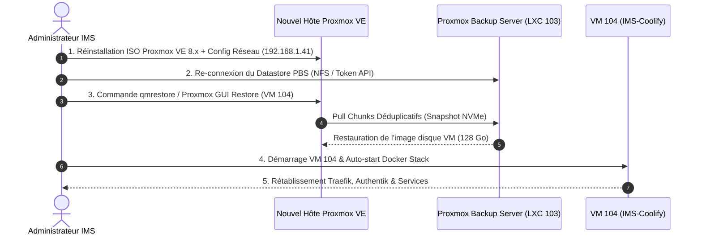

<Badge color="amber">🟡 En cours de rédaction — Non testé en conditions réelles</Badge>

<Warning>
**ATTENTION** : Cette procédure constitue le plan théorique de restauration d'urgence (Plan de Reprise d'Activité — PRA) en cas de perte totale du SSD NVMe principal de l'hôte Proxmox MS-01 (`ms01-pve`). Elle n'a pas encore fait l'objet d'une simulation réelle à froid.
</Warning>

## Objectif du Runbook

Rétablir l'intégralité de l'infrastructure et de la VM Coolify (`104`) sur un nouveau disque NVMe vierge ou un hyperviseur de secours à partir des sauvegardes dédupliquées stockées sur le Proxmox Backup Server (LXC 103 / NAS).

---

## Vue d'Ensemble de la Séquence de Restauration



---

## Étapes Opérationnelles de Restauration

### Étape 1 — Réinstallation du Système Hôte Proxmox VE

1. Démarrer le serveur MS-01 sur la clé USB d'installation ISO Proxmox VE 8.x.
2. Définir le nom d'hôte : `ms01-pve.lan.ims-world.fr`.
3. Assigner l'adresse IP statique du LAN : `192.168.1.41/24`, passerelle `192.168.1.1`.
4. Recréer le bridge virtuel d'isolation stockage `vmbr1` (`10.10.10.254/24`).

### Étape 2 — Re-connexion au Datastore Proxmox Backup Server (PBS)

Si le conteneur LXC PBS 103 est hébergé sur le stockage physique HDD préservé du NAS (`10.10.10.1`) :

```bash
# Ajouter le stockage PBS dans la configuration Proxmox VE
pvesm add pbs pbs-storage \
  --server 10.10.10.3 \
  --datastore pve-backups \
  --username root@pam \
  --fingerprint <empreinte_certificat_pbs>
```

### Étape 3 — Restauration de la VM Coolify (VM 104)

```bash
# Lister les sauvegardes disponibles dans le datastore PBS
proxmox-backup-client snapshot list --repository root@pam@10.10.10.3:pve-backups

# Restaurer la VM 104 sur le nouveau stockage NVMe local-zfs / local-lvm
qmrestore pbs-storage:backup/vm/104/2026-08-20T00:00:00Z 104 --storage local-zfs
```

### Étape 4 — Post-Restauration & Vérification des Services

1. Démarrer la VM 104 : `qm start 104`.
2. Vérifier que Docker et le proxy Traefik redémarrent automatiquement :
   ```bash
   ssh cmolotkoff@100.64.0.4 "docker ps"
   ```
3. Exécuter la check-list de validation de l'étanchéité des services `vpn-only` ([Sécuriser un Service avec vpn-only](/procedures/securiser-service-vpn-only)).
