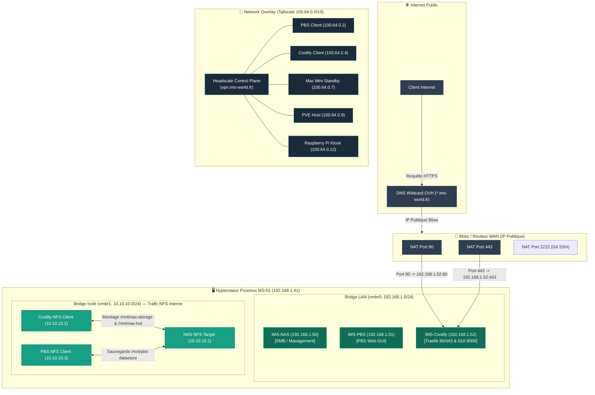

import { ips, domains } from "/snippets/variables.mdx";

## Diagramme Réseau Global



## Bridges Proxmox

| Bridge | Plage réseau | Rôle & Usage |
|---|---|---|
| `vmbr0` | `192.168.1.0/24` | LAN principal — SMB, SSH, interfaces d'administration locales |
| `vmbr1` | `10.10.10.0/24` (sans gateway) | Réseau virtuel isolé — trafic NFS haute vitesse entre l'hôte et les guests (NAS ↔ PBS ↔ Coolify) |

## Plan d'Adressage IP Complet (LAN, NFS & Tailnet)

| Équipement / Guest | `vmbr0` (LAN) | `vmbr1` (NFS Isolé) | Tailscale IP | Hostname Tailnet | Rôle |
|---|---|---|---|---|---|
| **Host Proxmox (MS-01)** | `{ips.pveLan}` | — | `{ips.ms01}` | `ims-pve-host` | Hyperviseur Principal Proxmox VE 9 |
| **IMS-NAS (LXC 100)** | `{ips.nasLan}` | `10.10.10.1` | ⚠️ Aucun (LAN) | — | Stockage FUSE MergerFS & NFS/SMB |
| **IMS-PBS (LXC 103)** | `{ips.pbsLan}` | `10.10.10.3` | `{ips.pbs}` | `ims-pve-103-pbs` | Proxmox Backup Server |
| **IMS-Coolify (VM 104)** | `{ips.coolifyLan}` | `10.10.10.2` | `{ips.coolify}` | `ims-pve-104-coolify` | Moteur Docker, Traefik v3.7 & Coolify |
| **Raspberry Pi 3B+** | `192.168.1.x` | — | `{ips.rpi}` | `ims-rpi-monitor` | Affichage Kiosk 2U |
| **Mac Mini 2014** | `192.168.1.x` | — | `{ips.macmini}` | `macmini-standby` | Hôte Standby chaud |

## Headscale — Control Plane Tailscale Self-Hosted

| Propriété | Valeur |
|---|---|
| **Serveur Control Plane** | `{domains.headscale}` |
| **Orchestration** | VM IMS-Coolify (VM 104) |
| **Plage Tailnet** | `100.64.0.0/10` (IPv4), `fd7a:115c:a1e0::/48` (IPv6) |
| **MagicDNS** | `*.ts.ims-world.fr` |

## Port-Forward Bbox

| Règle Bbox | Port Externe | Port Interne | Cible |
|---|---|---|---|
| `Coolify_HTTP` | 80 | 80 | VM Coolify (`{ips.coolifyLan}`) |
| `Coolify_HTTPS` | 443 | 443 | VM Coolify (`{ips.coolifyLan}`) |
| `Forgejo_SSH` | 2222 | 2222 | VM Coolify (`{ips.coolifyLan}`) |

## DNS Public Wildcard (OVH)

- **Configuration Wildcard `*.ims-world.fr`** : La zone DNS publique chez OVH redirige tout le trafic du domaine wildcard `*.ims-world.fr` vers l'IP publique dynamique de la Bbox.
- **Routage Automatique Coolify & Traefik** : Cette configuration permet à Coolify d'attribuer et de déployer n'importe quel nouveau sous-domaine (`auth.ims-world.fr`, `homeflix.ims-world.fr`, `vault.ims-world.fr`, etc.) instantanément, sans avoir à créer manuellement un nouvel enregistrement A dans la console OVH à chaque nouveau service.
- **Certificats HTTPS** : Génération et renouvellement automatisés des certificats TLS Let's Encrypt via le challenge DNS-01 (API OVH).

## Enregistrements Spéciaux Headscale (`extra_records`)

Les enregistrements internes configurés dans `config.yaml` (`dns.extra_records`) de Headscale permettent de mapper des noms FQDN personnalisés uniquement résolubles par les appareils connectés au Tailnet :

```yaml
extra_records:
  - name: "coolify-old.ims-world.fr"
    value: "{ips.macmini}"   # accès de secours à l'ancienne instance Mac Mini
```

## Sécurité Réseau & Firewall Host

| Composant | Rôle |
|---|---|
| **CrowdSec** | Détection et filtrage des comportements malveillants |
| **Fail2ban** | Bannissement dynamique d'IP via `nftables` |
| **Endlessh** | Tarpit anti-bot sur le port 22 (accès SSH légitime sur le port **4242**) |
| **Firewall Proxmox (Roadmap)** | Filtrage 3 niveaux (Host → Datacenter → Guest) en cours de déploiement |
