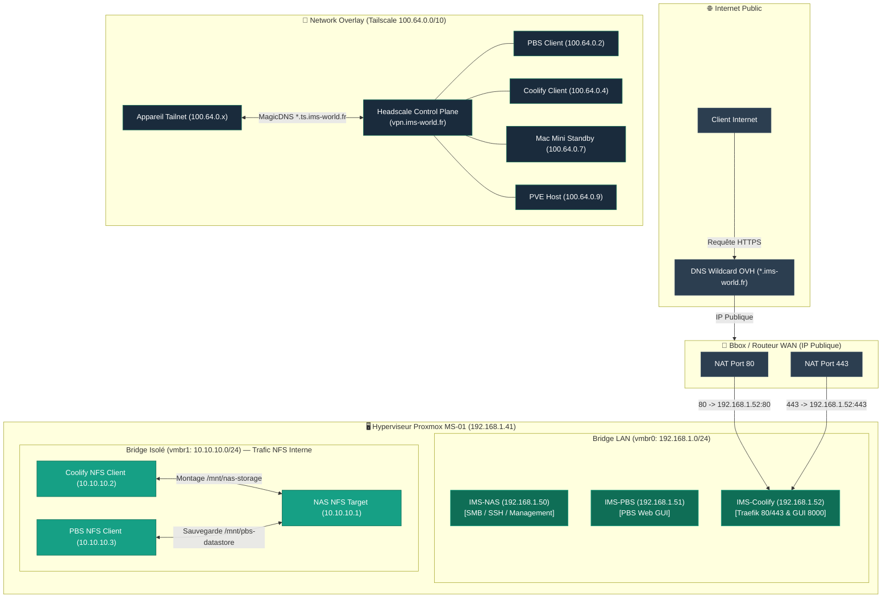

## Diagramme Réseau Global



## Bridges Proxmox

| Bridge | Plage | Usage |
|---|---|---|
| `vmbr0` | 192.168.1.0/24 | LAN — SMB, SSH, GUI locales |
| `vmbr1` | 10.10.10.0/24 (sans gateway) | Réseau isolé — trafic NFS interne entre guests |

## IPs par guest

| Guest | `vmbr0` (LAN) | `vmbr1` (isolé) | Tailscale |
|---|---|---|---|
| IMS-NAS | 192.168.1.50 | 10.10.10.1 | ⚠️ Aucun |
| IMS-PBS | 192.168.1.51 | 10.10.10.3 | 100.64.0.2 |
| IMS-Coolify | 192.168.1.52 | 10.10.10.2 | 100.64.0.4 |
| Mac Mini | — | — | 100.64.0.7 |
| Host MS-01 (pve) | 192.168.1.41 | — | 100.64.0.9 |
| ims-rpi-monitor | — | — | 100.64.0.12 |

<Warning>
Le NAS n'a aucun accès distant Tailscale à ce jour — SMB/NFS accessibles en LAN uniquement. Décision à trancher : subnet router généraliste vs client dédié (comme PBS/Coolify).
</Warning>

## Headscale — control plane Tailscale self-hosted

| Propriété | Valeur |
|---|---|
| **Serveur** | `vpn.ims-world.fr` |
| **Hébergement actuel** | VM IMS-Coolify (MS-01) — migré depuis le Mac Mini le 02/08/2026 |
| **Plage tailnet** | `100.64.0.0/10` (IPv4), `fd7a:115c:a1e0::/48` (IPv6) |
| **MagicDNS** | `*.ts.ims-world.fr` |

<Info>
Le nom `vpn.ims-world.fr` est reconnu comme trompeur (Headscale est un control plane, pas un VPN classique faisant transiter le trafic). Renommage envisagé mais reporté — nécessiterait de reconfigurer manuellement chaque appareil du tailnet.
</Info>

## Port-forward Bbox

| Règle | Port externe | Cible actuelle |
|---|---|---|
| `Coolify_HTTP` | 80 | VM Coolify (192.168.1.52) |
| `Coolify_HTTPS` | 443 | VM Coolify (192.168.1.52) |

<Warning>
**Découverte critique lors du cutover** : le port-forward route TOUT le trafic public d'un coup — il n'existe pas de bascule "partielle" au niveau réseau. Un domaine dont le Traefik cible n'a pas de router configuré reçoit le certificat par défaut de Traefik (TLS cassé), même s'il n'était pas visé par le changement. Pour un futur cutover : préparer tous les routers Traefik cibles AVANT de toucher au port-forward.
</Warning>

## DNS public (OVH)

- Wildcard `*.ims-world.fr` → IP publique
- Chaque sous-domaine récupère un vrai enregistrement A via le challenge DNS-01 Let's Encrypt (voir [Traefik Proxy](/reseau/traefik-proxy))

## Extra_records Headscale actifs

Injectés dans `config.yaml` de Headscale (`dns.extra_records`), résolus uniquement via MagicDNS pour les appareils du tailnet :

```yaml
extra_records:
  - name: "coolify-old.ims-world.fr"
    value: "100.64.0.7"   # accès de secours au Mac Mini, période de validation
```

<Tip>
Pattern réutilisé pendant toute la migration : ajouter un extra_record `<service>-ng.ims-world.fr` pointant vers la nouvelle instance permet de tester en conditions quasi-réelles sans jamais toucher au vrai nom de production — sauf pour Headscale lui-même, où le `server_url` est une identité, pas un simple routage (voir [Headscale](/services/headscale-headplane)).
</Tip>

## Sécurité réseau existante (Mac Mini, héritée)

| Outil | Rôle |
|---|---|
| CrowdSec | Détection/blocage d'intrusions |
| Fail2ban | Ban IP (nftables) |
| Endlessh | Tarpit anti-bot sur le port 22 (vrai SSH sur le port **4242**) |
| UFW + `DOCKER-USER` | Firewall contournant le bypass Docker/iptables |

<Warning>
Le firewall Proxmox 3 niveaux (host MS-01) n'est pas encore configuré — reste à faire avant toute exposition publique supplémentaire.
</Warning>
