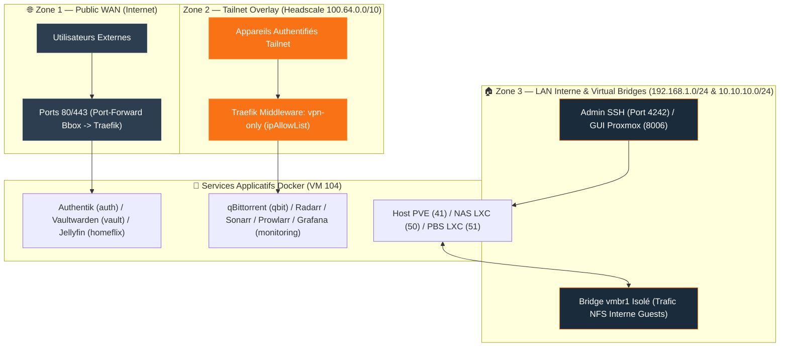

import { ips, domains } from "/snippets/variables.mdx";

## Philosophie de Sécurité (Sécurité en Profondeur)

<Info>
L'infrastructure IMS-WORLD applique le principe de **moindre privilège** et de **sécurité en profondeur** : aucun service n'est exposé publiquement s'il n'en a pas le besoin strict. Le trafic d'administration est systématiquement restreint au réseau privé Tailscale ou au LAN local.
</Info>

---

## 🔒 Architecture & Définition des 3 Zones de Confiance

Avant de répertorier chaque service applicatif, l'infrastructure est découpée en **3 zones d'isolation étanches** :

1. **Zone 1 — Public WAN (Internet)** : Services ouverts sur le Web (`auth.ims-world.fr`, `vault.ims-world.fr`, `homeflix.ims-world.fr`, `videoclub.ims-world.fr`). Accessibles via HTTPS sur les ports 80/443 de la Bbox, protégés par Traefik, Let's Encrypt et Authentik SSO.
2. **Zone 2 — Tailnet Overlay (VPN Restreint `100.64.0.0/10`)** : Services privés d'administration applicative (`qbit`, `radarr`, `sonarr`, `prowlarr`, `monitoring`, `headplane`). Résolution masquée (OVH `127.0.0.1`) et filtrés par le middleware Traefik `vpn-only` (**HTTP 403 Forbidden** hors du Tailnet).
3. **Zone 3 — Administration LAN & Bridge NFS Isolé (`192.168.1.0/24` & `10.10.10.0/24`)** : Interfaces de gestion bas niveau des hyperviseurs et stockage (GUI Proxmox 8006, PBS GUI 8007, SMB 445, NFS 2049). Totalement fermées à l'Internet public.

---

## 🛡️ Matrice d'Exposition par Zone de Confiance

<Tabs>
  <Tab title="🌐 Zone 1 — Services Publics (WAN)">
    <CardGroup cols={2}>
      <Card title="Authentik SSO" icon="key" href="/services/authentik">
        **Domaine** : `auth.ims-world.fr`
        **Auth** : SSO OIDC + WebAuthn 2FA
        **Protection** : Let's Encrypt DNS-01, TLS 1.3
      </Card>
      <Card title="Vaultwarden" icon="shield-halved" href="/services/vaultwarden">
        **Domaine** : `vault.ims-world.fr`
        **Auth** : SSO Authentik + Mot de passe fort
        **Protection** : TLS 1.3, Config `email_verified: true`
      </Card>
      <Card title="Jellyfin" icon="play" href="/services/homeflix">
        **Domaine** : `homeflix.ims-world.fr`
        **Auth** : Authentification native Jellyfin
        **Protection** : DNS-01 TLS, Transcodage iGPU Iris Xe
      </Card>
      <Card title="Jellyseerr" icon="film" href="/services/homeflix">
        **Domaine** : `videoclub.ims-world.fr`
        **Auth** : SSO / Auth Jellyfin
        **Protection** : DNS-01 TLS
      </Card>
      <Card title="Headscale VPN Server" icon="network-wired" href="/services/headscale-headplane">
        **Domaine** : `vpn.ims-world.fr`
        **Auth** : Noise Key Protocol + OIDC SSO
        **Protection** : Port-forwarding dédié 443
      </Card>
      <Card title="Ntfy Push Server" icon="bell" href="/services/ntfy">
        **Domaine** : `ntfy.ims-world.fr`
        **Auth** : Compte/Token local (Exposition WAN assumée pour push mobile)
        **Protection** : `signup=false`, `default_access=deny-all`
      </Card>
      <Card title="Dozzle Logs" icon="list" href="/services/dozzle">
        **Domaine** : `logs.ims-world.fr`
        **Auth** : Authentik Forward-Auth Outpost Traefik
        **Protection** : Session SSO obligatoire en amont du proxy
      </Card>
    </CardGroup>
  </Tab>
  <Tab title="🔐 Zone 2 — Services Filtrés (Tailnet Only)">
    <CardGroup cols={2}>
      <Card title="Headplane Admin" icon="sliders" href="/services/headscale-headplane">
        **URL** : `vpn.ims-world.fr/admin`
        **Protection** : Middleware Traefik `vpn-only` (`100.64.0.0/10`)
      </Card>
      <Card title="qBittorrent" icon="download" href="/services/homeflix">
        **Domaine** : `qbit.ims-world.fr`
        **Protection** : Middleware `vpn-only` + Kill-switch VPN Gluetun
      </Card>
      <Card title="Radarr & Sonarr" icon="tv" href="/services/homeflix">
        **Domaines** : `radarr.ims-world.fr` / `sonarr.ims-world.fr`
        **Protection** : Middleware `vpn-only` + Auth Formulaire
      </Card>
      <Card title="Prowlarr" icon="magnifying-glass" href="/services/homeflix">
        **Domaine** : `prowlarr.ims-world.fr`
        **Protection** : Middleware `vpn-only` + API Keys
      </Card>
      <Card title="Grafana (Monitoring)" icon="chart-line" href="/services/monitoring">
        **Domaine** : `monitoring.ims-world.fr`
        **Protection** : Middleware `vpn-only` + SSO Authentik OIDC
      </Card>
    </CardGroup>
  </Tab>
  <Tab title="🏠 Zone 3 — Administration LAN & NFS Isolé">
    | Service / Nœud | Adresse / Port | Exposition | Méthode d'Authentification |
    |---|---|---|---|
    | **Proxmox VE GUI** | `{ips.pveLan}:8006` | 🏠 LAN / Tailnet | PAM / Compte `cmolotkoff` |
    | **PBS Web GUI** | `{ips.pbsLan}:8007` | 🏠 LAN / Tailnet | Auth PBS `cmolotkoff@pbs` |
    | **NAS SMB** | `{ips.nasLan}:445` | 🏠 LAN Only | Auth SMB `cmolotkoff` |
    | **NAS NFS** | `10.10.10.1:2049` | 🔒 `vmbr1` Isolé | Subnet IP `10.10.10.0/24` |
  </Tab>
</Tabs>

---

## 🔒 Règles de Sécurité Impératives

<Warning>
**Port SSH 4242** : Le serveur SSH réel écoute sur le port **4242**. Le port 22 est occupé par **Endlessh** (tarpit piège à bots). Ne jamais ouvrir le port 22 ou 4242 vers le WAN public.
</Warning>

<Warning>
**Protection Iptables / Docker Bypass** : Docker contourne par défaut les règles UFW/iptables standards. La chaîne `DOCKER-USER` est configurée pour forcer le respect des restrictions IP.
</Warning>

<Tip>
Pour vérifier à tout moment qu'un service restreint n'est pas accessible depuis l'extérieur, exécuter un test d'accès WAN :
`curl -Iv https://qbit.ims-world.fr` (Doit retourner un HTTP **403 Forbidden** via le middleware `vpn-only`).
</Tip>
