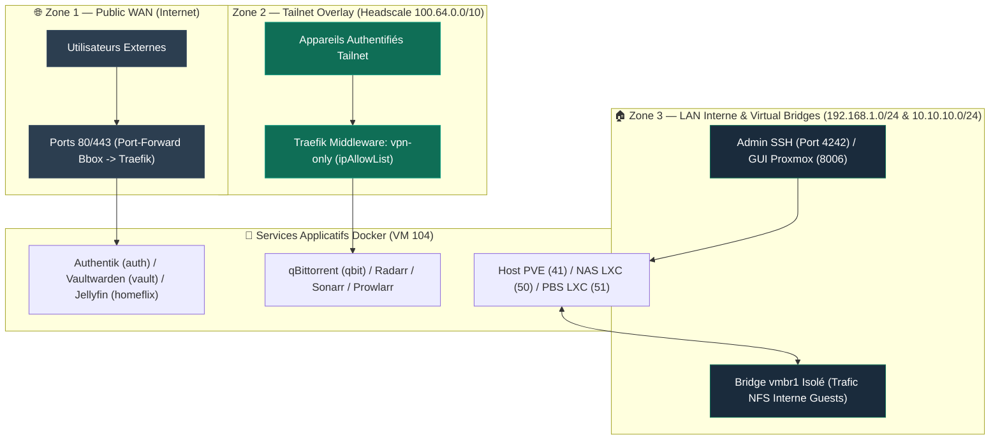

## Philosophie de Sécurité (Sécurité en Profondeur)

<Info>
L'infrastructure IMS-WORLD applique le principe de **moindre privilège** et de **sécurité en profondeur** : aucun service n'est exposé publiquement s'il n'en a pas le besoin strict. Le trafic d'administration est systématiquement restreint au réseau privé Tailscale ou au LAN local.
</Info>

---

## 🛡️ Schéma des 3 Zones de Confiance Réseau

---

## 📊 Matrice d'Exposition et d'Authentification des Services

| Service | Domaine / Adresse | Exposition | Méthode d'Authentification | Protections & Middlewares |
|---|---|---|---|---|
| **Authentik** | `auth.ims-world.fr` | 🌐 Public WAN | SSO OIDC + WebAuthn 2FA | Let's Encrypt DNS-01, TLS 1.3 |
| **Vaultwarden** | `vault.ims-world.fr` | 🌐 Public WAN | SSO Authentik + Mdp fort | Config `email_verified: true`, TLS 1.3 |
| **Jellyfin** | `homeflix.ims-world.fr` | 🌐 Public WAN | Auth native Jellyfin | DNS-01 TLS, Transcodage isolé |
| **Jellyseerr** | `videoclub.ims-world.fr` | 🌐 Public WAN | SSO / Auth Jellyfin | DNS-01 TLS |
| **Headscale** | `vpn.ims-world.fr` | 🌐 Public WAN | OIDC Authentik SSO + Noise Key | Protocol Noise encryption |
| **Headplane** | `vpn.ims-world.fr/admin` | 🔐 Tailnet-only | OIDC Authentik SSO | Middleware `vpn-only` |
| **qBittorrent** | `qbit.ims-world.fr` | 🔐 Tailnet-only | Auth native (`HostHeaderValidation=false`) | Middleware `vpn-only`, Gluetun VPN Tunnel |
| **Prowlarr** | `prowlarr.ims-world.fr` | 🔐 Tailnet-only | Auth native / API Key | Middleware `vpn-only` |
| **Radarr** | `radarr.ims-world.fr` | 🔐 Tailnet-only | Auth native / Formulaire | Middleware `vpn-only` |
| **Sonarr** | `sonarr.ims-world.fr` | 🔐 Tailnet-only | Auth native / Formulaire | Middleware `vpn-only` |
| **IT-Tools** | `it.ims-world.fr` | 🔐 Tailnet-only | Aucune (Outil stateless) | Middleware `vpn-only` |
| **Cap** | `cap.ims-world.fr` | ⏸️ En Pause | NextAuth / MySQL Keys | Chiffrement `DATABASE_ENCRYPTION_KEY` |
| **Proxmox VE GUI** | `192.168.1.41:8006` | 🏠 LAN / Tailnet | PAM / Compte nominatif `cmolotkoff` | HTTPS Auto-signé, Port restreint |
| **PBS Web GUI** | `192.168.1.51:8007` | 🏠 LAN / Tailnet | Auth PBS `cmolotkoff@pbs` | HTTPS Auto-signé |
| **NAS SMB** | `192.168.1.50:445` | 🏠 LAN-only | Auth SMB `cmolotkoff` | Bloqué hors du LAN |
| **NAS NFS** | `10.10.10.1:2049` | 🔒 `vmbr1` Isolé | Restriction IP Subnet `10.10.10.0/24` | `no_root_squash` restreint aux guests |

---

## 🔒 Règles de Sécurité Impératives

<Warning>
**Port SSH 4242** : Le serveur SSH réel écoute sur le port **4242**. Le port 22 est occupé par **Endlessh** (tarpit piège à bots). Ne jamais ouvrir le port 22 ou 4242 vers le WAN public.
</Warning>

<Warning>
**Protection Iptables / Docker Bypass** : Docker contourne par défaut les règles UFW/iptables standards. La chaîne `DOCKER-USER` est configurée pour forcer le respect des restrictions IP.
</Warning>

<Tip>
Pour vérifier à tout moment qu'un service restreint n'est pas accessible depuis l'extérieur, exécuter un test d'accès WAN :
`curl -Iv https://qbit.ims-world.fr` (Doit retourner un HTTP **403 Forbidden** via le middleware `vpn-only`).
</Tip>
