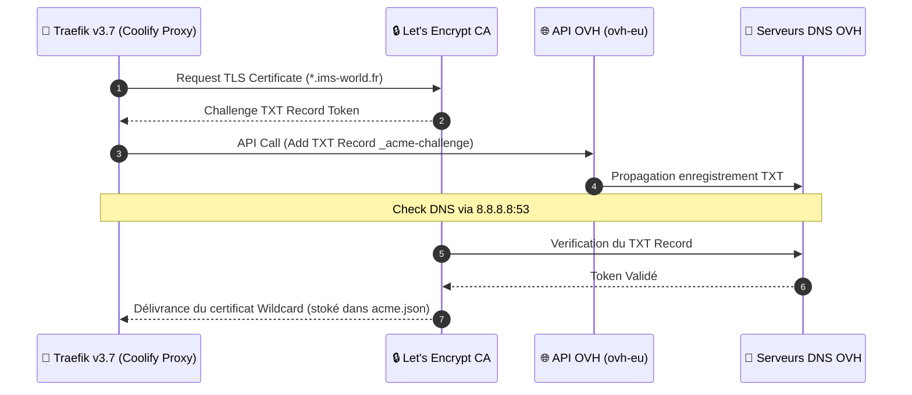

import { ips, domains } from "/snippets/variables.mdx";

<Badge color="green">🟢 Production Active (Traefik v3.7)</Badge>

## Version & Environnement

| Propriété | Valeur |
|---|---|
| **Image Docker** | `traefik:v3.7` |
| **Hôte d'Orchestration** | VM IMS-Coolify (VM 104) |
| **Réseau Docker** | `coolify` |
| **Challenge SSL** | Let's Encrypt DNS-01 (API OVH) |

---

## Séquence du Challenge ACME DNS-01 (OVH)



---

## Pipeline de Routage & Middleware Traefik

```mermaid
graph TD
    subgraph INGRESS ["🌐 Requêtes Entrantes"]
        PUB_REQ["Trafic Public WAN (80/443)"]
        VPN_REQ["Trafic Tailnet VPN (100.64.0.0/10)"]
    end

    subgraph TRAEFIK_ENGINE ["🚦 Traefik Proxy Engine"]
        ROUTER_PUB["Routers Publics (auth, vault)"]
        ROUTER_RESTRICT["Routers Restreints (arr, qbit)"]

        subgraph MIDDLEWARES ["🛡️ Dynamic Middlewares"]
            VPN_ONLY["vpn-only (ipAllowList: 100.64.0.0/10)"]
            TLS_RESOLVER["letsencrypt (DNS-01 OVH)"]
        end
    end

    subgraph CONTAINERS ["🐳 Containers Docker Cibles"]
        SVC_AUTH["Authentik (auth.ims-world.fr)"]
        SVC_VAULT["Vaultwarden (vault.ims-world.fr)"]
        SVC_QBIT["qBittorrent / *arr Stack"]
    end

    PUB_REQ --> ROUTER_PUB
    PUB_REQ --> ROUTER_RESTRICT

    VPN_REQ --> ROUTER_PUB
    VPN_REQ --> ROUTER_RESTRICT

    ROUTER_PUB --> TLS_RESOLVER
    TLS_RESOLVER --> SVC_AUTH
    TLS_RESOLVER --> SVC_VAULT

    ROUTER_RESTRICT --> VPN_ONLY
    VPN_ONLY -->|Si IP 100.64.x.x| SVC_QBIT
    VPN_ONLY -.-X|Si IP WAN Publique (403 Forbidden)| PUB_REQ

    classDef ingress fill:#2c3e50,stroke:#34495e,color:#fff;
    classDef traefik fill:#0F6E56,stroke:#16A085,color:#fff;
    classDef container fill:#1a2b3c,stroke:#0F6E56,color:#fff;
    class PUB_REQ,VPN_REQ ingress;
    class ROUTER_PUB,ROUTER_RESTRICT,VPN_ONLY,TLS_RESOLVER traefik;
    class SVC_AUTH,SVC_VAULT,SVC_QBIT container;
```

```yaml
environment:
  - OVH_ENDPOINT=ovh-eu
  - OVH_APPLICATION_KEY=<clé>
  - OVH_APPLICATION_SECRET=<secret>
  - OVH_CONSUMER_KEY=<consumer_key>
command:
  - '--certificatesresolvers.letsencrypt.acme.email=<email>'
  - '--certificatesresolvers.letsencrypt.acme.dnschallenge=true'
  - '--certificatesresolvers.letsencrypt.acme.dnschallenge.provider=ovh'
  - '--certificatesresolvers.letsencrypt.acme.dnschallenge.resolvers=8.8.8.8:53'
  - '--certificatesresolvers.letsencrypt.acme.storage=/traefik/acme.json'
  - '--providers.docker.network=coolify'
```

<Warning>
Le résolveur DNS recommandé par OVH (`213.251.128.1:53`) est tombé en panne, confirmé injoignable depuis 3 machines différentes. Contournement : `8.8.8.8` seul dans la liste. À revérifier périodiquement pour réintégrer le résolveur OVH.
</Warning>

<Warning>
Contrairement aux autres services (Environment Variables Coolify avec option "Is Secret"), les credentials OVH du proxy sont actuellement **en clair** dans le `docker-compose.yml` — limitation propre à cette partie de Coolify. À sécuriser via un `.env` séparé (voir [Roadmap](/procedures/roadmap)).
</Warning>

---

## Middleware `vpn-only` — Services Restreints à Tailscale

Fichier dynamique séparé (pas géré par les labels Docker), à recréer manuellement sur toute nouvelle install :

```yaml
# /data/coolify/proxy/dynamic/vpn-only.yaml
http:
  middlewares:
    vpn-only:
      ipAllowList:
        sourceRange:
          - "100.64.0.0/10"
```

Appliqué sur : qBittorrent, Prowlarr, Radarr, Sonarr (label `traefik.http.routers.<x>.middlewares=vpn-only@file`).

### Double Verrouillage & Limites de Sécurité Réelle

La restriction d'accès aux services privés (qBittorrent, Sonarr, Radarr, Prowlarr) s'appuie sur une **double barrière de sécurité** :

1. **Masquage au niveau DNS (OVH Override `127.0.0.1`)** :
   - Les sous-domaines privés sont configurés dans la zone DNS OVH pour pointer vers `127.0.0.1` (loopback). Un client public WAN qui effectue une résolution DNS ne découvre pas l'IP publique Bbox.
   - *Limite* : Le DNS n'étant pas une frontière réseau, un attaquant connaissant l'IP publique Bbox et forçant le header HTTP `Host` en HTTPS interroge tout de même le proxy Traefik.

2. **Filtrage applicatif au niveau Proxy (Middleware `ipAllowList`)** :
   - Le middleware Traefik `vpn-only` contrôle l'IP source de la requête HTTP entrante. Si l'IP ne fait pas partie de la plage du Tailnet (`100.64.0.0/10`), Traefik rejette immédiatement la connexion avec une **HTTP 403 Forbidden**.

<Note>
**Piste de Durcissement Niveau 4 (Roadmap)** : Pour une étanchéité absolue indépendante de la couche HTTP (évitant qu'une requête WAN atteigne Traefik), il est préconisé soit de binder l'écoute de ces services uniquement sur l'IP Tailscale de la VM (`100.64.0.4`), soit de bloquer les ports au niveau du pare-feu Proxmox (Layer 4). Voir [Roadmap](/procedures/roadmap).
</Note>

---

## Règle Réseau Multi-Interfaces — `traefik.docker.network`

<Warning>
Pour tout service attaché à **plusieurs réseaux Docker**, le label `traefik.docker.network=coolify` est indispensable — sans lui, Traefik ne sait pas quelle IP utiliser malgré un port explicitement défini. Symptôme : `service error: port is missing` dans les logs `coolify-proxy`.
</Warning>

---

## ⚠️ Règle d'Or de Routage : UI Coolify vs Labels Compose Manuels

<Warning>
**Règle de Routage Traefik & Coolify** : 

L'astuce d'utilisation du champ *Domains* dans l'UI Coolify (*"laisser Coolify gérer le routeur Traefik"*) est **exclusivement réservée aux services standards sans middleware sur-mesure** (sans `vpn-only`, sans forward-auth).

Dès qu'un service nécessite un middleware Traefik spécifique (ex: filtrage d'accès IP `vpn-only` pour les services Tailscale-only), **il faut impérativement ré-expliciter les labels Traefik manuellement dans le fichier Compose (`docker-compose.yml`) et laisser le champ Domains vide dans l'UI Coolify**. Sinon, Coolify génère un routeur automatique parallèle sans middleware, ce qui ré-expose publiquement le service.
</Warning>

