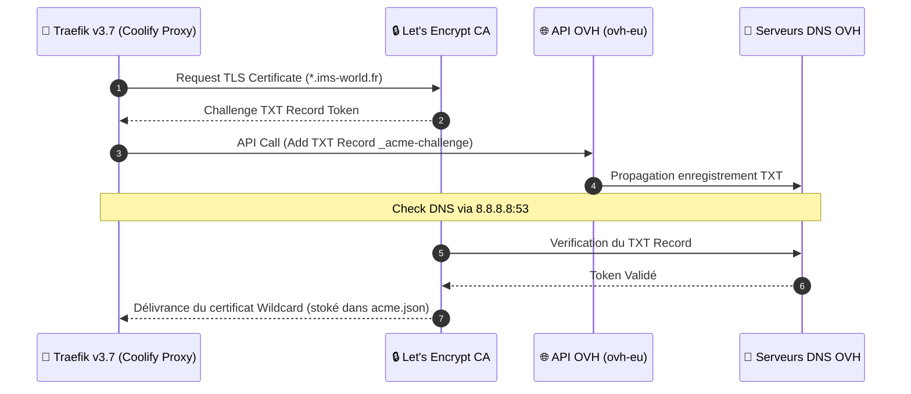

## Version

| Propriété | Valeur |
|---|---|
| **Image** | `traefik:v3.7` |
| **Mis à jour depuis** | `v3.6.23`, sans incident réel |

<Note>
Une fausse alerte post-upgrade a fait croire à un vrai problème (503 sur tous les domaines de test) — en réalité un artefact de test "hairpin" (curl lancé depuis la VM elle-même via son IP Tailscale). Toujours tester la disponibilité d'un service Tailscale depuis un point **externe**, jamais depuis la machine qui l'héberge.
</Note>

## Séquence du Challenge ACME DNS-01 (OVH)



## Pipeline de Routage & Middleware Traefik

```mermaid
graph TD
    subgraph INGRESS ["🌐 Requêtes Entrantes"]
        PUB_REQ["Trafic Public WAN (80/443)"]
        VPN_REQ["Trafic Tailnet VPN (100.64.0.0/10)"]
    end

    subgraph TRAEFIK_ENGINE ["🚦 Traefik Proxy Engine"]
        ROUTER_PUB["Routers Publics (auth, vault)"]
        ROUTER_RESTRICT["Routers Restreints (arr, qbit)"]

        subgraph MIDDLEWARES ["🛡️ Dynamic Middlewares"]
            VPN_ONLY["vpn-only (ipAllowList: 100.64.0.0/10)"]
            TLS_RESOLVER["letsencrypt (DNS-01 OVH)"]
        end
    end

    subgraph CONTAINERS ["🐳 Containers Docker Cibles"]
        SVC_AUTH["Authentik (auth.ims-world.fr)"]
        SVC_VAULT["Vaultwarden (vault.ims-world.fr)"]
        SVC_QBIT["qBittorrent / *arr Stack"]
    end

    PUB_REQ --> ROUTER_PUB
    PUB_REQ --> ROUTER_RESTRICT

    VPN_REQ --> ROUTER_PUB
    VPN_REQ --> ROUTER_RESTRICT

    ROUTER_PUB --> TLS_RESOLVER
    TLS_RESOLVER --> SVC_AUTH
    TLS_RESOLVER --> SVC_VAULT

    ROUTER_RESTRICT --> VPN_ONLY
    VPN_ONLY -->|Si IP 100.64.x.x| SVC_QBIT
    VPN_ONLY -.-X|Si IP WAN Publique (403 Forbidden)| PUB_REQ

    classDef ingress fill:#2c3e50,stroke:#34495e,color:#fff;
    classDef traefik fill:#0F6E56,stroke:#16A085,color:#fff;
    classDef container fill:#1a2b3c,stroke:#0F6E56,color:#fff;
    class PUB_REQ,VPN_REQ ingress;
    class ROUTER_PUB,ROUTER_RESTRICT,VPN_ONLY,TLS_RESOLVER traefik;
    class SVC_AUTH,SVC_VAULT,SVC_QBIT container;
```

```yaml
environment:
  - OVH_ENDPOINT=ovh-eu
  - OVH_APPLICATION_KEY=<clé>
  - OVH_APPLICATION_SECRET=<secret>
  - OVH_CONSUMER_KEY=<consumer_key>
command:
  - '--certificatesresolvers.letsencrypt.acme.email=<email>'
  - '--certificatesresolvers.letsencrypt.acme.dnschallenge=true'
  - '--certificatesresolvers.letsencrypt.acme.dnschallenge.provider=ovh'
  - '--certificatesresolvers.letsencrypt.acme.dnschallenge.resolvers=8.8.8.8:53'
  - '--certificatesresolvers.letsencrypt.acme.storage=/traefik/acme.json'
  - '--providers.docker.network=coolify'
```

<Warning>
Le résolveur DNS recommandé par OVH (`213.251.128.1:53`) est tombé en panne, confirmé injoignable depuis 3 machines différentes. Contournement : `8.8.8.8` seul dans la liste. À revérifier périodiquement pour réintégrer le résolveur OVH.
</Warning>

<Warning>
Contrairement aux autres services (Environment Variables Coolify avec option "Is Secret"), les credentials OVH du proxy sont actuellement **en clair** dans le `docker-compose.yml` — limitation propre à cette partie de Coolify. À sécuriser via un `.env` séparé, non urgent.
</Warning>

## Pièges de mise en route rencontrés

<Steps>
  <Step title="Resolver jamais initialisé">
    `nonexistent certificate resolver` sur tous les routers — cause : ligne `acme.email` manquante. Sans email de contact ACME, le resolver entier échoue silencieusement.
  </Step>
  <Step title="Permissions acme.json trop ouvertes">
    ```
    error="unable to get ACME account: permissions 660 for /traefik/acme.json are too open, please use 600"
    ```
    ```bash
    chmod 600 /data/coolify/proxy/acme.json
    ```
  </Step>
  <Step title="Panne du résolveur DNS OVH">
    Voir ci-dessus — basculé sur `8.8.8.8` seul.
  </Step>
</Steps>

## Middleware `vpn-only` — services restreints à Tailscale

Fichier dynamique séparé (pas géré par les labels Docker), à recréer manuellement sur toute nouvelle install :

```yaml
# /data/coolify/proxy/dynamic/vpn-only.yaml
http:
  middlewares:
    vpn-only:
      ipAllowList:
        sourceRange:
          - "100.64.0.0/10"
```

Appliqué sur : qBittorrent, Prowlarr, Radarr, Sonarr (label `traefik.http.routers.<x>.middlewares=vpn-only@file`).

<Warning>
**Audit de sécurité en attente** : `vpn-only` confirmé fonctionnel sur qBittorrent et Radarr (test explicite), mais **jamais re-testé sur Sonarr et Prowlarr** après tous les changements de la stack. Vérifier l'absence de router Traefik fantôme auto-généré par Coolify qui contournerait ce middleware (pattern déjà rencontré une fois sur Gluetun, corrigé).
</Warning>

## Piège récurrent — `traefik.docker.network` manquant

<Warning>
Pour tout service attaché à **plusieurs réseaux Docker**, le label `traefik.docker.network=coolify` est indispensable — sans lui, Traefik ne sait pas quelle IP utiliser malgré un port explicitement défini. Symptôme : `service error: port is missing` dans les logs `coolify-proxy`. Rencontré sur Gluetun (HomeFlix) et Headscale, à vérifier systématiquement sur tout nouveau service multi-réseaux.
</Warning>

## Découverte structurelle — port-forward et cutover

<Warning>
Basculer le port-forward Bbox route **tout le trafic public d'un coup**, pas seulement le service qu'on cherche à basculer. Voir [Architecture réseau](/reseau/architecture-reseau) pour le détail de cette découverte lors du cutover du 02/08/2026.
</Warning>
