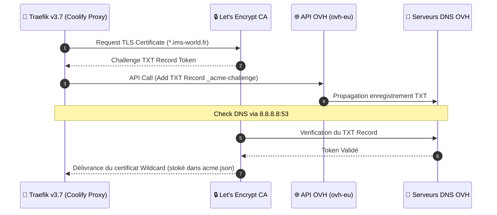

import { ips, domains } from "/snippets/variables.mdx";

<Badge color="green">🟢 Production Active (Traefik v3.7)</Badge>

## Version & Environnement

| Propriété | Valeur |
|---|---|
| **Image Docker** | `traefik:v3.7` |
| **Hôte d'Orchestration** | VM IMS-Coolify (VM 104) |
| **Réseau Docker** | `coolify` |
| **Challenge SSL** | Let's Encrypt DNS-01 (API OVH) |

---

## Séquence du Challenge ACME DNS-01 (OVH)



---

## Pipeline de Routage & Middleware Traefik

```mermaid
graph TD
    subgraph INGRESS ["🌐 Requêtes Entrantes"]
        PUB_REQ["Trafic Public WAN (80/443)"]
        VPN_REQ["Trafic Tailnet VPN (100.64.0.0/10)"]
    end

    subgraph TRAEFIK_ENGINE ["🚦 Traefik Proxy Engine"]
        ROUTER_PUB["Routers Publics (auth, vault)"]
        ROUTER_RESTRICT["Routers Restreints (arr, qbit)"]

        subgraph MIDDLEWARES ["🛡️ Dynamic Middlewares"]
            VPN_ONLY["vpn-only (ipAllowList: 100.64.0.0/10)"]
            TLS_RESOLVER["letsencrypt (DNS-01 OVH)"]
        end
    end

    subgraph CONTAINERS ["🐳 Containers Docker Cibles"]
        SVC_AUTH["Authentik (auth.ims-world.fr)"]
        SVC_VAULT["Vaultwarden (vault.ims-world.fr)"]
        SVC_QBIT["qBittorrent / *arr Stack"]
    end

    PUB_REQ --> ROUTER_PUB
    PUB_REQ --> ROUTER_RESTRICT

    VPN_REQ --> ROUTER_PUB
    VPN_REQ --> ROUTER_RESTRICT

    ROUTER_PUB --> TLS_RESOLVER
    TLS_RESOLVER --> SVC_AUTH
    TLS_RESOLVER --> SVC_VAULT

    ROUTER_RESTRICT --> VPN_ONLY
    VPN_ONLY -->|Si IP 100.64.x.x| SVC_QBIT
    VPN_ONLY -.-X|Si IP WAN Publique (403 Forbidden)| PUB_REQ

    classDef ingress fill:#2c3e50,stroke:#34495e,color:#fff;
    classDef traefik fill:#0F6E56,stroke:#16A085,color:#fff;
    classDef container fill:#1a2b3c,stroke:#0F6E56,color:#fff;
    class PUB_REQ,VPN_REQ ingress;
    class ROUTER_PUB,ROUTER_RESTRICT,VPN_ONLY,TLS_RESOLVER traefik;
    class SVC_AUTH,SVC_VAULT,SVC_QBIT container;
```

```yaml
environment:
  - OVH_ENDPOINT=ovh-eu
  - OVH_APPLICATION_KEY=<clé>
  - OVH_APPLICATION_SECRET=<secret>
  - OVH_CONSUMER_KEY=<consumer_key>
command:
  - '--certificatesresolvers.letsencrypt.acme.email=<email>'
  - '--certificatesresolvers.letsencrypt.acme.dnschallenge=true'
  - '--certificatesresolvers.letsencrypt.acme.dnschallenge.provider=ovh'
  - '--certificatesresolvers.letsencrypt.acme.dnschallenge.resolvers=8.8.8.8:53'
  - '--certificatesresolvers.letsencrypt.acme.storage=/traefik/acme.json'
  - '--providers.docker.network=coolify'
```

<Warning>
Le résolveur DNS recommandé par OVH (`213.251.128.1:53`) est tombé en panne, confirmé injoignable depuis 3 machines différentes. Contournement : `8.8.8.8` seul dans la liste. À revérifier périodiquement pour réintégrer le résolveur OVH.
</Warning>

<Warning>
Contrairement aux autres services (Environment Variables Coolify avec option "Is Secret"), les credentials OVH du proxy sont actuellement **en clair** dans le `docker-compose.yml` — limitation propre à cette partie de Coolify. À sécuriser via un `.env` séparé (voir [Roadmap](/procedures/roadmap)).
</Warning>

---

## Provider File Centralisé `vpn-only.yaml` — Services Restreints au Tailnet

<Check>
**Fix Validé CIS Docker Benchmark (`"userland-proxy": false`)** :
En désactivant le proxy userland Docker (`"userland-proxy": false` dans `/etc/docker/daemon.json`), Docker s'appuie nativement sur les règles iptables `DNAT` + `MASQUERADE` et le paramètre noyau `net.ipv4.route_localnet`. Ce mécanisme de durcissement préserve l'adresse IP source réelle du client (WAN, LAN ou Tailnet `100.64.0.0/10`) sans masquage en `10.0.1.1`. Voir l'[ADR-009](/history/adr/adr-009-bug-docker-proxy-middleware-vpn-only).
</Check>

L'ensemble des routeurs et des définitions de services `vpn-only` est centralisé dans le fichier dynamique du provider File Traefik : `/data/coolify/proxy/dynamic/vpn-only.yaml` (surveillé en hot-reload automatique).

```yaml
# /data/coolify/proxy/dynamic/vpn-only.yaml
http:
  middlewares:
    vpn-only:
      ipAllowList:
        sourceRange:
          - "100.64.0.0/10"
    admin-gzip:
      compress: {}

  routers:
    grafana-admin:
      rule: "Host(`monitoring.ims-world.fr`)"
      entryPoints: [https]
      service: grafana-admin
      middlewares: [vpn-only, admin-gzip]
      tls: {certResolver: letsencrypt}

    qbit-admin:
      rule: "Host(`qbit.ims-world.fr`)"
      entryPoints: [https]
      service: qbit-admin
      middlewares: [vpn-only, admin-gzip]
      tls: {certResolver: letsencrypt}

    sonarr-admin:
      rule: "Host(`sonarr.ims-world.fr`)"
      entryPoints: [https]
      service: sonarr-admin
      middlewares: [vpn-only, admin-gzip]
      tls: {certResolver: letsencrypt}

    radarr-admin:
      rule: "Host(`radarr.ims-world.fr`)"
      entryPoints: [https]
      service: radarr-admin
      middlewares: [vpn-only, admin-gzip]
      tls: {certResolver: letsencrypt}

    prowlarr-admin:
      rule: "Host(`prowlarr.ims-world.fr`)"
      entryPoints: [https]
      service: prowlarr-admin
      middlewares: [vpn-only, admin-gzip]
      tls: {certResolver: letsencrypt}

    coolify-admin:
      rule: "Host(`coolify.ims-world.fr`)"
      entryPoints: [https]
      service: coolify-admin
      middlewares: [vpn-only, admin-gzip]
      tls: {certResolver: letsencrypt}

    headplane-admin:
      rule: "Host(`admin.vpn.ims-world.fr`)"
      entryPoints: [https]
      service: headplane-admin
      middlewares: [vpn-only, admin-gzip]
      tls: {certResolver: letsencrypt}

  services:
    grafana-admin:
      loadBalancer:
        servers:
          - url: "http://grafana-rrw19kmye6gng961igtzqpgw:3000"

    qbit-admin:
      loadBalancer:
        servers:
          - url: "http://gluetun-w39uebmcnse7yctsft8hzed8:8080"

    sonarr-admin:
      loadBalancer:
        servers:
          - url: "http://sonarr-w39uebmcnse7yctsft8hzed8:8989"

    radarr-admin:
      loadBalancer:
        servers:
          - url: "http://radarr-w39uebmcnse7yctsft8hzed8:7878"

    prowlarr-admin:
      loadBalancer:
        servers:
          - url: "http://prowlarr-w39uebmcnse7yctsft8hzed8:9696"

    coolify-admin:
      loadBalancer:
        servers:
          - url: "http://coolify:8080"

    headplane-admin:
      loadBalancer:
        servers:
          - url: "http://headplane-i136ix2bmrrbeovnyrh1o72w:3000"
```

---

## ⚠️ Règle d'Or de Routage : UI Coolify vs Dynamic File Provider

<Warning>
**Gestion des Domaines d'Administration Privés** :

- **Services Publics ou avec SSO OIDC Natif** (Immich, Vaultwarden, Forgejo) : Renseigner le domaine dans le champ *Domains* de l'UI Coolify. Coolify génère automatiquement le routeur Traefik.
- **Services Privés `vpn-only`** (Coolify, Headplane, qBittorrent, Sonarr, Radarr, Prowlarr, Grafana) : **Laisser le champ Domains VIDE dans l'UI Coolify** et déclarer le router/service exclusivement dans `/data/coolify/proxy/dynamic/vpn-only.yaml`.

Si un domaine privé est saisi dans l'UI Coolify, Coolify génère un routeur automatique parallèle sans le middleware `vpn-only`, créant une concurrence de routeurs non déterministe qui peut ré-exposer le service publiquement.
</Warning>

