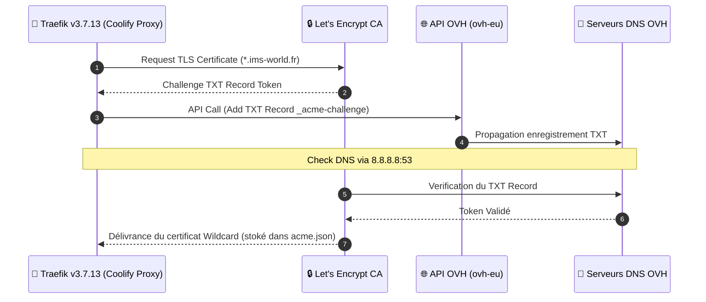

import { ips, domains } from "/snippets/variables.mdx";

<Badge color="green">🟢 Production Active (Traefik v3.7.13)</Badge>

## Version & Environnement

| Propriété | Valeur |
|---|---|
| **Image Docker** | `traefik:v3.7.13` |
| **Hôte d'Orchestration** | VM IMS-Coolify (VM 104) |
| **Réseau Docker** | `coolify` |
| **Challenge SSL** | Let's Encrypt DNS-01 (API OVH) |

---

## Séquence du Challenge ACME DNS-01 (OVH)


```mermaid
sequenceDiagram
    autonumber
    participant Traefik as 🚦 Traefik v3.7.13 (Coolify Proxy)
    participant ACME as 🔒 Let's Encrypt CA
    participant OVH_API as 🌐 API OVH (ovh-eu)
    participant DNS as 📡 Serveurs DNS OVH

    Traefik->>ACME: Request TLS Certificate (*.ims-world.fr)
    ACME-->>Traefik: Challenge TXT Record Token
    Traefik->>OVH_API: API Call (Add TXT Record _acme-challenge)
    OVH_API->>DNS: Propagation enregistrement TXT
    Note over Traefik,DNS: Check DNS via 8.8.8.8:53
    ACME->>DNS: Verification du TXT Record
    DNS-->>ACME: Token Validé
    ACME-->>Traefik: Délivrance du certificat Wildcard (stoké dans acme.json)
```

---

## Pipeline de Routage & Middleware Traefik

```mermaid
graph TD
    subgraph INGRESS ["🌐 Requêtes Entrantes"]
        PUB_REQ["Trafic Public WAN (80/443)"]
        VPN_REQ["Trafic Tailnet VPN (100.64.0.0/10)"]
    end

    subgraph TRAEFIK_ENGINE ["🚦 Traefik Proxy Engine"]
        ROUTER_PUB["Routers Publics (auth, vault)"]
        ROUTER_RESTRICT["Routers Restreints (arr, qbit)"]

        subgraph MIDDLEWARES ["🛡️ Dynamic Middlewares"]
            VPN_ONLY["vpn-only (ipAllowList: 100.64.0.0/10)"]
            TLS_RESOLVER["letsencrypt (DNS-01 OVH)"]
        end
    end

    subgraph CONTAINERS ["🐳 Containers Docker Cibles"]
        SVC_AUTH["Authentik (auth.ims-world.fr)"]
        SVC_VAULT["Vaultwarden (vault.ims-world.fr)"]
        SVC_QBIT["qBittorrent / *arr Stack"]
    end

    PUB_REQ --> ROUTER_PUB
    PUB_REQ --> ROUTER_RESTRICT

    VPN_REQ --> ROUTER_PUB
    VPN_REQ --> ROUTER_RESTRICT

    ROUTER_PUB --> TLS_RESOLVER
    TLS_RESOLVER --> SVC_AUTH
    TLS_RESOLVER --> SVC_VAULT

    ROUTER_RESTRICT --> VPN_ONLY
    VPN_ONLY -->|Si IP 100.64.x.x| SVC_QBIT
    VPN_ONLY -.-X|Si IP WAN Publique (403 Forbidden)| PUB_REQ

    classDef ingress fill:#2c3e50,stroke:#34495e,color:#fff;
    classDef traefik fill:#0F6E56,stroke:#16A085,color:#fff;
    classDef container fill:#1a2b3c,stroke:#0F6E56,color:#fff;
    class PUB_REQ,VPN_REQ ingress;
    class ROUTER_PUB,ROUTER_RESTRICT,VPN_ONLY,TLS_RESOLVER traefik;
    class SVC_AUTH,SVC_VAULT,SVC_QBIT container;
```

```yaml
environment:
  - OVH_ENDPOINT=ovh-eu
  - OVH_APPLICATION_KEY=<clé>
  - OVH_APPLICATION_SECRET=<secret>
  - OVH_CONSUMER_KEY=<consumer_key>
command:
  - '--certificatesresolvers.letsencrypt.acme.email=<email>'
  - '--certificatesresolvers.letsencrypt.acme.dnschallenge=true'
  - '--certificatesresolvers.letsencrypt.acme.dnschallenge.provider=ovh'
  - '--certificatesresolvers.letsencrypt.acme.dnschallenge.resolvers=8.8.8.8:53'
  - '--certificatesresolvers.letsencrypt.acme.storage=/traefik/acme.json'
  - '--providers.docker.network=coolify'
```

<Warning>
Le résolveur DNS recommandé par OVH (`213.251.128.1:53`) est tombé en panne, confirmé injoignable depuis 3 machines différentes. Contournement : `8.8.8.8` seul dans la liste. À revérifier périodiquement pour réintégrer le résolveur OVH.
</Warning>

---

## 🛡️ Plugin Bouncer CrowdSec (Sécurité Globale Entrypoints)

Traefik intègre le plugin officiel **`crowdsec-bouncer-traefik-plugin` v1.6.0** appliqué **globalement sur les entrypoints HTTP et HTTPS** pour contrôler le trafic entrant avant transmission aux conteneurs applicatifs :

```yaml
# Arguments de commande Traefik (statique)
command:
  - '--entrypoints.http.http.middlewares=crowdsec-bouncer@file'
  - '--entrypoints.https.http.middlewares=crowdsec-bouncer@file'
```

- **Mode d'Opération** : `stream` (synchronisation des décisions toutes les 60s, zéro latence par requête HTTP).
- **Politique de Secours (Fail-Open)** : Variable `updateMaxFailure: -1` explicitement définie pour garantir qu'aucune interruption de service ne survienne si l'agent CrowdSec s'arrête (fail-open validé par test réel).
- **Règle de Redéploiement** : En cas de modification de la configuration du plugin, exécuter impérativement `docker compose -f /data/coolify/proxy/docker-compose.yml up -d --force-recreate` sur la VM 104. Voir la fiche [CrowdSec](/services/crowdsec).

<Warning>
Contrairement aux autres services (Environment Variables Coolify avec option "Is Secret"), les credentials OVH du proxy sont actuellement **en clair** dans le `docker-compose.yml` — limitation propre à cette partie de Coolify. À sécuriser via un `.env` séparé (voir [Roadmap](/procedures/roadmap)).
</Warning>

---

## Provider File Centralisé `vpn-only.yaml` — Services Restreints au Tailnet

<Check>
**Préservation de l'IP Source Client (CIS Benchmark & Tailscale SNAT Bypass)** :
Pour garantir que Traefik perçoive la véritable adresse IP du client (`100.64.0.x`), deux réglages sont appliqués :
1. **Docker** : `"userland-proxy": false` dans `/etc/docker/daemon.json` (durcissement recommandation CIS Benchmark Section 2.12).
2. **Tailscale** : `sudo tailscale set --snat-subnet-routes=false` (désactivation du SNAT `ts-postrouting` sur le trafic DNAT'é vers les bridges Docker). Voir l'[ADR-009](/history/adr/adr-009-bug-docker-proxy-middleware-vpn-only).
</Check>

L'ensemble des routeurs et des définitions de services `vpn-only` est centralisé dans le fichier dynamique du provider File Traefik : `/data/coolify/proxy/dynamic/vpn-only.yaml` (surveillé en hot-reload automatique).

```yaml
# Fichier dynamique Traefik : /data/coolify/proxy/dynamic/vpn-only.yaml
http:
  middlewares:
    vpn-only:
      ipAllowList:
        sourceRange:
          - "100.64.0.0/10"
          - "192.168.1.0/24"   # Accès LAN direct & Hairpin NAT Bbox
    admin-gzip:
      compress: {}

  routers:
    # Exemple de routeur prive filtré
    grafana-admin:
      rule: "Host(`monitoring.ims-world.fr`)"
      entryPoints: [https]
      service: grafana-admin
      middlewares: [vpn-only, admin-gzip]
      tls: {certResolver: letsencrypt}

    # ... autres routeurs d'administration vpn-only (coolify, qbit, radarr, sonarr, prowlarr, logs...)

  services:
    # Exemple de service pointant vers le conteneur interne Docker
    grafana-admin:
      loadBalancer:
        servers:
          - url: "http://grafana-rrw19kmye6gng961igtzqpgw:3000"

    # ... autres services d'administration vpn-only
```

---

## ⚠️ Règle d'Or de Routage : UI Coolify vs Dynamic File Provider

<Warning>
**Gestion des Domaines d'Administration Privés** :

- **Services Publics ou avec SSO OIDC Natif** (Immich, Vaultwarden, Forgejo) : Renseigner le domaine dans le champ *Domains* de l'UI Coolify. Coolify génère automatiquement le routeur Traefik.
- **Services Privés `vpn-only`** (Coolify, Headplane, qBittorrent, Sonarr, Radarr, Prowlarr, Grafana) : **Laisser le champ Domains VIDE dans l'UI Coolify** et déclarer le router/service exclusivement dans `/data/coolify/proxy/dynamic/vpn-only.yaml`.

Si un domaine privé est saisi dans l'UI Coolify, Coolify génère un routeur automatique parallèle sans le middleware `vpn-only`, créant une concurrence de routeurs non déterministe qui peut ré-exposer le service publiquement.
</Warning>

---

## 🖼️ Gestion Globale des Pages d'Erreur Custom (404, 403 Masqué & 5xx)

Traefik intercepte et personnalise l'affichage des pages d'erreur (HTTP 404, HTTP 403 et HTTP 5xx) pour l'ensemble du homelab en s'appuyant sur un conteneur helper Nginx dédié (`nginx:1.27-alpine`, UUID Coolify `vciwi7dolcl0hw1mffvjcfha`).

### 1. Architecture & Flux de Traitement

```mermaid
graph TD
    REQ["🌐 Requête HTTP Client"] --> TRAEFIK["🚦 Traefik Proxy Engine"]
    
    TRAEFIK -->|Route Non Déclarée ou Inexistante| ROUTER_CATCHALL["Router catchall-error-pages (Priority: 1)"]
    TRAEFIK -->|Erreur Serveur 500-599| MW_5XX["Middleware error-5xx@file"]
    TRAEFIK -->|Accès Bloqué vpn-only 403| MW_404["Middleware error-404@file"]

    ROUTER_CATCHALL --> ERR_SVC["Service error-pages-svc (Nginx Docker)"]
    MW_5XX -->|Redirection 5xx.html?code={status}| ERR_SVC
    MW_404 -->|Redirection 404.html| ERR_SVC

    ERR_SVC -->|Rendu HTML/CSS Custom| CLIENT["🖥️ Navigateur Client"]
```

### 2. Configuration Dynamic File Provider (`/data/coolify/proxy/dynamic/error-pages.yaml`)

```yaml
http:
  middlewares:
    error-404:
      errors:
        status: ["404", "403"]
        service: error-pages-svc
        query: "/404.html"

    error-5xx:
      errors:
        status: ["500-599"]
        service: error-pages-svc
        query: "/5xx.html?code={status}"

  routers:
    catchall-error-pages:
      rule: "PathPrefix(`/`)"
      priority: 1
      entryPoints: [http, https]
      service: error-pages-svc

  services:
    error-pages-svc:
      loadBalancer:
        servers:
          - url: "http://vciwi7dolcl0hw1mffvjcfha-nginx:80"
```

### 3. Décision de Sécurité — Masquage des HTTP 403 en 404 (Stealth Security)

<Info>
**Discrétion Vis-à-vis des Scanners Externe** :
Le middleware `vpn-only` (`ipAllowList`) retourne normalement un code HTTP **403 Forbidden** lorsqu'un client hors VPN tente d'accéder à un service privé (Sonarr, Radarr, qBittorrent, etc.).

Par décision d'architecture, le middleware `error-404` intercepte à la fois les codes **404** et **403** pour afficher une **page 404 générique identique** ("Page non trouvée"). Aucune indication visuelle ni header ne révèle à un scanner externe que la ressource existe ou est protégée par un pare-feu.
</Info>

### 4. Code HTTP Dynamique (Pages 5xx)

Traefik supporte le placeholder `{status}` dans le paramètre `query` du middleware `errors`. Le code d'erreur exact (`500`, `502`, `503`, `504`) est transmis dans l'URL et injecté dynamiquement en JavaScript dans la page HTML, affichant un libellé français adapté à la panne.

### 5. Pièges & Conseils de Maintenance

<Warning>
**Modification de la Commande Traefik via l'UI Coolify** :
Le fichier `/data/coolify/proxy/docker-compose.yml` est régénéré automatiquement par Coolify depuis sa base de données. Toute édition manuelle directe en SSH sur ce fichier est **silencieusement écrasée**.

Pour ajouter les middlewares d'erreur sur les entrypoints HTTP/HTTPS, **toujours éditer la commande Traefik depuis l'IHM Coolify** (*Server ➔ Proxy ➔ Commands*) :
```text
--entrypoints.http.http.middlewares=crowdsec-bouncer@file,error-404@file,error-5xx@file
--entrypoints.https.http.middlewares=crowdsec-bouncer@file,error-404@file,error-5xx@file
```
</Warning>

<Info>
**Astuce de Test pour Simuler un Vrai 502 Bad Gateway** :
Pour tester la page d'erreur 5xx sans couper un service : exécuter `docker pause <nom-conteneur>`.
`docker stop` ferait disparaître le routeur du service dans Traefik (retombant sur le 404 du catchall), alors que `docker pause` conserve le routeur mais rend le conteneur non-répondant, déclenchant le vrai comportement HTTP 502 de Traefik. Penser à faire `docker unpause` immédiatement après.
</Info>


