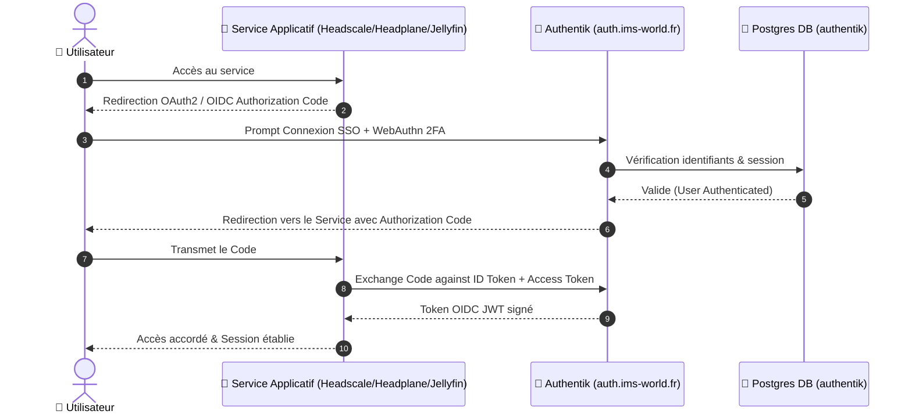

## Accès & Administration SSO

<Tabs>
  <Tab title="🌐 Interface SSO Admin">
    <Card title="Console Authentik Admin" icon="shield-halved" href="https://auth.ims-world.fr">
      Provider d'identité centralisé (OAuth2 / OIDC + WebAuthn 2FA). Accessible sur `auth.ims-world.fr`.
    </Card>
  </Tab>
  <Tab title="🔑 Clef de Récupération d'Urgence">
    En cas de perte du WebAuthn 2FA ou du mot de passe admin :
    ```bash
    # Générer une clé de récupération d'urgence (valable 1h)
    docker exec -it authentik-worker-k5mxvc2r6c4zlb6j3d443h7b ak create_recovery_key 1 akadmin
    ```
  </Tab>
  <Tab title="🐘 Backup DB (PostgreSQL)">
    ```bash
    # Dump complet de la base authentik
    docker exec postgresql-k5mxvc2r6c4zlb6j3d443h7b pg_dump -U <user> -d authentik -F c -f /tmp/dump.sql
    ```
  </Tab>
</Tabs>

## Fiche Service

| Propriété | Valeur |
|---|---|
| **Domaine** | `auth.ims-world.fr` |
| **Rôle** | SSO / OIDC pour l'ensemble des services (Headscale, Headplane, Jellyfin prévu) |
| **Base de données** | PostgreSQL |
| **UUID Coolify** | `k5mxvc2r6c4zlb6j3d443h7b` |
| **Chemin sur la VM** | `/data/coolify/services/k5mxvc2r6c4zlb6j3d443h7b/` |
| **Statut** | 🟢 Production |

## Séquence d'Authentification OIDC Centralisée



<Check>
Service d'identité centralisé actif. La clé `SECRET_KEY` doit rester strictement identique entre redéploiements pour préserver les sessions utilisateurs.
</Check>

## OIDC — Providers Configurés

| Client | Issuer URL |
|---|---|
| Headscale | `https://auth.ims-world.fr/application/o/headscale/` |
| Headplane | `https://auth.ims-world.fr/application/o/headplane/` |
| Jellyfin (prévu) | `https://auth.ims-world.fr/application/o/jellyfin/` |

## Retours d'Expérience & Particularités Techniques

<AccordionGroup>
  <Accordion title="Sauvegarde & Restauration PostgreSQL">
    <Steps>
      <Step title="Sauvegarde de la base de données">
        ```bash
        docker exec postgresql-k5mxvc2r6c4zlb6j3d443h7b pg_dump -U <user> -d authentik -F c -f /tmp/dump.sql
        ```
      </Step>
      <Step title="Restauration de la base">
        ```bash
        # Arrêter les conteneurs applicatifs (authentik-server / worker)
        pg_restore -U <user> -d authentik --clean --if-exists /tmp/dump.sql
        ```
      </Step>
    </Steps>
  </Accordion>

  <Accordion title="Branding & Personnalisation par domaine">
    <Warning>
    **Branding par domaine** : le CSS custom et le logo n'apparaissaient pas sur la nouvelle instance malgré un restore DB réussi. Cause : la config de marque (Customization → Brands) est rattachée à un domaine précis dans Authentik, pas globale.
    </Warning>
  </Accordion>

  <Accordion title="Emplacement réel des médias (Logos & Icônes)">
    <Warning>
    **Emplacement réel des médias** : le dossier `/media` du container est vide (volume interne éphémère). Les vrais fichiers (icônes, logos) vivent dans `/data/media/public/...`, à l'intérieur du bind-mount `/data`. Localisé via :
    ```bash
    docker exec <container> find / -iname "<nom_fichier_connu>" 2>/dev/null
    ```
    </Warning>
  </Accordion>

  <Accordion title="WebAuthn (2FA) & Dépendance Circulaire OIDC">
    <Info>
    Les credentials WebAuthn sont cryptographiquement liés au nom de domaine exact — non testables sur un sous-domaine `-ng`, uniquement validables une fois le vrai domaine actif.
    </Info>

    <Warning>
    Au moment du cutover, Headscale a temporairement dû désactiver `only_start_if_oidc_is_available` (mis à `false`) car le port-forward routait vers un Authentik pas encore accessible avec un certificat valide — dépendance circulaire. À repasser en `true` maintenant que la situation est stable. Voir [Headscale](/services/headscale-headplane).
    </Warning>
  </Accordion>
</AccordionGroup>
