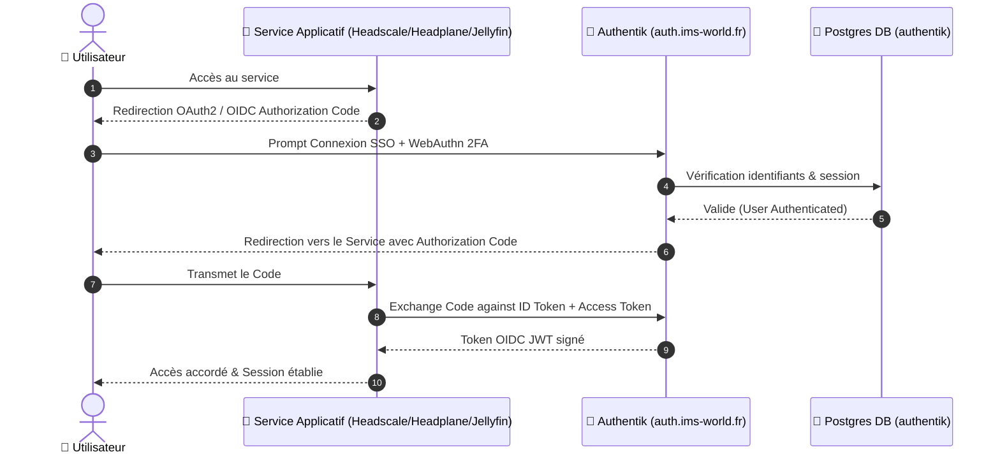

## Fiche service

| Propriété | Valeur |
|---|---|
| **Domaine** | `auth.ims-world.fr` |
| **Rôle** | SSO / OIDC pour l'ensemble des services (Headscale, Headplane, Jellyfin prévu) |
| **Base de données** | PostgreSQL |
| **UUID Coolify** | `k5mxvc2r6c4zlb6j3d443h7b` |
| **Chemin** | `/data/coolify/services/k5mxvc2r6c4zlb6j3d443h7b/` |
| **Statut** | 🟢 Production (migré et basculé le 02/08/2026) |

## Séquence d'Authentification OIDC Centralisée



<Check>
Premier service stateful migré du projet — le protocole de migration standard (voir [Migration d'un service](/procedures/migration-service)) a été affiné à partir de cette expérience.
</Check>

## Migration — résumé

<Steps>
  <Step title="Préparation">
    Compose repris à l'identique (chemins relatifs, variables magiques Coolify). `SECRET_KEY` copié tel quel — critique pour préserver les sessions existantes.
  </Step>
  <Step title="Dump et restore">
    ```bash
    # Sur l'ancien serveur — dump à chaud, sans coupure
    docker exec postgresql-<uuid> pg_dump -U <user> -d authentik -F c -f /tmp/dump.sql
    ```
    ```bash
    # Sur le nouveau — restore après arrêt des 2 containers applicatifs (pas postgresql)
    pg_restore -U <user> -d authentik --clean --if-exists /tmp/dump.sql
    ```
  </Step>
  <Step title="Validation">
    Testé via un sous-domaine `-ng` temporaire, avant bascule réelle du domaine.
  </Step>
</Steps>

## Découvertes non prévues

<Warning>
**Branding par domaine** : le CSS custom et le logo n'apparaissaient pas sur la nouvelle instance malgré un restore DB réussi. Cause : la config de marque (Customization → Brands) est rattachée à un domaine précis dans Authentik, pas globale.
</Warning>

<Warning>
**Emplacement réel des médias** : le dossier `/media` du container est vide (volume interne éphémère). Les vrais fichiers (icônes, logos) vivent dans `/data/media/public/...`, à l'intérieur du bind-mount `/data`. Localisé via :
```bash
docker exec <container> find / -iname "<nom_fichier_connu>" 2>/dev/null
```
</Warning>

## WebAuthn (2FA)

<Info>
Les credentials WebAuthn sont cryptographiquement liés au nom de domaine exact — non testables sur un sous-domaine `-ng`, uniquement validables une fois le vrai domaine actif. Reste à valider explicitement post-cutover.
</Info>

Contournement utilisé pendant les tests (bypass total mot de passe + 2FA, mécanisme natif) :
```bash
docker exec -it authentik-worker-<uuid> ak create_recovery_key 1 <username>
```

## OIDC — providers configurés

| Client | Issuer |
|---|---|
| Headscale | `https://auth.ims-world.fr/application/o/headscale/` |
| Headplane | `https://auth.ims-world.fr/application/o/headplane/` |
| Jellyfin (prévu) | `https://auth.ims-world.fr/application/o/jellyfin/` |

<Warning>
Au moment du cutover, Headscale a temporairement dû désactiver `only_start_if_oidc_is_available` (mis à `false`) car le port-forward routait vers un Authentik pas encore accessible avec un certificat valide — dépendance circulaire. À repasser en `true` maintenant que la situation est stable. Voir [Headscale](/services/headscale-headplane).
</Warning>
