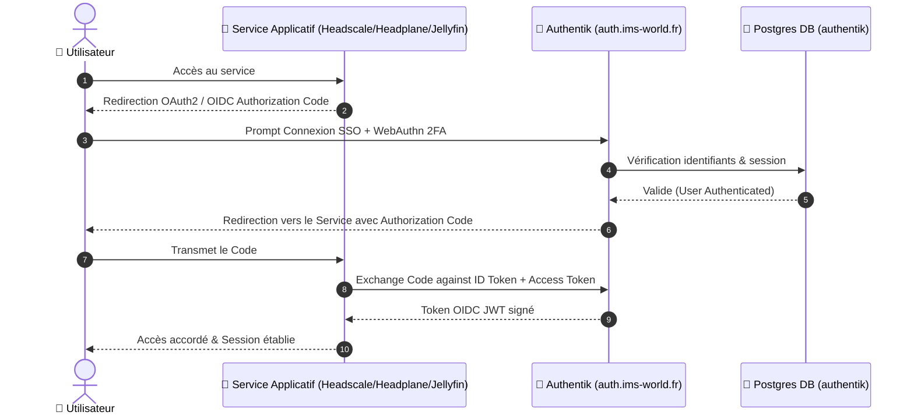

import { ips, domains } from "/snippets/variables.mdx";

<Badge color="green">🟢 Production Active</Badge>

## Accès & Administration SSO

<Tabs>
  <Tab title="🌐 Interface SSO Admin">
    <Card title="Console Authentik Admin" icon="shield-halved" href="https://auth.ims-world.fr">
      Provider d'identité centralisé (OAuth2 / OIDC + WebAuthn 2FA). Accessible sur `auth.ims-world.fr`.
    </Card>
  </Tab>
  <Tab title="🔑 Clef de Récupération d'Urgence">
    En cas de perte du WebAuthn 2FA ou du mot de passe admin :
    ```bash
    # Générer une clé de récupération d'urgence (valable 1h)
    docker exec -it authentik-worker-k5mxvc2r6c4zlb6j3d443h7b ak create_recovery_key 1 akadmin
    ```
  </Tab>
  <Tab title="🐘 Backup DB (PostgreSQL)">
    ```bash
    # Dump complet de la base authentik
    docker exec postgresql-k5mxvc2r6c4zlb6j3d443h7b pg_dump -U <user> -d authentik -F c -f /tmp/dump.sql
    ```
  </Tab>
</Tabs>

## Fiche Service

| Propriété | Valeur |
|---|---|
| **Domaine** | `{domains.sso}` |
| **Rôle** | Provider d'Identité Centralisé (SSO / OIDC + WebAuthn 2FA) |
| **Base de Données** | PostgreSQL |
| **Hôte d'Orchestration** | VM IMS-Coolify (VM 104) |
| **UUID Coolify** | `k5mxvc2r6c4zlb6j3d443h7b` |
| **Chemin sur la VM** | `/data/coolify/services/k5mxvc2r6c4zlb6j3d443h7b/` |
| **Statut** | <Badge color="green">🟢 Production Active</Badge> |

---

## 👥 Groupes & Rôles RBAC

| Groupe | Privilèges Superuser | Rôle & Portée d'Accès |
|---|---|---|
| `admins` | ✅ `is_superuser` | Administrateurs système — contournement automatique de toutes les règles |
| `membres` | ❌ Utilisateur standard | Famille & amis — accès aux applications personnelles (Vaultwarden, HomeFlix, etc.) |
| `invites` | ❌ Accès restreint | Accès limité aux outils de divertissement |
| `authentik Admins` | ✅ Système | Groupe système interne (ne pas modifier) |

---

## 👤 Procédure : Inviter un Nouvel Utilisateur

<Steps>
  <Step title="Génération de l'invitation dans Authentik">
    Aller dans **Répertoire → Invitations → New Invitation** (choisir *with Existing Enrollment Flow*).
    Saisir le nom (slug en minuscules, ex: `jean-dupont`) et cocher **Usage unique**.
  </Step>
  <Step title="Transmission du lien">
    Cliquer **Suivant** pour générer le lien unique. Transmettre le lien par email directement via l'interface ou manuellement.
  </Step>
  <Step title="Parcours de l'invité">
    L'invité clique sur le lien, remplit son nom d'utilisateur, email et mot de passe, puis valide la confirmation d'email reçue via Resend (`no-reply@ims-world.fr`).
  </Step>
  <Step title="Affectation automatique des droits">
    À la validation, le compte est créé et rattaché automatiquement au groupe par défaut (`membres`).
  </Step>
</Steps>

---

## Séquence d'Authentification OIDC Centralisée


