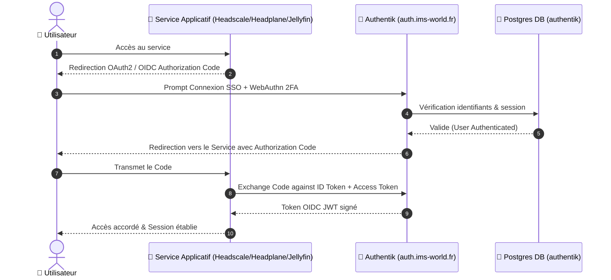
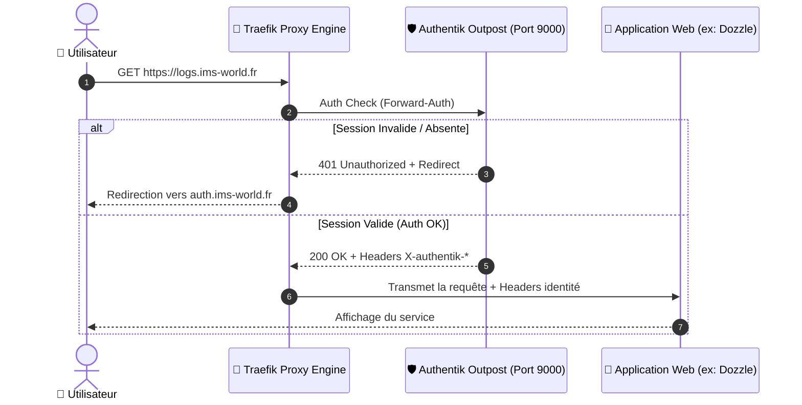

import { ips, domains } from "/snippets/variables.mdx";

<Badge color="green">🟢 Production Active</Badge>

## Accès Rapides & Administration

<Tabs>
  <Tab title="🌐 Interface Web">
    <Card title="Console Authentik Admin" icon="shield-halved" href="https://auth.ims-world.fr">
      Provider d'identité centralisé (OAuth2 / OIDC + WebAuthn 2FA). Accessible sur `auth.ims-world.fr`.
    </Card>
  </Tab>
  <Tab title="⚡ Commandes CLI & Maintenance">
    ```bash
    # Générer une clé de récupération d'urgence (valable 1h)
    docker exec -it authentik-worker-k5mxvc2r6c4zlb6j3d443h7b ak create_recovery_key 1 akadmin

    # Dump complet de la base de données PostgreSQL
    docker exec postgresql-k5mxvc2r6c4zlb6j3d443h7b pg_dump -U <user> -d authentik -F c -f /tmp/dump.sql
    ```
  </Tab>
</Tabs>

---

## Fiche Service

| Propriété | Valeur |
|---|---|
| **Domaine** | {domains.sso} |
| **Rôle** | Provider d'Identité Centralisé (SSO / OIDC + WebAuthn 2FA) |
| **Base de Données** | PostgreSQL |
| **Hôte d'Orchestration** | VM IMS-Coolify (VM 104) |
| **UUID Coolify** | `k5mxvc2r6c4zlb6j3d443h7b` |
| **Chemin sur la VM** | `/data/coolify/services/k5mxvc2r6c4zlb6j3d443h7b/` |
| **Statut** | <Badge color="green">🟢 Production Active</Badge> |

---

## Architecture & Topologie


```mermaid
sequenceDiagram
    autonumber
    actor User as 👤 Utilisateur
    participant Client as 🚀 Service Applicatif (Headscale/Headplane/Jellyfin)
    participant Auth as 🔐 Authentik (auth.ims-world.fr)
    participant DB as 🐘 Postgres DB (authentik)

    User->>Client: Accès au service
    Client-->>User: Redirection OAuth2 / OIDC Authorization Code
    User->>Auth: Prompt Connexion SSO + WebAuthn 2FA
    Auth->>DB: Vérification identifiants & session
    DB-->>Auth: Valide (User Authenticated)
    Auth-->>User: Redirection vers le Service avec Authorization Code
    User->>Client: Transmet le Code
    Client->>Auth: Exchange Code against ID Token + Access Token
    Auth-->>Client: Token OIDC JWT signé
    Client-->>User: Accès accordé & Session établie
```

---

## Composants & Fonctionnement (Groupes & Rôles RBAC)

<Info>
 Authentik assure la gouvernance IAM et le contrôle d'accès basé sur les rôles (**RBAC**). La répartition exacte des 5 groupes (`authentik Admins`, `admins`, `membres`, `invites`, `authentik Read-only`) et la matrice croisée d'accès applicatif sont détaillées dans la [Matrice des Rôles & Droits d'Accès (RBAC)](/reseau/matrice-securite-exposition#matrice-des-rles--droits-daccs-rbac-authentik).
</Info>

| Groupe Authentik | Super-Utilisateur ? | Périmètre d'Accès Résumé |
|---|:---:|---|
| **`authentik Admins`** | `Oui` (🟢) | Administration globale du Homelab, Coolify, Proxmox, Traefik, Monitoring |
| **`admins`** | `Oui` (🟢) | Administration de la plateforme IAM Authentik et des politiques de sécurité |
| **`membres`** | `Non` (🔴) | Accès complet aux apps (Tailscale / Headscale, Vaultwarden, Immich, Zipline, HomeFlix, IT-Tools, etc.) |
| **`invites`** | `Non` (🔴) | Accès restreint (HomeFlix Jellyfin, Vidéoclub JellySeerr, IT-Tools, Stirling PDF) |
| **`authentik Read-only`** | `Non` (🔴) | Audit et consultation des métriques en lecture seule |

---

## Outpost Proxy & Forward-Auth Traefik

Authentik supporte **deux modes d'intégration** selon les capacités des applications hébergées :

1. **OIDC Natif (OpenID Connect / OAuth2)** : L'application gère son propre flux d'authentification et dialogue directement avec Authentik (ex. [Grafana](/services/monitoring), [Vaultwarden](/services/vaultwarden), [Headplane](/services/headscale-headplane), [Zipline](/services/zipline), [Forgejo](/services/forgejo), [PhotoPrism](/services/photoprism)).
2. **Proxy Outpost (Forward-Auth)** : Pour les applications web dépourvues de système d'authentification natif (ex. [Dozzle](/services/dozzle) sur `logs.ims-world.fr`, [Uptime Kuma](/services/uptime-kuma) sur `status.ims-world.fr`, [IT-Tools](/services/it-tools) sur `tools.ims-world.fr` et [Stirling PDF](/services/stirling-pdf) sur `pdf.ims-world.fr`), l'Outpost embarqué Authentik (`ak-outpost-ims-outpost:9000`) s'intercale en amont via le middleware Traefik `forwardAuth`.


```mermaid
sequenceDiagram
    autonumber
    actor User as 👤 Utilisateur
    participant Traefik as 🚦 Traefik Proxy Engine
    participant Outpost as 🛡️ Authentik Outpost (Port 9000)
    participant App as 🐳 Application Web (ex: Dozzle)

    User->>Traefik: GET https://logs.ims-world.fr
    Traefik->>Outpost: Auth Check (Forward-Auth)
    alt Session Invalide / Absente
        Outpost-->>Traefik: 401 Unauthorized + Redirect
        Traefik-->>User: Redirection vers auth.ims-world.fr
    else Session Valide (Auth OK)
        Outpost-->>Traefik: 200 OK + Headers X-authentik-*
        Traefik->>App: Transmet la requête + Headers identité
        App-->>User: Affichage du service
    end
```

<Info>
Le filtrage des accès des applications en Forward-Auth ne se fait pas dans le fichier Compose de l'application, mais directement dans la console **Authentik (Applications → Outposts / Policies)**.
</Info>

---

## Exploitation & Procédures (Inviter un Utilisateur)

<Steps>
  <Step title="Génération de l'invitation dans Authentik">
    Aller dans **Répertoire → Invitations → New Invitation** (choisir *with Existing Enrollment Flow*).
    Saisir le nom (slug en minuscules, ex: `jean-dupont`) et cocher **Usage unique**.
  </Step>
  <Step title="Transmission du lien">
    Cliquer **Suivant** pour générer le lien unique. Transmettre le lien par email directement via l'interface ou manuellement.
  </Step>
  <Step title="Parcours de l'invité">
    L'invité clique sur le lien, remplit son nom d'utilisateur, email et mot de passe, puis valide la confirmation d'email reçue via Resend (`no-reply@ims-world.fr`).
  </Step>
  <Step title="Affectation automatique des droits">
    À la validation, le compte est créé et rattaché automatiquement au groupe par défaut (`membres`).
  </Step>
</Steps>

---

## 🔄 Montées de Version & Réconciliation des Outposts (Upgrade 2026.8.0)

<Badge color="green">🟢 Upgrade 2026.5.0 → 2026.8.0 Validé (24/08/2026)</Badge>

### ⚠️ Piège d'Architecture : Outposts Docker Managés

Les outposts configurés en **Local Docker Connection** (`ims-outpost`) ne sont pas définis dans le `docker-compose.yml` principal de Coolify. Ils sont créés et gérés dynamiquement par Authentik via le socket Docker de l'hôte (`/var/run/docker.sock`).

<Warning>
**Désalignement de version des Outposts** : Un simple bump du tag dans le `docker-compose.yml` (`authentik-server` et `authentik-worker`) ne redéploie pas automatiquement les conteneurs outpost (`ak-outpost-*`). Un redémarrage du worker seul ne suffit pas toujours à forcer la réconciliation.
</Warning>

### 🛠️ Procédure de Réconciliation Obligatoire Post-Upgrade

En cas d'alerte de version désalignée sous **Applications ➔ Outposts** (ex: `ims-outpost` restant en 2026.5.0 alors que le serveur est en 2026.8.0) :

```bash
# 1. Vérifier la version de l'image de l'outpost
docker ps -a --format '{{.Names}}\t{{.Image}}\t{{.Status}}' | grep -i outpost

# 2. Stopper et supprimer le conteneur outpost stateless (sans risque de perte de données)
docker stop ak-outpost-ims-outpost
docker rm ak-outpost-ims-outpost

# 3. Redémarrer server + worker pour forcer Authentik à ré-instancier l'outpost à jour
docker restart authentik-server-k5mxvc2r6c4zlb6j3d443h7b authentik-worker-k5mxvc2r6c4zlb6j3d443h7b
```

Au redémarrage, Authentik détecte l'absence du conteneur outpost et ré-instancie immédiatement `ak-outpost-ims-outpost` sur l'image alignée `ghcr.io/goauthentik/proxy:2026.8.0`.

