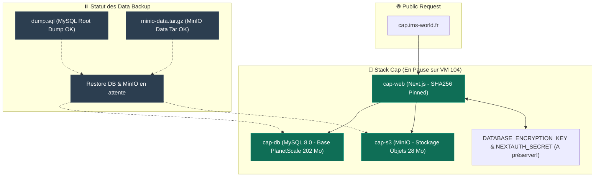

<Info>
**Statut: En attente de déploiement** — Stack technique et dumps préparés (base MySQL 202 Mo + données MinIO 28 Mo).
</Info>

## Fiche service

| Propriété | Valeur |
|---|---|
| **Domaine visé** | `cap.ims-world.fr` |
| **Composants** | `cap-web` (Next.js) + `cap-db` (MySQL 8.0) + `cap-s3` (MinIO) |

## Architecture Cap & État de la Migration



<Warning>
L'ancien plan classait Cap comme "recréation à neuf, aucune donnée" — **faux**, vérifié en session : 202 Mo de base MySQL + 28 Mo de données MinIO réelles (enregistrements). Toujours vérifier par soi-même plutôt que de faire confiance à une note qui peut dater.
</Warning>

## Versions à figer

<Warning>
`cap-web` n'expose aucun tag de version lisible — utiliser le digest exact plutôt que `latest` :
```yaml
image: 'ghcr.io/capsoftware/cap-web@sha256:bd905035ea8fc4517a38add2cc74fde61cc8e332dd46d534a65692cbdd2b0b81'
```
</Warning>

| Composant | Référence figée |
|---|---|
| cap-web | digest `sha256:bd905035...` |
| MySQL | `8.0` |
| MinIO | `RELEASE.2025-09-07T16-13-09Z` |

## Dump MySQL

<Warning>
L'utilisateur applicatif n'a pas les privilèges `PROCESS` requis pour un dump complet — utiliser le compte **root** :
```bash
docker exec <cap-db> mysqldump -u root -p'<password>' --no-tablespaces planetscale > dump.sql
```
</Warning>

## Copie MinIO

MinIO stocke ses objets directement comme fichiers sur disque — simple copie, pas de dump applicatif nécessaire :
```bash
docker stop <cap-s3>
sudo tar czf minio-data.tar.gz -C <chemin_s3> .
docker start <cap-s3>
```

## Variables critiques à préserver à l'identique

<Warning>
`DATABASE_ENCRYPTION_KEY` et `NEXTAUTH_SECRET` doivent être **repris à l'identique** — contrairement aux credentials MySQL/MinIO (régénérables sans risque puisqu'on restaure les données complètes), ces deux clés chiffrent/signent des données déjà existantes dans le dump. Une nouvelle valeur casserait le déchiffrement des données migrées et invaliderait toutes les sessions.
</Warning>

## Reste à faire pour finaliser

1. Démarrer MySQL une première fois (initialise sa structure)
2. Restaurer le dump SQL par-dessus
3. Vérifier la cohérence des permissions du dossier `s3/` (mélange root/cmolotkoff suite à un premier `tar` sans `sudo`)
4. Régénérer `MINIO_ROOT_PASSWORD` (exposé en clair pendant la préparation)
5. Tester fonctionnellement avant bascule du domaine réel
