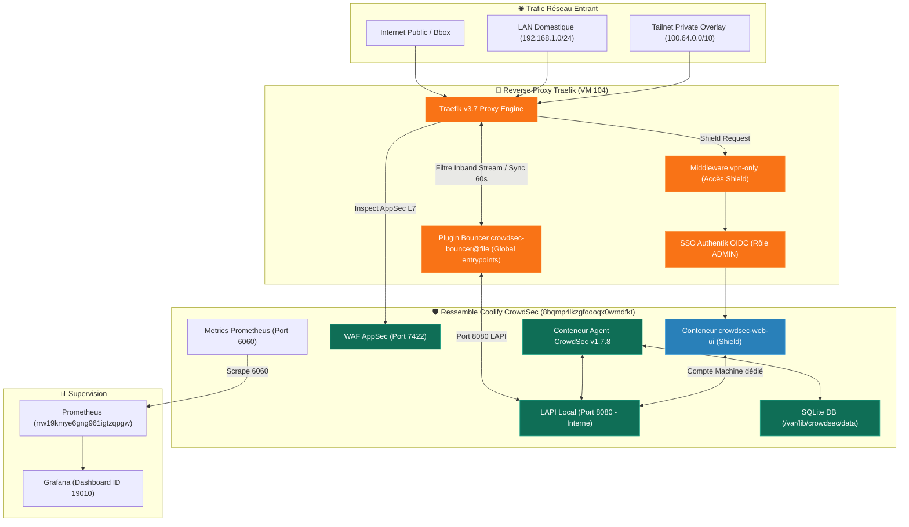

import { ips, domains } from "/snippets/variables.mdx";

<Badge color="green">🟢 Production Active (v1.7.8 + Web UI)</Badge>

## Accès Rapides & Administration

<Tabs>
  <Tab title="🌐 Interface Web (Shield)">
    <Card title="CrowdSec Web UI (Shield)" icon="shield-check" href="https://shield.ims-world.fr">
      Console de gestion locale des alertes, bouncers et décisions de bannissement sur `shield.ims-world.fr` (`vpn-only` + SSO Authentik OIDC rôle ADMIN).
    </Card>
  </Tab>
  <Tab title="⚡ Commandes CLI `cscli` (Agent)">
    ```bash
    # Se connecter à la VM Coolify
    ssh cmolotkoff@100.64.0.4

    # Alias pratique pour exécuter cscli dans le conteneur agent
    alias cscli="docker exec -it crowdsec-8bqmp4lkzgfoooqx0wrndfkt cscli"

    # Décisions & Bans
    cscli decisions list                           # Voir les bans actifs
    cscli decisions delete --id <id>               # Débannir par ID
    cscli decisions delete --ip <ip>               # Débannir par IP

    # Allowlists (Bypass de ban)
    cscli allowlists list                          # Lister les allowlists actives
    cscli allowlists inspect tailscale             # Inspecter l'allowlist Tailscale
    cscli allowlists add home-lan 192.168.1.50 -d "IP test" # Ajouter une entrée

    # Diagnostics & Métriques
    cscli metrics                                  # Métriques complètes (parsers, AppSec, logs)
    cscli bouncers list                            # Lister les bouncers enregistrés (Traefik)

    # Redéploiement forcé Traefik après modif de config du bouncer
    # (Obligatoire : le hot-reload du provider file ne suffit pas pour ce plugin)
    docker compose -f /data/coolify/proxy/docker-compose.yml up -d --force-recreate
    ```
  </Tab>
</Tabs>

---

## Fiche Service

| Propriété | Valeur |
|---|---|
| **Domaine Admin Web UI** | `shield.ims-world.fr` |
| **Rôle** | Détection d'Intrusions L3/L4/L7, WAF AppSec, Bouncer Traefik & Administration des Bans |
| **Version Agent** | `crowdsecurity/crowdsec:v1.7.8` |
| **Version Web UI** | `ghcr.io/theduffman85/crowdsec-web-ui:2026.8.1` |
| **Version Bouncer Traefik** | `crowdsec-bouncer-traefik-plugin` v1.6.0 (Plugin dynamique) |
| **Hôte d'Orchestration** | VM IMS-Coolify (VM 104) |
| **UUID Coolify** | `8bqmp4lkzgfoooqx0wrndfkt` |
| **Chemin Stockage Host** | `/data/coolify/services/8bqmp4lkzgfoooqx0wrndfkt/` |
| **Exposition Web UI** | **VPN-Only** (`vpn-only.yaml`) + **SSO Authentik OIDC** (Rôle `ADMIN` strict) |
| **Mode d'Opération Proxy** | **Stream Mode** (Sync 60s, cache local, Fail-Open `updateMaxFailure: -1`) |
| **Date de Mise en Prod** | **22 août 2026** |
| **Statut** | <Badge color="green">🟢 Production Active</Badge> |

---

## Architecture & Topologie du Composant



---

## Composants Déployés & Stockage

### 1. Organisation des Emplacements de Stockage (Bind Mounts)
Les données sont stockées en **bind-mounts relatifs directs sur l'hôte** (pas de volumes Docker nommés) pour permettre l'inspection et l'édition directe sans passer par `docker exec` :

- `/data/coolify/services/8bqmp4lkzgfoooqx0wrndfkt/config` ➔ `/etc/crowdsec` *(Configurations, acquisitions `acquis.yaml`, collections)*
- `/data/coolify/services/8bqmp4lkzgfoooqx0wrndfkt/data` ➔ `/var/lib/crowdsec/data` *(Base SQLite locale, décisions de ban, alertes)*
- `/data/coolify/services/8bqmp4lkzgfoooqx0wrndfkt/webui-data` ➔ `/app/data` *(Cache SQLite local de l'interface Web UI Shield)*

### 2. Configuration de l'Acquisition des Logs (`acquis.yaml`)
L'agent lit les logs directement auprès du démon Docker via l'API socket (`source: docker`). Chaque conteneur surveillé possède un fichier d'acquisition dédié dans `/etc/crowdsec/acquis.d/` (`type: traefik`, `type: appsec`, `type: immich`, etc.).

<Warning>
**Piège de syntaxe `container_name_regexp`** : Les noms de conteneurs dans le moteur Docker sont préfixés d'un slash `/` en interne. La Regex ne doit **jamais comporter d'ancre de début `^`** (ex: `container_name_regexp: ".*traefik.*"`).
</Warning>

---

## Configuration du Bouncer Traefik & Comportement Fail-Open

### 1. Plugin Bouncer Traefik (`crowdsec-bouncer@file`)
Le bouncer est intégré comme plugin Traefik v1.6.0 et appliqué **globalement sur les entrypoints HTTP et HTTPS** dans la configuration statique de Traefik :

```text
--entrypoints.https.http.middlewares=crowdsec-bouncer@file
--entrypoints.http.http.middlewares=crowdsec-bouncer@file
```

### 2. Mode Stream & Mode Fail-Open (`updateMaxFailure: -1`)
- **Mode Stream Retenu** : Le bouncer maintient une copie locale des décisions synchronisée toutes les 60s avec la LAPI. Contrairement au mode `live` (qui effectue une requête HTTP bloquante par paquet), le mode stream n'ajoute **aucune latence** sur les connexions longues (WebSocket, SSE, transcodage vidéo).
- **Garantie Fail-Open** : La variable `updateMaxFailure` est explicitement définie à **`-1`**. Si le conteneur agent CrowdSec est arrêté ou en panne, Traefik **ne bloque aucun trafic légitime** (fail-open assumé et validé par test d'arrêt réel de 90 secondes).

<Warning>
**Exigence de Redémarrage Forcé de Traefik** : Toute modification de la configuration du plugin bouncer (mode, clé API, seuils) nécessite impérativement un redémarrage forcé du conteneur Traefik (`docker compose up -d --force-recreate traefik`). Le simple hot-reload du provider file ne suffit pas pour ce plugin.
</Warning>

---

## Pare-Feu Applicatif WAF (AppSec)

Le module AppSec fonctionne sur deux niveaux de filtrage distincts :

1. **Blocage Actif (Inband)** : `appsec-virtual-patching` + `appsec-generic-rules` (196 règles). Intercepte et bloque immédiatement les attaques d'injections SQL, XSS, Path Traversal et CVEs connues sur le port `7422`.
2. **Détection Seule (Outofband)** : `appsec-crs` (OWASP Core Rule Set). Fonctionne en mode détection/log sans blocage actif (configuration par défaut pour prévenir les faux positifs sans réglage préalable).

---

## Allowlists (Whitelists Anti-Auto-Ban)

Afin d'éviter tout verrouillage accidentel des administrateurs, deux règles d'exclusion (`allowlists`) ont été configurées dans l'agent CrowdSec :

- **`tailscale` (`100.64.0.0/10`)** : Exempté de tout bannissement pour sécuriser les accès d'administration VPN.
- **`home-lan` (`192.168.1.0/24`)** : Exempté de ban pour prévenir les faux positifs provoqués par le hairpin NAT de la Bbox sur les requêtes LAN locales.

<Info>
**Remarque** : Les événements d'attaque provenant des plages autorisées sont toujours enregistrés dans les métriques et alertes, mais **l'action de bannissement est neutralisée**.
</Info>

---

## Interface d'Administration Locale (Shield / `crowdsec-web-ui`)

- **URL d'Accès** : `https://shield.ims-world.fr`
- **Authentification & Sécurité** : Déployée en réseau privé `vpn-only` et protégée par **Authentik OIDC SSO**. Seuls les utilisateurs possédant le rôle **`ADMIN`** peuvent ouvrir l'interface.
- **Compte Machine Dédié** : L'interface communique avec l'agent via un compte machine dédié (`cscli machines add crowdsec-web-ui --password '<pwd>'`).
- **Validation** : Testée et confirmée fonctionnelle avec capacité de débannissement d'IP en direct.

<Info>
**Pourquoi pas la Console SaaS app.crowdsec.net ?**
Sur le plan gratuit, la gestion des décisions à distance depuis la console SaaS est désactivée. L'interface locale **Shield** offre la gestion complète des décisions en local sans aucun coût récurrent ni dépendance cloud.
</Info>

---

## Retours d'Expérience & Pièges Connus

1. **Mode `live` à proscrire** : Provoque une latence sévère et coupe les connexions WebSocket/SSE.
2. **`updateMaxFailure` doit être à `-1`** : La valeur par défaut `0` bascule Traefik en mode fail-closed (blocage total du site) si l'agent CrowdSec s'arrête.
3. **Faux positifs Grafana / PromQL** : Les requêtes JSON/PromQL complexes générées par les dashboards Grafana déclenchent des détections mineures sur le CRS OWASP. Ces détections s'accumulent dans le scénario `crowdsecurity/crowdsec-appsec-outofband`. L'allowlist `home-lan` neutralise ce risque.
4. **Incompatibilité `firix/authentik`** : Le parser communautaire Authentik s'attend à des logs au format syslog/journald et échoue sur une acquisition Docker directe.

---

<CardGroup cols={2}>
  <Card title="Traefik Proxy Engine" icon="route" href="/reseau/traefik-proxy">
    Configuration du bouncer CrowdSec et des middlewares d'entrypoints.
  </Card>
  <Card title="Intégrer une App en OIDC" icon="key" href="/procedures/integration-service-authentik-oidc">
    Procédure d'intégration SSO OIDC et capture de la Redirect URI de Shield.
  </Card>
</CardGroup>
