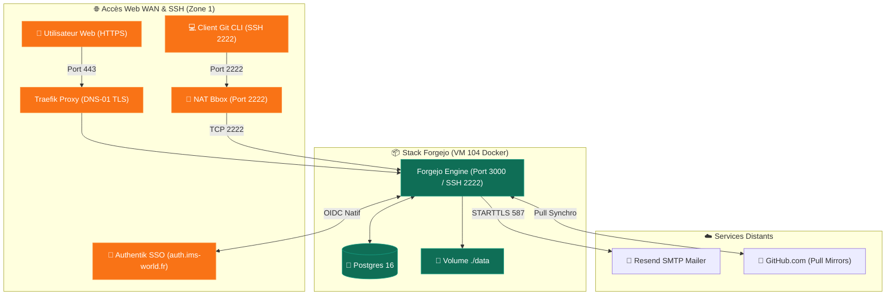

import { ips, domains } from "/snippets/variables.mdx";

<Badge color="green">🟢 Production Active</Badge>

## Accès Rapides & Administration

<Tabs>
  <Tab title="🌐 Interface Web">
    <Card title="Forgejo Web UI" icon="code-branch" href="https://forge.ims-world.fr">
      Plateforme de gestion de dépôts Git, d'issues et de miroir de sauvegardes sur `forge.ims-world.fr`.
    </Card>
  </Tab>
  <Tab title="⚡ Commandes CLI & Maintenance">
    ```bash
    # Se connecter à la VM Coolify
    ssh cmolotkoff@100.64.0.4

    # Accéder au dossier du service Forgejo
    cd /data/coolify/services/culcigf0vwg0fbdvegbkzoan/

    # Inspecter les logs du conteneur applicatif et de la base Postgres
    docker compose logs -f --tail=100

    # Test de clonage d'un dépôt en SSH (Port 2222)
    git clone ssh://git@forge.ims-world.fr:2222/cmolotkoff/mon-depot.git
    ```
  </Tab>
</Tabs>

---

## Fiche Service

| Propriété | Valeur |
|---|---|
| **Domaine Web** | `forge.ims-world.fr` |
| **Port SSH Git** | `forge.ims-world.fr:2222` (NAT Bbox TCP 2222) |
| **Rôle** | Forge Git self-hosted et miroir de sauvegarde automatique de dépôts GitHub |
| **Image Docker** | `codeberg.org/forgejo/forgejo:11` |
| **Base de Données** | PostgreSQL 16 (`postgres:16-alpine`) |
| **Hôte d'Orchestration** | VM IMS-Coolify (VM 104) |
| **UUID Coolify** | `culcigf0vwg0fbdvegbkzoan` |
| **Chemin sur la VM** | `/data/coolify/services/culcigf0vwg0fbdvegbkzoan/` |
| **Stockage** | Bind-mounts locaux (`./data` et `./postgres`) |
| **Relais Mailer** | Resend SMTP (`smtp.resend.com:587`, `forgejo@ims-world.fr`) |
| **Authentification** | **SSO Authentik OIDC Natif** (`DISABLE_REGISTRATION=true`) |
| **Statut** | <Badge color="green">🟢 Production Active</Badge> |

---

## Architecture & Topologie



---

## Composants & Exposition Réseau

| Composant | Image / Port | Rôle |
|---|---|---|
| **`forgejo`** | `codeberg.org/forgejo/forgejo:11` | Application web Forgejo (HTTP 3000 / SSH 2222) |
| **`forgejo-db`** | `postgres:16-alpine` | Base de données PostgreSQL v16 |
| **`./data`** | Bind-mount hôte | Stockage des dépôts Git bruts, LFS et avatars |
| **`./postgres`** | Bind-mount hôte | Données système et utilisateurs de la base de données |

<Warning>
**Exposition du Port SSH 2222** : Contrairement aux requêtes HTTP/HTTPS qui passent par Traefik, les opérations Git via SSH (port `2222`) utilisent un port-mapping TCP direct Docker (`ports: - '2222:2222'`). La sécurité repose intégralement sur l'authentification par clé SSH de Forgejo. Pour plus de détails, voir l'[ADR-006](/history/adr/adr-006-exposition-port-ssh-forgejo-bbox).
</Warning>

---

## Miroirs GitHub & Exploitation

### 1. Authentification & SSO OIDC
- **Authentification OIDC Native** : Forgejo est configuré en OIDC Natif avec Authentik (`auth.ims-world.fr`). Le conteneur utilise `extra_hosts: auth.ims-world.fr:host-gateway` pour résoudre et valider les jetons OAuth en interne.
- **Fermeture des inscriptions** : Les inscriptions publiques directes sont désactivées (`DISABLE_REGISTRATION=true`). L'authentification passe par Authentik ou des comptes locaux provisionnés.

### 2. Dépôts Miroirs de Sauvegarde (Pull Mirrors)

<Info>
Forgejo est utilisé comme **miroir de sécurité secondaire**, la plateforme principale de développement restant GitHub. Plusieurs dépôts sont configurés en synchronisation automatique périodique.
</Info>

Lors de la migration du service, les Personal Access Tokens (PAT) GitHub stockés en base de données doivent être renouvelés pour réactiver la synchronisation automatique :

1. Accéder à l'interface web `forge.ims-world.fr`.
2. Pour chaque dépôt miroir (`sentryx`, `FailyBanDiscordBot`, `my_printf`, `MonitoringServer`, `Intra-IMS`, `default-ansible`) :
   - Naviguer dans **Paramètres du dépôt → Miroir**.
   - Mettre à jour le jeton d'accès GitHub (PAT avec scope `repo`).
