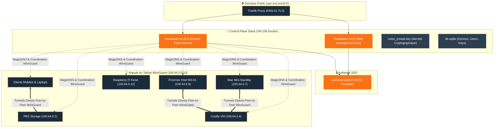

import TailscaleTable from "/snippets/tailscale-table.mdx";
import { ips, domains } from "/snippets/variables.mdx";

<Badge color="green">🟢 Production Active</Badge>

## Accès Rapides & Administration

<Tabs>
  <Tab title="🌐 Interfaces Web">
    <Card title="Headplane Admin Console" icon="network-wired" href="https://vpn.ims-world.fr">
      Interface de gestion des utilisateurs, clés d'authentification et appareils du réseau Tailnet.
    </Card>
  </Tab>
  <Tab title="⚡ Commandes CLI & Maintenance">
    ```bash
    # Lister les nœuds enregistrés sur le Tailnet
    docker exec headscale-i136ix2bmrrbeovnyrh1o72w headscale nodes list

    # Créer une clé API pour la console Headplane
    docker exec headscale-i136ix2bmrrbeovnyrh1o72w headscale apikeys create --expiration 999d
    ```
  </Tab>
  <Tab title="🗺️ IP des Nœuds du Tailnet (100.64.0.0/10)">
    <TailscaleTable />
  </Tab>
</Tabs>

---

## Fiche Service

| Propriété | Valeur |
|---|---|
| **Domaine** | `{domains.headscale}` |
| **Versions** | `headscale/headscale:v0.28.0` + `ghcr.io/tale/headplane:0.6.2` |
| **Base de Données** | SQLite |
| **Hôte d'Orchestration** | VM IMS-Coolify (VM 104) |
| **UUID Coolify** | `i136ix2bmrrbeovnyrh1o72w` |
| **Chemin sur la VM** | `/data/coolify/services/i136ix2bmrrbeovnyrh1o72w/` |
| **Statut** | <Badge color="green">🟢 Production Active</Badge> |

---

## Architecture & Topologie



<Warning>
Headscale est un control plane qui coordonne des connexions WireGuard peer-to-peer (Mesh VPN), et non un VPN centralisé classique.
</Warning>

---

## Composants & Fichiers Critiques

| Fichier / Élement | Rôle & Usage | Conséquence si Altéré |
|---|---|---|
| `noise_private.key` | Identité cryptographique du serveur Headscale | Tous les clients verraient un "nouveau serveur" non reconnu |
| `db.sqlite` | Base SQLite des nœuds, utilisateurs et clés d'accès | Perte instantanée de tous les appareils enregistrés |
