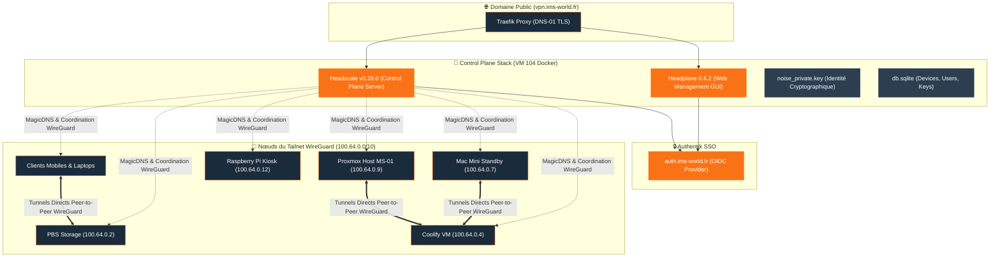

import TailscaleTable from "/snippets/tailscale-table.mdx";

## Accès & Administration VPN

<Tabs>
  <Tab title="🌐 WebUI Admin (Headplane)">
    <Card title="Headplane Admin" icon="network-wired" href="https://vpn.ims-world.fr">
      Interface de gestion des utilisateurs, clés d'authentification et appareils du réseau Tailnet.
    </Card>
  </Tab>
  <Tab title="⚡ CLI Headscale & Actions">
    ```bash
    # Lister les nœuds enregistrés
    docker exec headscale-i136ix2bmrrbeovnyrh1o72w headscale nodes list

    # Créer une clé API pour Headplane
    docker exec headscale-i136ix2bmrrbeovnyrh1o72w headscale apikeys create --expiration 999d
    ```
  </Tab>
  <Tab title="🗺️ IP des Nœuds du Tailnet (100.64.0.0/10)">
    <TailscaleTable />
  </Tab>
</Tabs>

## Fiche Service

| Propriété | Valeur |
|---|---|
| **Domaine** | `vpn.ims-world.fr` |
| **Versions** | `headscale/headscale:v0.28.0` + `ghcr.io/tale/headplane:0.6.2` |
| **Base de données** | SQLite |
| **UUID Coolify** | `i136ix2bmrrbeovnyrh1o72w` |
| **Chemin sur la VM** | `/data/coolify/services/i136ix2bmrrbeovnyrh1o72w/` |
| **Statut** | 🟢 Production |

## Architecture Headscale & Mesh VPN (WireGuard Overlay)



<Warning>
Headscale est un control plane qui coordonne des connexions WireGuard peer-to-peer (Mesh VPN), et non un VPN centralisé classique.
</Warning>

## Identité Cryptographique & Clés Critiques

| Fichier | Rôle | Conséquence si changé |
|---|---|---|
| `noise_private.key` | Identité cryptographique du serveur | Tous les clients verraient un "nouveau serveur" non reconnu |
| `db.sqlite` | Nœuds, utilisateurs, clés | Perte de tous les appareils enregistrés |

## Retours d'Expérience & Particularités Techniques

<AccordionGroup>
  <Accordion title="Piège récurrent — dossier fantôme (3ème occurrence)">
    <Warning>
    Coolify pré-crée un dossier vide à l'emplacement attendu d'un fichier de config avant toute copie. Ici plus retors qu'avec Authentik/Vaultwarden : `cp` vers un dossier existant a copié le fichier **dedans** au lieu de remplacer (erreur silencieuse). Pire — une fois qu'un **container a démarré** avec le mauvais mapping dossier↔fichier, un simple `docker restart` ne suffit PAS à corriger : le montage reste figé. Il faut une vraie recréation du container.

    ```bash
    # Vérification systématique AVANT tout premier démarrage
    file <chemin_config_attendu>   # doit dire "ASCII text", pas "directory"
    ```
    </Warning>
  </Accordion>

  <Accordion title="Cascade de blocages lors du cutover (02/08/2026)">
    <Steps>
      <Step title="502 Bad Gateway">
        Label `traefik.docker.network=coolify` manquant sur Headscale — même piège que sur Gluetun (HomeFlix), corrigé.
      </Step>
      <Step title="Port-forward pointait vers le mauvais hôte">
        La règle Bbox ciblait l'IP du **host Proxmox** (192.168.1.41, qui n'écoute que sur 8006) au lieu de la VM Coolify (192.168.1.52).
      </Step>
      <Step title="Crash-loop perpétuel">
        `only_start_if_oidc_is_available: true` bloque le démarrage tant qu'Authentik n'est pas joignable AVEC un certificat valide.

        ```yaml
        only_start_if_oidc_is_available: false
        ```
      </Step>
    </Steps>

    <Warning>
    `only_start_if_oidc_is_available` reste actuellement à `false` — **à repasser en `true`** (voir [Roadmap](/procedures/roadmap)) maintenant que `auth.ims-world.fr` est stable sur le MS-01.
    </Warning>
  </Accordion>

  <Accordion title="Accès de secours au Mac Mini pendant la validation">
    ```yaml
    extra_records:
      - name: "coolify-old.ims-world.fr"
        value: "100.64.0.7"
    ```
    À retirer une fois la période de validation terminée et le Mac Mini décommissionné.
  </Accordion>
</AccordionGroup>
