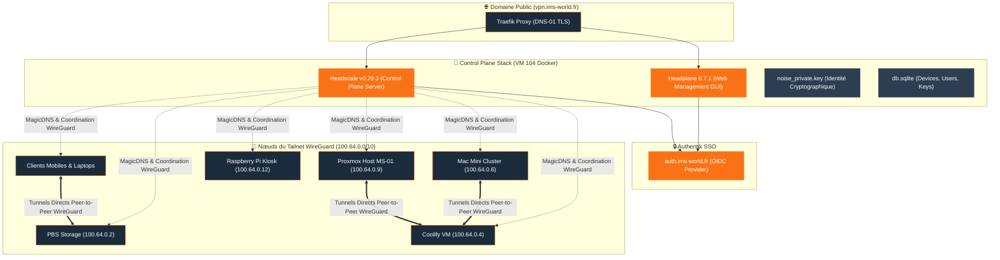

import TailscaleTable from "/snippets/tailscale-table.mdx";
import { ips, domains } from "/snippets/variables.mdx";

<Badge color="green">🟢 Production Active</Badge>

## Accès Rapides & Administration

<Tabs>
  <Tab title="🌐 Interfaces Web">
    <Card title="Headplane Admin Console" icon="network-wired" href="https://vpn.ims-world.fr">
      Interface de gestion des utilisateurs, clés d'authentification et appareils du réseau Tailnet.
    </Card>
  </Tab>
  <Tab title="⚡ Commandes CLI & Maintenance">
    ```bash
    # Lister les nœuds enregistrés sur le Tailnet
    docker exec headscale-i136ix2bmrrbeovnyrh1o72w headscale nodes list

    # Créer une clé API pour la console Headplane
    docker exec headscale-i136ix2bmrrbeovnyrh1o72w headscale apikeys create --expiration 999d
    ```
  </Tab>
  <Tab title="🗺️ IP des Nœuds du Tailnet (100.64.0.0/10)">
    <TailscaleTable />
  </Tab>
</Tabs>

---

## Fiche Service

| Propriété | Valeur |
|---|---|
| **URL Coordination (Public)** | `https://vpn.ims-world.fr` *(Public WAN — serveur de coordination Tailscale)* |
| **URL Admin Headplane (Tailnet Only)** | `https://admin.vpn.ims-world.fr/admin` *(Tailscale Only — **`/admin` obligatoire**)* |
| **Versions** | `headscale/headscale:v0.29.3` + `ghcr.io/tale/headplane:0.7.1` |
| **Base de Données** | SQLite (`db.sqlite`) |
| **Hôte d'Orchestration** | VM IMS-Coolify (VM 104) |
| **UUID Coolify** | `i136ix2bmrrbeovnyrh1o72w` |
| **Chemin sur la VM** | `/data/coolify/services/i136ix2bmrrbeovnyrh1o72w/` |
| **Statut** | <Badge color="green">🟢 Production Active</Badge> |

<Warning>
**Suffixe de Chemin `/admin` Obligatoire** : L'application web Headplane est compilée avec le base path `/admin`. Accéder à `https://admin.vpn.ims-world.fr/` sans le suffixe renvoie un HTTP **404 Not Found** (car Headplane n'enregistre aucune route sur la racine `/`). L'URL exacte d'administration est **`https://admin.vpn.ims-world.fr/admin`**.
</Warning>

---

## Architecture & Topologie


```mermaid
graph TB
    subgraph WAN_PUB ["🌐 Domaine Public (vpn.ims-world.fr)"]
        TRAEFIK["Traefik Proxy (DNS-01 TLS)"]
    end

    subgraph HEADSCALE_STACK ["🔐 Control Plane Stack (VM 104 Docker)"]
        HEADSCALE["Headscale v0.29.3 (Control Plane Server)"]
        HEADPLANE["Headplane 0.7.1 (Web Management GUI)"]
        NOISE_KEY["noise_private.key (Identité Cryptographique)"]
        DB_SQLITE["db.sqlite (Devices, Users, Keys)"]
    end

    subgraph OIDC_AUTH ["🔒 Authentik SSO"]
        AUTH_SRV["auth.ims-world.fr (OIDC Provider)"]
    end

    subgraph TAILNET_NODES ["📱 Nœuds du Tailnet WireGuard (100.64.0.0/10)"]
        MAC["Mac Mini Cluster (100.64.0.6)"]
        PVE["Proxmox Host MS-01 (100.64.0.9)"]
        PBS["PBS Storage (100.64.0.2)"]
        COOL["Coolify VM (100.64.0.4)"]
        RPI["Raspberry Pi Kiosk (100.64.0.12)"]
        MOBILE["Clients Mobiles & Laptops"]
    end

    TRAEFIK --> HEADSCALE
    TRAEFIK --> HEADPLANE
    HEADPLANE --> AUTH_SRV
    HEADSCALE --> AUTH_SRV

    HEADSCALE -.->|MagicDNS & Coordination WireGuard| MAC
    HEADSCALE -.->|MagicDNS & Coordination WireGuard| PVE
    HEADSCALE -.->|MagicDNS & Coordination WireGuard| PBS
    HEADSCALE -.->|MagicDNS & Coordination WireGuard| COOL
    HEADSCALE -.->|MagicDNS & Coordination WireGuard| RPI
    HEADSCALE -.->|MagicDNS & Coordination WireGuard| MOBILE

    MAC <==>|Tunnels Directs Peer-to-Peer WireGuard| COOL
    PVE <==>|Tunnels Directs Peer-to-Peer WireGuard| COOL
    MOBILE <==>|Tunnels Directs Peer-to-Peer WireGuard| PBS

    classDef srv fill:#F97316,stroke:#FB923C,color:#fff;
    classDef key fill:#2c3e50,stroke:#34495e,color:#fff;
    classDef node fill:#1a2b3c,stroke:#F97316,color:#fff;
    class HEADSCALE,HEADPLANE,AUTH_SRV srv;
    class NOISE_KEY,DB_SQLITE key;
    class MAC,PVE,PBS,COOL,RPI,MOBILE node;
```

<Warning>
Headscale est un control plane qui coordonne des connexions WireGuard peer-to-peer (Mesh VPN), et non un VPN centralisé classique.
</Warning>

---

## Composants & Fichiers Critiques

| Fichier / Élement | Rôle & Usage | Conséquence si Altéré |
|---|---|---|
| `noise_private.key` | Identité cryptographique du serveur Headscale | Tous les clients verraient un "nouveau serveur" non reconnu |
| `db.sqlite` | Base SQLite des nœuds, utilisateurs et clés d'accès | Perte instantanée de tous les appareils enregistrés |

---

## 🌐 Enregistrements DNS Split-Horizon (`extra_records`)

Pour garantir que les sous-domaines d'administration privés restreints à **`vpn-only`** soient résolus directement vers l'IP Tailscale du proxy (`100.64.0.4`) sans rebondir sur le DNS public Internet (Hairpin NAT Bbox), ils sont déclarés dans la section `extra_records` de Headscale :

```yaml
# Fichier hôte sur la VM Coolify : /data/coolify/services/i136ix2bmrrbeovnyrh1o72w/config/config.yaml
# (Ou directement depuis l'interface Web Headplane)
dns:
  extra_records:
    - name: "coolify.ims-world.fr"
      type: "A"
      value: "100.64.0.4"
    - name: "logs.ims-world.fr"
      type: "A"
      value: "100.64.0.4"
    # ... autres sous-domaines d'administration vpn-only
```

---

## 🔐 Authentification OIDC & Enrôlement des Utilisateurs (Authentik)

L'accès au Tailnet et l'enrôlement des appareils clients reposent sur la fédération d'identité **OpenID Connect (OIDC)** fournie par [Authentik](/services/authentik) (`auth.ims-world.fr`).

- **Périmètre des droits** : L'accès au réseau Headscale et l'enregistrement de machines sont ouverts aux comptes appartenant au groupe **`membres`** (en complément des administrateurs).
- **Flux de première connexion** :
  Lors de la première connexion d'un utilisateur :
  ```bash
  tailscale up --login-server https://vpn.ims-world.fr
  ```
  Le client Tailscale fournit une URL de redirection vers la mire SSO Authentik. Après validation des identifiants et du second facteur (2FA / WebAuthn), la session est approuvée et le nœud est rattaché au Tailnet avec une adresse IP dédiée en `100.64.0.x`.
- **Séparation des privilèges** : L'accès à la console d'administration **Headplane** (`https://admin.vpn.ims-world.fr/admin`) demeure strictement réservé aux profils `authentik Admins` et `admins`. Les utilisateurs du groupe `membres` bénéficient exclusivement de l'enrôlement réseau.
