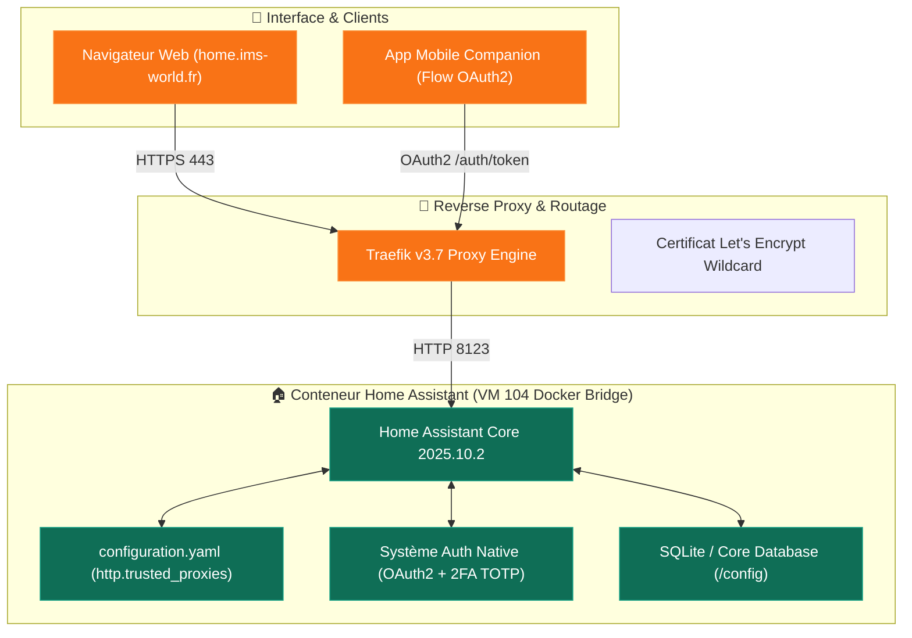

import { ips, domains } from "/snippets/variables.mdx";

<Badge color="green">🟢 Production Active (2025.10.2)</Badge>

## Accès Rapides & Administration

<Tabs>
  <Tab title="🌐 Interface Web">
    <Card title="Home Assistant Console" icon="house-signal" href="https://home.ims-world.fr">
      Interface de gestion domotique et tableaux de bord d'automatisation sur `home.ims-world.fr` (Auth native HA + 2FA TOTP).
    </Card>
  </Tab>
  <Tab title="⚡ Commandes CLI & Maintenance">
    ```bash
    # Se connecter à la VM Coolify
    ssh cmolotkoff@100.64.0.4

    # Accéder au dossier de la ressource Home Assistant
    cd /data/coolify/services/pleg2rvxkp9uqvtyu7cg46yb/

    # Inspecter les logs du conteneur
    docker compose logs -f --tail=100

    # Purger un bannissement IP accidentel (en cas d'auto-ban hairpin NAT)
    docker compose stop
    rm -f ./config/ip_bans.yaml
    docker compose start
    ```
  </Tab>
</Tabs>

---

## Fiche Service

| Propriété | Valeur |
|---|---|
| **Domaine** | `home.ims-world.fr` |
| **Rôle** | Plateforme Domotique, Automatisation & Gestion des Équipements Smart Home |
| **Image Docker** | `ghcr.io/home-assistant/home-assistant:2025.10.2` |
| **Port Interne** | `8123` |
| **Hôte d'Orchestration** | VM IMS-Coolify (VM 104) — IP `192.168.1.52` |
| **UUID Coolify** | `pleg2rvxkp9uqvtyu7cg46yb` |
| **Chemin sur la VM** | `/data/coolify/services/pleg2rvxkp9uqvtyu7cg46yb/` |
| **Mode Réseau** | Bridge Docker + Labels Traefik (`SERVICE_URL_HOMEASSISTANT_8123`) |
| **Stockage Local** | Bind-mounts relatifs (`./config:/config`, `./configuration.yaml:/config/configuration.yaml`) |
| **Authentification** | Native Home Assistant + 2FA TOTP (Pas de ForwardAuth SSO) |
| **Date de Mise en Prod** | **21 août 2026** |
| **Statut** | <Badge color="green">🟢 Production Active</Badge> |

---

## Architecture & Arbitrages Techniques



### 1. Docker Pur vs Home Assistant OS (HAOS)
- **Choix d'Architecture** : Conteneur Docker classique déployé directement sur la VM Coolify existante (`104`), en parfaite cohérence avec le principe d'infrastructure **"Tout centralisé sur Coolify"**.
- **Refus des VMs Dédiées** : Aucun nœud ni VM Proxmox dédiée n'a été créée pour conserver une gestion homogène des ressources.

### 2. Mode Réseau : Bridge Docker vs Host
- **Mode Bridge Retenu** : Déploiement en réseau bridge classique avec labels Traefik générés automatiquement par Coolify via `SERVICE_URL_HOMEASSISTANT_8123`.
- **Compromis Assumé** : Perte de la découverte automatique mDNS/SSDP sur le LAN (nécessiterait `network_mode: host`). En contrepartie, le service bénéficie du routage propre Traefik, du SSL automatique et de l'isolation conteneurisée. Les équipements sans découverte IP explicite sont ajoutés manuellement par leur adresse IP.

### 3. Nettoyage du Compose
- **Pas de `privileged: true`** : Retiré du compose initial (superflu sans accès matériel direct).
- **Suppression du volume nommé** : Remplacé par un bind-mount relatif propre (`./config:/config`).
- **Suppression de `/run/dbus`** : Retiré car aucun usage Bluetooth ou D-Bus n'est requis à ce jour.

---

## Reverse Proxy Traefik & Configuration `http:`

Le fichier `configuration.yaml` (bind-monté depuis `/data/coolify/services/pleg2rvxkp9uqvtyu7cg46yb/configuration.yaml`) intègre la section `http:` indispensable au fonctionnement derrière Traefik :

```yaml
http:
  use_x_forwarded_for: true
  trusted_proxies:
    - 10.0.0.0/8
    - 172.16.0.0/12
    - 192.168.0.0/16
  ip_ban_enabled: true
  login_attempts_threshold: 5
```

<Warning>
**Risque d'Auto-Ban sous l'IP `_gateway` (Hairpin NAT)** :
Le paramètre `ip_ban_enabled: true` applique un bannissement d'IP au bout de 5 tentatives échouées. Lors d'un accès à `home.ims-world.fr` depuis le LAN local, le phénomène de **hairpin NAT** réécrit l'IP source sous l'adresse de la passerelle locale (`_gateway`).
- **Impact** : En cas de saisie manquée de mot de passe depuis le LAN, c'est l'IP passerelle globale qui est bannie, bloquant tous les accès locaux.
- **Bonne Pratique** : Toujours vérifier l'authentification depuis le réseau mobile (4G/5G) ou Tailscale pour établir un diagnostic fiable.
- **Déblocage** : En cas de blocage, arrêter le service, supprimer `./config/ip_bans.yaml` et redémarrer le conteneur.
</Warning>

---

## Stratégie d'Authentification

- **Décision** : **Authentification Native Home Assistant + 2FA TOTP**.
- **Rejet d'Authentik Forward-Auth** : Contrairement aux services comme Uptime Kuma, IT-Tools ou Stirling PDF, Home Assistant n'est **pas** placé derrière l'Outpost Forward-Auth Authentik.
- **Motif Technique** : L'application mobile officielle ***Home Assistant Companion*** exécute un flux OAuth2 directement contre l'API native de HA (`/auth/authorize`, `/auth/token`) pour obtenir des jetons de longue durée. Placer un proxy Forward-Auth en frontal intercepterait ces requêtes et détruirait l'authentification de l'application mobile.

---

## Intégrations & Bugs Amont

| Intégration | État | Observations & Actions |
|---|:---:|---|
| **Alexa Devices** | ❌ Désactivée | Bug amont officiel Home Assistant Core (voir alerte ci-dessous) |

<Warning>
**Bug Amont — Intégration Alexa Devices (`home-assistant:2025.10.2`)** :
Une erreur python `AttributeError: 'NoneType' object has no attribute 'get'` survient dans la librairie `aioamazondevices` (utilisée par l'intégration core `alexa_devices`).
- **Issues GitHub Référencées** : [#154618](https://github.com/home-assistant/core/issues/154618) (doublon de [#153531](https://github.com/home-assistant/core/issues/153531)).
- **Statut** : Bug officiel confirmé sans correctif au moment du déploiement. L'intégration reste désactivée en attente du patch upstream.
</Warning>

---

## Exposition Réseau & Alerte Sécurité

<Warning>
**Balayage Automatique des Nouveaux Sous-Domaines Wildcard** :
En raison de la zone DNS wildcard `*.ims-world.fr`, la publication d'un nouveau sous-domaine déclenche quasi-instantanément l'indexation et le scan par des bots d'attaque Web.
- **Constat Terrain** : Moins de 10 minutes après le premier accès web, une tentative d'exploration sur `/api/config` a été enregistrée dans les logs depuis l'IP distante `43.228.157.191`.
- **Rappel Sécurité** : Comportement classique d'Internet, mais rappel de la nécessité de finaliser l'implémentation de **CrowdSec** pour bannir automatiquement ces sondes au niveau Traefik.
</Warning>

---

## Évolutions Matérielles Futures (Passthrough USB)

<Info>
Un dongle USB Zigbee/Z-Wave est envisagé mais **non encore acheté**. Aucun passthrough matériel n'est configuré à ce jour.
</Info>

Lors de l'acquisition du dongle USB, le passthrough matériel nécessitera deux niveaux de configuration :
1. **Hôte Proxmox MS-01 ➔ VM 104** : Passthrough du périphérique USB au niveau QEMU/Proxmox (`qm set 104 -usbX host=...`). Nécessitera un redémarrage planifié de la VM 104.
2. **VM 104 ➔ Conteneur Home Assistant** : Configuration de la section `devices:` dans le Compose en utilisant la nomenclature `/dev/serial/by-id/...` pour garantir la stabilité de l'énumération USB.

---

<CardGroup cols={2}>
  <Card title="Traefik Proxy Engine" icon="route" href="/reseau/traefik-proxy">
    Configuration des routeurs Traefik et middlewares partagés.
  </Card>
  <Card title="Matrice de Sécurité & d'Exposition" icon="shield-check" href="/reseau/matrice-securite-exposition">
    Zones de confiance, filtrage IP et politiques d'authentification.
  </Card>
</CardGroup>
