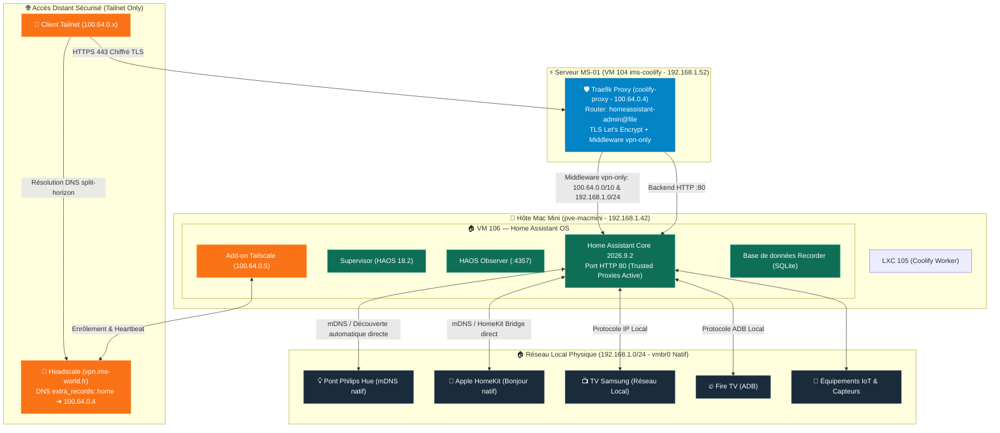

import { ips, domains } from "/snippets/variables.mdx";

<Badge color="green">🟢 Production Active (VM Dédiée HAOS & HTTPS Traefik)</Badge>

<Warning>
**Changement d'architecture majeur** : Cette documentation remplace la version décrivant l'ancien déploiement Docker sur `ims-coolify` (VM 104). Ce conteneur Docker a été intégralement supprimé. Home Assistant fonctionne désormais au sein d'une **machine virtuelle dédiée (HAOS)** hébergée sur le **Mac Mini (Nœud 2 du cluster Proxmox)**.
</Warning>

## Accès Rapides & Administration

<Tabs>
  <Tab title="🌐 Interfaces Web">
    <CardGroup cols={2}>
      <Card title="Accès Sécurisé HTTPS (Tailnet)" icon="shield-halved" href="https://home.ims-world.fr">
        Interface web principale chiffrée avec certificat Let's Encrypt : `https://home.ims-world.fr` (filtrage IP strict `vpn-only` via Traefik).
      </Card>
      <Card title="Accès Direct Local (LAN)" icon="network-wired" href="http://192.168.1.92">
        Accès direct sur le réseau local physique : `http://192.168.1.92` (port 80) et Observer HAOS sur `http://192.168.1.92:4357`.
      </Card>
    </CardGroup>
  </Tab>
  <Tab title="⚡ Console & Maintenance Proxmox">
    ```bash
    # Se connecter en SSH au Mac Mini (Nœud 2 Proxmox)
    ssh cmolotkoff@100.64.0.6
    
    # Ouvrir la console CLI série de la VM Home Assistant (VMID 106)
    qm terminal 106
    
    # Vérifier l'état de la machine virtuelle
    qm status 106
    
    # Redémarrer la VM proprement si besoin
    qm reboot 106
    ```
  </Tab>
</Tabs>

---

## Fiche Service

| Propriété | Valeur |
|---|---|
| **Nom du Service** | Home Assistant OS (HAOS) |
| **Type de Workload** | Machine Virtuelle Dédiée KVM (VMID `106`) |
| **Hôte d'Accueil** | Apple Mac Mini Late 2012 (`pve-macmini`, Nœud 2 `ims-cluster`) |
| **IP Réseau Local (LAN)** | `192.168.1.92` (Bail DHCP statique sur la Bbox) |
| **IP Tailscale (Tailnet)** | `100.64.0.5` (`ha-macmini`) |
| **FQDN Tailnet Split-Horizon** | `https://home.ims-world.fr` (`extra_records` ➔ `100.64.0.4` Traefik) |
| **Version HAOS** | `18.2` |
| **Version Core** | `2026.9.2` |
| **Serveur de Coordination VPN** | Headscale IMS-WORLD (`https://vpn.ims-world.fr`) |
| **Reverse Proxy** | Traefik v3 (`coolify-proxy`, VM 104) avec middleware `vpn-only` et certificat wildcard Let's Encrypt |
| **Backend Proxy URL** | `http://192.168.1.92:80` (Port HTTP natif HAOS) |
| **Authentification** | Native Home Assistant (compte administrateur local) |
| **Statut** | <Badge color="green">🟢 Production Active</Badge> |

---

## Architecture & Topologie


```mermaid
graph TB
    subgraph WAN_REMOTE ["🌐 Accès Distant Sécurisé (Tailnet Only)"]
        CLIENT_TS["📱 Client Tailnet (100.64.0.x)"]
        HEADSCALE["🔑 Headscale (vpn.ims-world.fr)<br/>DNS extra_records: home ➔ 100.64.0.4"]
    end

    subgraph MS01 ["⚡ Serveur MS-01 (VM 104 ims-coolify - 192.168.1.52)"]
        TRAEFIK["🛡️ Traefik Proxy (coolify-proxy - 100.64.0.4)<br/>Router: homeassistant-admin@file<br/>TLS Let's Encrypt + Middleware vpn-only"]
    end

    subgraph MAC_MINI ["🍎 Hôte Mac Mini (pve-macmini - 192.168.1.42)"]
        subgraph VM_HAOS ["🏠 VM 106 — Home Assistant OS"]
            HA_CORE["Home Assistant Core 2026.9.2<br/>Port HTTP 80 (Trusted Proxies Active)"]
            HA_SUP["Supervisor (HAOS 18.2)"]
            HA_OBS["HAOS Observer (:4357)"]
            ADDON_TS["Add-on Tailscale (100.64.0.5)"]
            DB_SQLITE["Base de données Recorder (SQLite)"]
        end
        WORKER_105["LXC 105 (Coolify Worker)"]
    end

    subgraph HOME_LAN ["🏠 Réseau Local Physique (192.168.1.0/24 - vmbr0 Natif)"]
        HUE_BRIDGE["💡 Pont Philips Hue (mDNS natif)"]
        APPLE_HOME["📱 Apple HomeKit (Bonjour natif)"]
        TV_SAMSUNG["📺 TV Samsung (Réseau Local)"]
        FIRE_TV["🔥 Fire TV (ADB)"]
        IOT_DEVICES["🔌 Équipements IoT & Capteurs"]
    end

    CLIENT_TS -->|Résolution DNS split-horizon| HEADSCALE
    CLIENT_TS -->|HTTPS 443 Chiffré TLS| TRAEFIK
    TRAEFIK -->|Middleware vpn-only: 100.64.0.0/10 & 192.168.1.0/24| HA_CORE
    TRAEFIK -->|Backend HTTP :80| HA_CORE

    ADDON_TS <-->|Enrôlement & Heartbeat| HEADSCALE

    HA_CORE <-->|mDNS / Découverte automatique directe| HUE_BRIDGE
    HA_CORE <-->|mDNS / HomeKit Bridge direct| APPLE_HOME
    HA_CORE <-->|Protocole IP Local| TV_SAMSUNG
    HA_CORE <-->|Protocole ADB Local| FIRE_TV
    HA_CORE <--> IOT_DEVICES

    classDef ts fill:#F97316,stroke:#FB923C,color:#fff;
    classDef traefik fill:#0284C7,stroke:#0369A1,color:#fff;
    classDef ha fill:#0F6E56,stroke:#16A085,color:#fff;
    classDef lan fill:#1a2b3c,stroke:#2c3e50,color:#fff;
    class CLIENT_TS,HEADSCALE,ADDON_TS ts;
    class TRAEFIK traefik;
    class HA_CORE,HA_SUP,HA_OBS,DB_SQLITE ha;
    class HUE_BRIDGE,APPLE_HOME,TV_SAMSUNG,FIRE_TV,IOT_DEVICES lan;
```

---

## Pourquoi ce Changement d'Architecture ?

Le déploiement initial sous forme de conteneur Docker sur `ims-coolify` (VM 104, derrière Traefik) fonctionnait, mais se heurtait à une limite technique structurelle : **la découverte locale mDNS / Bonjour / SSDP**.

1. **Réseau natif et protocoles de découverte (mDNS/Bonjour)** :
   * Plusieurs intégrations prévues (Philips Hue, HomeKit Bridge, Google Cast) reposent sur la diffusion multicast mDNS (`224.0.0.251:5353`).
   * Ce trafic multicast ne franchit pas les réseaux Docker bridge isolés sans déployer de relais complexe (`avahi-daemon` en mode reflector).
   * En déployant HAOS au sein d'une machine virtuelle raccordée directement au pont `vmbr0`, Home Assistant dispose d'une interface réseau native sur le LAN physique `192.168.1.0/24`. Hue et HomeKit fonctionnent ainsi immédiatement sans configuration réseau additionnelle.
2. **Écosystème officiel HAOS & Supervised** :
   * Image officielle avec gestion intégrée des add-ons et des montées de version du système et du noyau en un clic depuis l'interface web.
3. **Passthrough matériel direct** :
   * L'intégration future d'un contrôleur domotique (clé USB Zigbee ou Z-Wave) s'effectue directement au niveau de l'hyperviseur Proxmox vers la VM, sans couche d'indirection Docker supplémentaire.
4. **Isolation matérielle sur le Mac Mini** :
   * Le Mac Mini 2012 était sous-utilisé. L'isolation de la domotique physique sur cet hôte garantit que les éclairages et automatismes continuent de fonctionner même en cas de redémarrage ou de maintenance lourde sur le serveur principal MS-01 ou la VM Coolify.

---

## Déploiement & Configuration Initiale

<Steps>
  <Step title="Création de la VM via script communautaire">
    Exécution du script communautaire officiel Proxmox VE directement en SSH sur le Mac Mini :
    ```bash
    bash -c "$(curl -fsSL https://raw.githubusercontent.com/community-scripts/ProxmoxVE/main/vm/haos-vm.sh)"
    ```
    La VM est instanciée avec le **VMID 106**.
  </Step>

  <Step title="Premier démarrage & initialisation">
    Le premier boot prend quelques minutes : le Supervisor télécharge l'image Home Assistant Core en arrière-plan (état *landingpage* affiché dans la console Proxmox). L'adresse IP DHCP obtenue (`192.168.1.92`) s'affiche dans la console série.
  </Step>

  <Step title="Onboarding initial sur le LAN">
    Connexion sur l'interface locale `http://192.168.1.92` pour créer le compte administrateur principal. Cette étape requiert un accès direct au réseau local physique.
  </Step>

  <Step title="Installation & Configuration de l'Add-on Tailscale">
    HAOS utilisant un système de fichiers immuable en lecture seule, le client Tailscale est déployé via l'add-on communautaire officiel :
    1. Dans Home Assistant : **Paramètres** ➔ **Modules complémentaires** ➔ **Boutique des modules complémentaires**.
    2. Cliquer sur les trois points verticaux en haut à droite ➔ **Dépôts**, et ajouter :
       ```text
       https://github.com/hassio-addons/repository
       ```
    3. Installer le module **Tailscale**.
    4. Dans l'onglet **Configuration** de l'add-on, modifier uniquement le paramètre `login_server` pour pointer vers Headscale :
       ```yaml
       login_server: "https://vpn.ims-world.fr"
       ```
       *Conserver tous les autres paramètres par défaut (`accept_routes`, `advertise_routes`, `exit_node` désactivés).*
    5. Démarrer le module et activer l'affichage dans la barre latérale.
    6. Ouvrir l'onglet **Tailscale** dans la barre latérale, cliquer sur **Log In**, et valider l'authentification sur Headscale.
    7. La machine obtient l'adresse IP Tailnet **`100.64.0.5`**.
  </Step>

  <Step title="Configuration du Reverse Proxy HTTPS (Zone 2 Traefik)">
    Pour offrir un accès sécurisé HTTPS standard avec certificat Let's Encrypt et contexte sécurisé pour l'application Companion, le routage est délégué au Traefik central de la VM 104.
  </Step>
</Steps>

---

## Configuration du Reverse Proxy HTTPS (HAOS 2026+ & Traefik)

<Important>
**Évolution majeure HAOS 2026+ (Configuration HTTP via l'interface)** :
Dans les versions récentes de Home Assistant Core (2026+), **la section `http:` du fichier `configuration.yaml` est ignorée et dépréciée**. La configuration du serveur HTTP et des proxys inverses s'administre désormais exclusivement depuis l'IHM web.
</Important>

### 1. Configuration dans l'IHM Home Assistant
1. Connectez-vous sur `http://192.168.1.92`.
2. Rendez-vous dans **Paramètres** ➔ **Système** ➔ **Réseau** ➔ section **Serveur HTTP**.
3. Vérifiez le port d'écoute (par défaut : `80`).
4. Dans le volet déroulant **Proxy inverse** :
   - Activez l'interrupteur **Faire confiance à X-Forwarded-For**.
   - Cliquez sur **+ Ajouter Proxies de confiance** pour déclarer les plages autorisées :
     - `192.168.1.52` *(Hôte VM Coolify / Traefik)*
     - `192.168.1.0/24` *(LAN physique)*
     - `100.64.0.0/10` *(Plage Tailnet Overlay)*
     - `172.16.0.0/12` *(Réseaux internes bridges Docker)*
     - `10.0.0.0/8` *(Réseaux overlay Docker)*
5. Cliquez sur **Enregistrer** (l'enregistrement redémarre automatiquement Home Assistant Core).

### 2. Déclaration Traefik (`vpn-only.yaml` sur VM 104)
Sur `ims-coolify`, le fichier dynamique `/data/coolify/proxy/dynamic/vpn-only.yaml` associe le nom de domaine `home.ims-world.fr` au backend LAN :

```yaml
http:
  routers:
    homeassistant-admin:
      rule: Host(`home.ims-world.fr`)
      entryPoints:
        - https
      service: homeassistant-admin
      middlewares:
        - vpn-only
        - admin-gzip
      tls:
        certResolver: letsencrypt

  services:
    homeassistant-admin:
      loadBalancer:
        servers:
          - url: 'http://192.168.1.92:80'
```

### 3. Enregistrement DNS Split-Horizon (Headscale)
Dans la configuration Headscale (`extra_records` ou via Headplane) :
- Le FQDN **`home.ims-world.fr`** pointe vers **`100.64.0.4`** (l'IP Tailscale de Traefik / VM 104).
- Traefik termine le chiffrement TLS 1.3 avec le certificat wildcard `*.ims-world.fr`, applique le middleware `vpn-only` (rejet immédiat HTTP 403 pour toute IP hors Tailnet), puis achemine le trafic vers `http://192.168.1.92:80`.

---

## Matrice des Intégrations

| Intégration | Protocole / Type | État | Notes |
|---|---|---|---|
| **Philips Hue** | Local (mDNS / Pont Hue) | ⏳ À configurer | Découverte native du pont sur le LAN grâce au pont `vmbr0` |
| **Apple HomeKit Bridge** | Local (Bonjour / mDNS) | ⏳ À configurer | Exposition des entités HA vers l'écosystème Apple Maison |
| **Samsung Smart TV** | Local (Websocket IP) | ⏳ À configurer | Évite l'API SmartThings cloud devenue payante |
| **Fire TV** | Local (ADB réseau) | ⏳ À configurer | Pilotage multimédia via Android Debug Bridge |
| **Levoit (VeSync)** | Cloud / Local | ⏳ À configurer | Ventilateur et purificateur d'air |
| **Google Home** | Hybride Cloud | ⏳ À configurer | Configuration manuelle Google Cloud Platform (sans Nabu Casa) |
| **Alexa Devices** | Cloud (aioamazondevices) | ❌ Désactivée | En attente d'un correctif amont (issues core [#154618](https://github.com/home-assistant/core/issues/154618) et [#153531](https://github.com/home-assistant/core/issues/153531)) |
| **Xgimi Mogo 2** | Expérimental (HACS) | 💡 À évaluer | Intégration communautaire custom `manymuch/Xgimi-4-Home-Assistant` |

---

## Feuille de Route Domotique

### 1. Court Terme (Immédiat)
- [ ] **Philips Hue** : Détection et association du pont Hue et des ampoules.
- [ ] **HomeKit Bridge** : Publication des accessoires dans l'application Maison d'Apple.
- [ ] **Samsung TV & Fire TV** : Intégration des téléviseurs et passerelles multimédias.
- [ ] **Application Mobile Companion** : Installation sur les smartphones et configuration de l'URL sécurisée `https://home.ims-world.fr`.

### 2. Moyen Terme (Matériel & Contrôleurs)
- [ ] **Contrôleur USB Zigbee / Z-Wave** :
  <Warning>
  **Interférences USB 3.0 sur le Mac Mini 2012** : Les ports USB du Mac Mini sont exclusivement en norme USB 3.0. Ils émettent un rayonnement parasite sur la fréquence 2.4 GHz qui perturbe lourdement le signal radio Zigbee.
  **Règle d'or** : Utiliser impérativement une **rallonge blindée USB 2.0 d'au moins 1 mètre** entre le Mac Mini et le dongle USB. Dans Proxmox, mapper le périphérique par ID matériel (`/dev/serial/by-id/...`) et non par numéro de port physique.
  </Warning>
- [ ] **Capteurs environnementaux** : Intégration de capteurs de température, humidité et détecteurs d'ouverture Zigbee.

### 3. Idées à Explorer
- **Export des métriques vers Prometheus / Grafana** : Ingestion des états et temps de réponse domotiques dans la stack LGTM du homelab.
- **Notifications critiques Ntfy** : Routage des alertes de sécurité (fuite d'eau, intrusion) vers le topic `ims-alerts`.
- **Frigate NVR** : Détection d'objets et vidéosurveillance locale si une caméra IP est déployée.
- **Assist (Voix locale)** : Assistant vocal souverain déconnecté du cloud.

---

## 📋 Tâches d'Exploitation & Infrastructure (TODO)

- [ ] **Sauvegarde Proxmox Backup Server (PBS)** : Intégrer la VM 106 dans un job nocturne automatisé `vzdump` vers le datastore PBS (LXC 103) pour garantir la résilience du SSD du Mac Mini.
- [x] **Reverse Proxy HTTPS Traefik (`vpn-only`)** : Mettre en place un routeur Traefik filtré sur `https://home.ims-world.fr` pointant vers `192.168.1.92:80` avec certificat Let's Encrypt et proxies de confiance configurés via l'IHM HAOS. *(Validé le 14/09/2026)*
- [ ] **Vérification du bail statique LAN** : Confirmer la réservation du bail DHCP permanent pour l'adresse `192.168.1.92` sur la Bbox.
- [ ] **Supervision Uptime Kuma** : Ajouter une sonde HTTP sur `https://home.ims-world.fr` avec notification push Ntfy en cas d'interruption du service.

