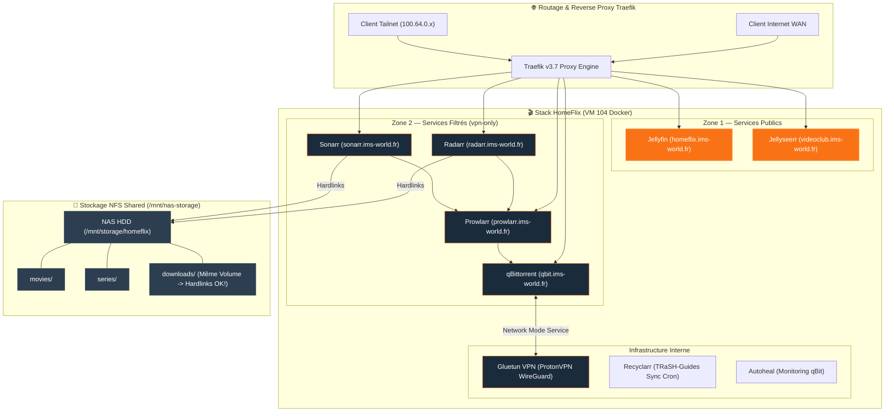

import { ips, domains } from "/snippets/variables.mdx";

<Badge color="green">🟢 Production Active (Stack 9 Conteneurs)</Badge>

## Accès Rapides aux Services

<Tabs>
  <Tab title="🌐 Accès Web Publics (Zone 1)">
    <CardGroup cols={2}>
      <Card title="Jellyfin (Streaming)" icon="play" href="https://homeflix.ims-world.fr">
        Interface principale de streaming vidéo (accélération matérielle QuickSync iGPU).
      </Card>
      <Card title="Jellyseerr (Demandes)" icon="film" href="https://videoclub.ims-world.fr">
        Portail de recherche et de demande automatique de médias.
      </Card>
    </CardGroup>
  </Tab>
  <Tab title="🔐 Accès Filtrés Tailnet (Zone 2)">
    <CardGroup cols={2}>
      <Card title="Radarr (Films)" icon="video" href="https://radarr.ims-world.fr">
        Gestion et automatisation des films.
      </Card>
      <Card title="Sonarr (Séries)" icon="tv" href="https://sonarr.ims-world.fr">
        Gestion et automatisation des séries.
      </Card>
      <Card title="Prowlarr (Indexers)" icon="magnifying-glass" href="https://prowlarr.ims-world.fr">
        Gestionnaire centralisé des indexeurs torrent.
      </Card>
      <Card title="qBittorrent (Client)" icon="download" href="https://qbit.ims-world.fr">
        Client torrent routé via VPN Gluetun (kill-switch actif).
      </Card>
    </CardGroup>
  </Tab>
  <Tab title="💻 Administration CLI">
    ```bash
    # Se connecter à la VM Coolify
    ssh cmolotkoff@100.64.0.4
    
    # Accéder au dossier de la stack HomeFlix
    cd /data/coolify/services/w39uebmcnse7yctsft8hzed8/
    
    # Inspecter les logs des 9 conteneurs
    docker compose logs -f --tail=100
    ```
  </Tab>
</Tabs>

---

## Fiche Service

| Propriété | Valeur |
|---|---|
| **Nom de la Stack** | HomeFlix V2 (9 conteneurs Docker) |
| **Hôte d'Orchestration** | VM IMS-Coolify (VM 104) |
| **UUID Coolify** | `w39uebmcnse7yctsft8hzed8` |
| **Chemin sur la VM** | `/data/coolify/services/w39uebmcnse7yctsft8hzed8/` |
| **VPN & Kill-Switch** | ProtonVPN WireGuard (`qmcgaw/gluetun:v3.40.0` avec Port-Forwarding) |
| **Accélération Matérielle** | Passthrough iGPU Intel Iris Xe (QuickSync Haswell / QSV) |
| **Profils Qualité** | TRaSH-Guides sync quotidien (Recyclarr 04h00) |
| **Stockage NFS Shared** | `/mnt/nas-storage/homeflix/` (Hardlinks garantis sur même volume) |
| **Statut** | <Badge color="green">🟢 Production Active</Badge> |

---

## Topologie de la Stack HomeFlix (9 Containers)



---

## Composants & Roles de la Stack

| Service | Domaine | Exposition / Zone | Rôle |
|---|---|---|---|
| **Jellyfin** | `homeflix.ims-world.fr` | 🌐 Zone 1 (Public WAN) | Serveur de streaming vidéo (accélération iGPU Haswell/Iris Xe) |
| **Jellyseerr** | `videoclub.ims-world.fr` | 🌐 Zone 1 (Public WAN) | Portail de demande de films/séries |
| **qBittorrent** | `qbit.ims-world.fr` | 🔐 Zone 2 (Tailnet Only) | Client de téléchargement torrent routé via Gluetun |
| **Prowlarr** | `prowlarr.ims-world.fr` | 🔐 Zone 2 (Tailnet Only) | Gestionnaire centralisé d'indexeurs |
| **Radarr** | `radarr.ims-world.fr` | 🔐 Zone 2 (Tailnet Only) | Automation & gestion de la bibliothèque de films |
| **Sonarr** | `sonarr.ims-world.fr` | 🔐 Zone 2 (Tailnet Only) | Automation & gestion de la bibliothèque de séries |
| **Gluetun** | Interne | 🏠 Interne | Client VPN ProtonVPN WireGuard avec kill-switch mécanique pour qBit |
| **Recyclarr** | Interne | 🏠 Interne | Synchronisation automatique quotidienne des profils de qualité TRaSH-Guides (04h00) |
| **Autoheal** | Interne | 🏠 Interne | Surveillance et redémarrage automatique de qBittorrent si la liaison VPN Gluetun tombe |

---

## Architecture Stockage — Répartition SSD/NAS & Hardlinks

<Warning>
**Contrainte technique impérative** : Les hardlinks ne traversent jamais deux systèmes de fichiers distincts. Le dossier `downloads/` **DOIT impérativement** résider sur le même point de montage NFS que `movies/` et `series/`. Sinon, Radarr et Sonarr effectuent une copie complète des fichiers au lieu d'un hardlink, ce qui double la consommation de stockage sur disque !
</Warning>

```
/data/coolify/services/w39uebmcnse7yctsft8hzed8/data/config   (SSD local VM — SQLite & configs)
/mnt/nas-storage/homeflix/movies      (NAS — Hardlinks garantis avec downloads/)
/mnt/nas-storage/homeflix/series      (NAS — Hardlinks garantis avec downloads/)
/mnt/nas-storage/homeflix/downloads   (NAS — Dossier de téléchargement qBittorrent)
```

---

## Exploitation & Vérifications VPN

<AccordionGroup>
  <Accordion title="Vérification du Port Forwarding ProtonVPN">
    ```bash
    # Nom du conteneur Gluetun
    GLUETUN=$(docker ps --format '{{.Names}}' | grep "^gluetun" | head -1)

    # Récupérer le port attribué dynamiquement par ProtonVPN
    docker exec "$GLUETUN" cat /tmp/gluetun/forwarded_port
    
    # Logs d'attribution du port
    docker logs "$GLUETUN" --tail 20 | grep -i "port forwarded"
    ```
    *Ce port doit être reporté dans qBittorrent (`Options → Connexion → Port d'écoute`).*
  </Accordion>

  <Accordion title="Audit & Gestion des Hardlinks (rdfind)">
    <Steps>
      <Step title="Audit des doublons réels (rdfind)">
        ```bash
        rdfind -dryrun true -makehardlinks false -makeresultsfile true movies series downloads
        ```
      </Step>
      <Step title="Comptage des fichiers en hardlink">
        ```bash
        find /mnt/nas-storage/homeflix/ -type f -links +1 | wc -l   # Fichiers partagés en hardlink
        ```
      </Step>
    </Steps>
  </Accordion>

  <Accordion title="Métrologie Disque — Piège de du vs df">
    <Warning>
    La commande `du -sh` sur le dossier homeflix sur-compte les hardlinks en additionnant la taille de chaque lien physique. Toujours valider l'occupation réelle au niveau bloc via la commande **`df -h`**.
    </Warning>
  </Accordion>

  <Accordion title="Passthrough GPU (Iris Xe)">
    L'iGPU Intel Iris Xe du MS-01 est attribuée en passthrough à la VM Coolify (VM 104) pour le transcodage matériel QuickSync de Jellyfin. Voir [Host Proxmox](/infrastructure/proxmox-host#gpu-igpu-iris-xe-passthrough-vm-coolify).
  </Accordion>
</AccordionGroup>
