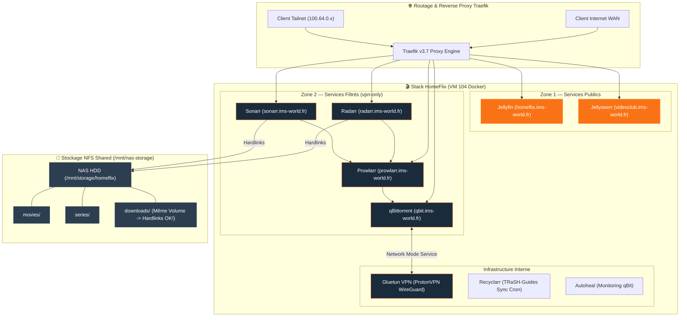

import { ips, domains } from "/snippets/variables.mdx";

<Badge color="green">🟢 Production Active (Stack 9 Conteneurs)</Badge>

## Accès Rapides & Administration

<Tabs>
  <Tab title="🌐 Interfaces Web">
    <CardGroup cols={2}>
      <Card title="Jellyfin (Streaming)" icon="play" href="https://homeflix.ims-world.fr">
        Interface principale de streaming vidéo (accélération matérielle QuickSync iGPU).
      </Card>
      <Card title="Jellyseerr (Demandes)" icon="film" href="https://videoclub.ims-world.fr">
        Portail de recherche et de demande automatique de médias.
      </Card>
      <Card title="Radarr (Films)" icon="video" href="https://radarr.ims-world.fr">
        Gestion et automatisation des films (Tailnet).
      </Card>
      <Card title="Sonarr (Séries)" icon="tv" href="https://sonarr.ims-world.fr">
        Gestion et automatisation des séries (Tailnet).
      </Card>
      <Card title="Prowlarr (Indexers)" icon="magnifying-glass" href="https://prowlarr.ims-world.fr">
        Gestionnaire centralisé des indexeurs torrent (Tailnet).
      </Card>
      <Card title="qBittorrent (Client)" icon="download" href="https://qbit.ims-world.fr">
        Client torrent routé via VPN Gluetun (Tailnet).
      </Card>
    </CardGroup>
  </Tab>
  <Tab title="⚡ Commandes CLI & Maintenance">
    ```bash
    # Se connecter à la VM Coolify
    ssh cmolotkoff@100.64.0.4
    
    # Accéder au dossier de la stack HomeFlix
    cd /data/coolify/services/w39uebmcnse7yctsft8hzed8/
    
    # Inspecter les logs des 9 conteneurs
    docker compose logs -f --tail=100
    ```
  </Tab>
</Tabs>

---

## Fiche Service

| Propriété | Valeur |
|---|---|
| **Nom de la Stack** | HomeFlix V2 (9 conteneurs Docker) |
| **Hôte d'Orchestration** | VM IMS-Coolify (VM 104) |
| **UUID Coolify** | `w39uebmcnse7yctsft8hzed8` |
| **Chemin sur la VM** | `/data/coolify/services/w39uebmcnse7yctsft8hzed8/` |
| **VPN & Kill-Switch** | ProtonVPN WireGuard (`qmcgaw/gluetun:v3.40.0` avec Port-Forwarding) |
| **Accélération Matérielle** | Passthrough iGPU Intel Iris Xe (QuickSync Haswell / QSV) |
| **Profils Qualité** | TRaSH-Guides sync quotidien (Recyclarr 04h00) |
| **Stockage NFS Shared** | `/mnt/nas-storage/homeflix/` (Hardlinks garantis sur même volume) |
| **Statut** | <Badge color="green">🟢 Production Active</Badge> |

---

## Architecture & Topologie



---

## Composants & Fonctionnement

| Service | Domaine | Exposition / Zone | Rôle |
|---|---|---|---|
| **Jellyfin** | `homeflix.ims-world.fr` | 🌐 Zone 1 (Public WAN) | Serveur de streaming vidéo (accélération iGPU Haswell/Iris Xe) |
| **Jellyseerr** | `videoclub.ims-world.fr` | 🌐 Zone 1 (Public WAN) | Portail de demande de films/séries |
| **qBittorrent** | `qbit.ims-world.fr` | 🔐 Zone 2 (`vpn-only.yaml`) | Client torrent routé via Gluetun (`network_mode: service:gluetun`) |
| **Prowlarr** | `prowlarr.ims-world.fr` | 🔐 Zone 2 (`vpn-only.yaml`) | Gestionnaire centralisé d'indexeurs |
| **Radarr** | `radarr.ims-world.fr` | 🔐 Zone 2 (`vpn-only.yaml`) | Automation & gestion de la bibliothèque de films |
| **Sonarr** | `sonarr.ims-world.fr` | 🔐 Zone 2 (`vpn-only.yaml`) | Automation & gestion de la bibliothèque de séries |
| **Gluetun** | Interne | 🏠 Interne | Client VPN ProtonVPN WireGuard avec kill-switch mécanique pour qBit |
| **Recyclarr** | Interne | 🏠 Interne | Synchronisation automatique quotidienne des profils de qualité TRaSH-Guides (04h00) |
| **Autoheal** | Interne | 🏠 Interne | Surveillance et redémarrage automatique de qBittorrent si la liaison VPN Gluetun tombe |

<Note>
**Routage `vpn-only.yaml` & Netns Gluetun** :
Les sous-domaines `qbit`, `prowlarr`, `radarr` et `sonarr` sont **retirés du champ Domains de l'UI Coolify** et déclarés exclusivement dans `/data/coolify/proxy/dynamic/vpn-only.yaml`. Pour qBittorrent (`network_mode: service:gluetun`), le service Traefik pointe directement vers le conteneur `gluetun` (port 8080) qui héberge l'espace de nommage réseau.
</Note>

---

## Stockage & Politique de Sécurité (Hardlinks)

<Warning>
**Contrainte technique impérative** : Les hardlinks ne traversent jamais deux systèmes de fichiers distincts. Le dossier `downloads/` **DOIT impérativement** résider sur le même point de montage NFS que `movies/` et `series/`. Sinon, Radarr et Sonarr effectuent une copie complète des fichiers au lieu d'un hardlink, ce qui double la consommation de stockage sur disque !
</Warning>

```
/data/coolify/services/w39uebmcnse7yctsft8hzed8/data/config   (SSD local VM — SQLite & configs)
/mnt/nas-storage/homeflix/movies      (NAS — Hardlinks garantis avec downloads/)
/mnt/nas-storage/homeflix/series      (NAS — Hardlinks garantis avec downloads/)
/mnt/nas-storage/homeflix/downloads   (NAS — Dossier de téléchargement qBittorrent)
```

---

## Exploitation & Procédures (ProtonVPN & Hardlinks)

<AccordionGroup>
  <Accordion title="Vérification du Port Forwarding ProtonVPN">
    ```bash
    # Nom du conteneur Gluetun
    GLUETUN=$(docker ps --format '{{.Names}}' | grep "^gluetun" | head -1)

    # Récupérer le port attribué dynamiquement par ProtonVPN
    docker exec "$GLUETUN" cat /tmp/gluetun/forwarded_port
    
    # Logs d'attribution du port
    docker logs "$GLUETUN" --tail 20 | grep -i "port forwarded"
    ```
    *Ce port doit être reporté dans qBittorrent (`Options → Connexion → Port d'écoute`).*
  </Accordion>

  <Accordion title="Audit & Gestion des Hardlinks (rdfind)">
    <Steps>
      <Step title="Audit des doublons réels (rdfind)">
        ```bash
        rdfind -dryrun true -makehardlinks false -makeresultsfile true movies series downloads
        ```
      </Step>
      <Step title="Comptage des fichiers en hardlink">
        ```bash
        find /mnt/nas-storage/homeflix/ -type f -links +1 | wc -l   # Fichiers partagés en hardlink
        ```
      </Step>
    </Steps>
  </Accordion>

  <Accordion title="Métrologie Disque — Piège de du vs df">
    <Warning>
    La commande `du -sh` sur le dossier homeflix sur-compte les hardlinks en additionnant la taille de chaque lien physique. Toujours valider l'occupation réelle au niveau bloc via la commande **`df -h`**.
    </Warning>
  </Accordion>

  <Accordion title="Résolution des Imports Manuels Bloqués (Unable to parse file)">
    **Symptôme** : Un film/épisode apparaît en *"Downloading 0B"* ou reste bloqué dans Radarr/Sonarr alors que le fichier est déjà complet dans qBittorrent.
    
    **Cause** : Nom de fichier trop générique (ex: `Iron Man 2 1080p.mkv` sans tags de source/codec/groupe). Radarr/Sonarr ne peuvent pas déduire la Qualité automatiquement et bloquent l'importation.

    **Procédure de Résolution** :
    1. Dans Radarr/Sonarr → **Activity → Queue** → cliquer sur l'icône **Manual Import** de la ligne concernée.
    2. Dans la fenêtre d'importation, cliquer sur le badge Quality (`Unknown`) et sélectionner manuellement la qualité réelle du fichier.
    3. **Règle d'Or** : S'assurer que le mode d'importation est réglé sur **Import Mode = Hardlink** (ne jamais sélectionner *Copy*).
    4. Valider l'importation.
  </Accordion>

  <Accordion title="Détection & Nettoyage des Orphelins downloads/ (Audit & Script Inodes)">
    **Mécanique du Problème** : Supprimer un film/épisode depuis Radarr ou Sonarr (*Delete File*) retire uniquement le hardlink côté `movies/` ou `series/`. Le fichier téléchargé dans `downloads/` et le torrent associé dans qBittorrent restent intacts et continuent d'occuper la totalité de l'espace disque.

    <Warning>
    **Avertissement Piège MergerFS (`inodecalc=path-hash`)** : Ne jamais exécuter le diagnostic d'inodes ou d'espace disque à travers `/mnt/storage` ou `/mnt/nas-storage` (NFS). Le calcul `path-hash` génère des inodes virtuels artificiels. **Tout diagnostic DOIT s'effectuer en SSH direct sur le LXC NAS 100 sur le chemin du disque physique (`/mnt/disk1/homeflix/`)**. Voir l'[ADR-007](/history/adr/adr-007-calcul-inodes-mergerfs-path-hash).
    </Warning>

    **Script de Scan des Orphelins** (à exécuter en SSH direct sur le LXC NAS 100 dans `/mnt/disk1/homeflix/`) :

    ```bash
    # Entrer dans le LXC NAS 100 depuis l'hôte Proxmox
    sudo pct enter 100
    cd /mnt/disk1/homeflix/

    echo "=== TORRENTS ORPHELINS (Dossiers multi-fichiers) ==="
    for d in downloads/movies/*/ ; do
      d="${d%/}"
      has_link=0
      total_size=0
      while IFS= read -r -d '' f; do
        inode=$(stat -c '%i' "$f")
        size=$(stat -c '%s' "$f")
        total_size=$((total_size + size))
        match=$(find movies/ series/ -type f -inum "$inode" 2>/dev/null | head -1)
        [ -n "$match" ] && has_link=1
      done < <(find "$d" -type f -print0)
      if [ "$has_link" -eq 0 ]; then
        size_h=$(awk -v s="$total_size" 'BEGIN{printf "%.1f Go", s/1073741824}')
        echo "$size_h   $(basename "$d")"
      fi
    done

    echo ""
    echo "=== FICHIERS ISOLÉS ORPHELINS (Single-file) ==="
    for f in downloads/movies/*.mkv; do
      [ -f "$f" ] || continue
      inode=$(stat -c '%i' "$f")
      match=$(find movies/ series/ -type f -inum "$inode" 2>/dev/null | head -1)
      if [ -z "$match" ]; then
        size_h=$(stat -c '%s' "$f" | awk '{printf "%.1f Go", $1/1073741824}')
        echo "$size_h   $(basename "$f")"
      fi
    done
    ```
  </Accordion>

  <Accordion title="Procédure de Suppression Propre (Double Liens)">
    Pour libérer réellement l'espace disque physique d'un hardlink, **les deux liens doivent être supprimés** :

    1. **Radarr / Sonarr** → *Delete Movie/Episode File* (retire le lien dans `movies/` ou `series/`).
    2. **qBittorrent** → Rechercher le torrent concerné → Vérifier le ratio de seed minimum → Clic droit **Delete** → Cocher **"Also delete files"** (retire le lien dans `downloads/`).
    
    <Warning>
    Ne jamais effectuer de `rm` manuel sur un fichier encore référencé par un torrent actif dans qBittorrent sous peine de laisser le torrent en erreur indéfiniment.
    </Warning>
  </Accordion>

  <Accordion title="Accélération Matérielle GPU (Intel QuickSync QSV — Validé)">
    L'iGPU Intel Iris Xe du MS-01 est attribuée en passthrough PCIe (`hostpci0`) à la VM Coolify (VM 104).

    **1. Montage du périphérique dans `docker-compose.yml`** :
    ```yaml
    services:
      jellyfin:
        devices:
          - /dev/dri:/dev/dri
    ```

    **2. Configuration dans l'interface Jellyfin (`Dashboard → Playback → Transcoding`)** :
    - **Hardware acceleration** : `Intel QuickSync (QSV)`
    - **Device** : `/dev/dri/renderD128`
    - **Décodage & Encodage** : Cocher H.264 et HEVC.

    <Warning>
    **En cas d'erreur `/dev/dri: no such file or directory` au démarrage** : Si Jellyfin refuse de démarrer post-reboot avec une erreur de périphérique `/dev/dri`, le module `i915` est absent pour la nouvelle version du noyau Ubuntu. Voir le [Post-Mortem du 19/08/2026](/history/incidents/2026-08-19-perte-gpu-passthrough-dev-dri) et la [Procédure de Dépannage](/procedures/depannage-courant#échec-démarrage-jellyfin---devdri-no-such-file-or-directory).
    </Warning>
  </Accordion>
</AccordionGroup>
